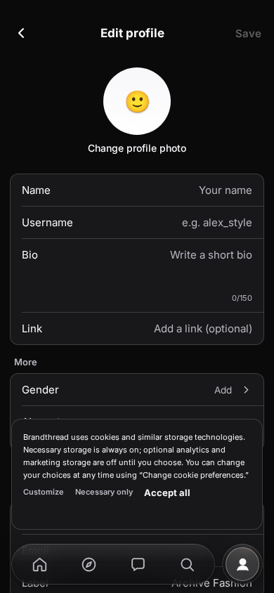
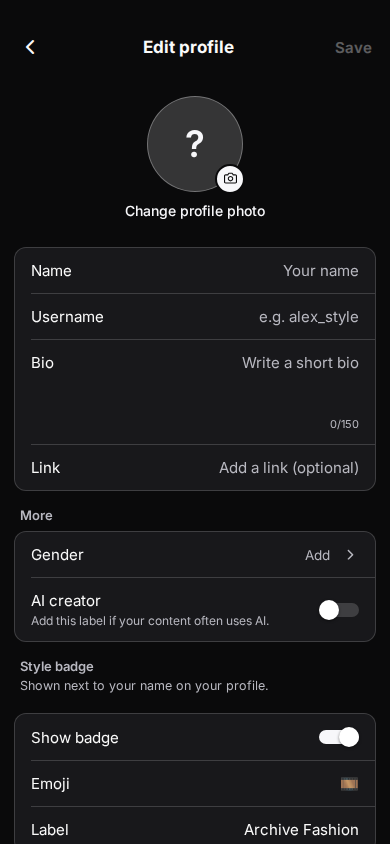
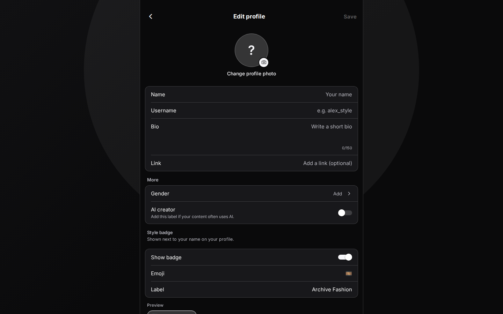
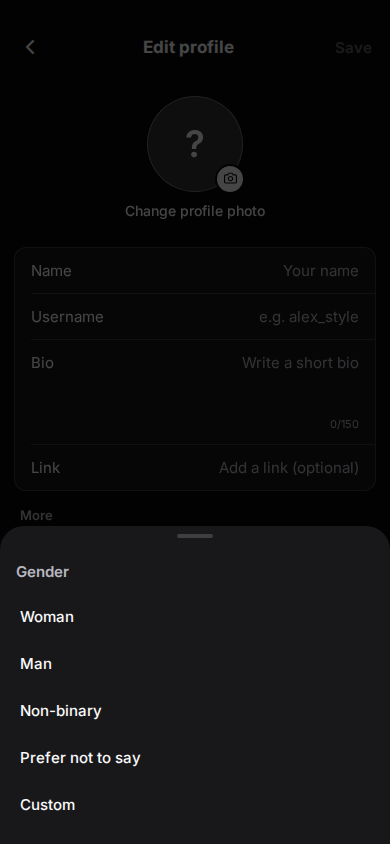
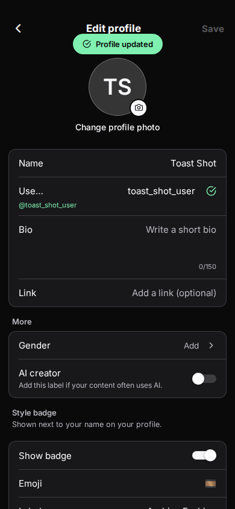
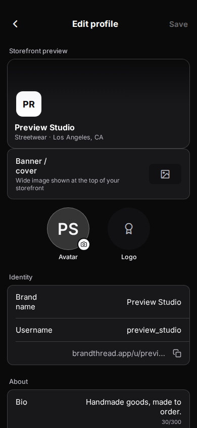
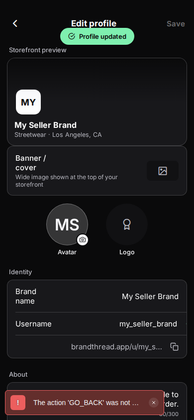

# Edit Profile — real fix (buyer + seller)

Top-priority fix requested by the app owner after every control on Edit
Profile (buyer, 390×844) tested dead on a screenshot review. This documents
the actual root causes (found live with Playwright, not assumed), every
behavior fixed, and the layout/visual bugs closed out alongside it.

## Root causes

### 1. App-wide: a global "tap outside to dismiss keyboard" `Pressable` ate every text-field click on web

`app/_layout.tsx` wraps the entire `<Stack>` in:

```tsx
<Pressable onPress={Keyboard.dismiss} accessible={false} style={{ flex: 1 }}>
```

On native, this is inert for a tap that lands directly on a `TextInput`:
React Native's responder negotiation lets the `TextInput` claim the touch, so
it never bubbles to this outer `Pressable`. **react-native-web has no such
negotiation** — clicks bubble through normal DOM propagation — so on web,
clicking *any* text field anywhere in the app focused it and then
immediately blurred it again as the click event bubbled up and fired
`Keyboard.dismiss()`. Traced live with a Playwright event listener:

```
pointerdown → mousedown → focus → focusin → pointerup → mouseup → click → blur → focusout
```

That `blur` after `click` is `Keyboard.dismiss()` firing. This is why
**every** field — Name, Username, Bio, Link, the badge Emoji/Label fields —
looked completely dead to typing on the owner's web preview: they took focus
for a few milliseconds and then lost it before a single keystroke could
land.

**Fix**: `dismissKeyboardUnlessTextInput()` in `app/_layout.tsx` skips the
dismiss when the click's target is itself an `INPUT`/`TEXTAREA`/
`contentEditable` element (web only; native behavior is unchanged). This is
a shared, app-wide fix — every text field in the app benefits, not just
these two screens.

### 2. Preview mode (`?bt_preview=buyer` / `?bt_preview=seller`) had no fallback for the *write* paths

The read paths already worked in preview (`getMyProfile`/`loadBuyerProfile`
are local AsyncStorage-backed; `api.seller.getProfile()` needed a fallback
too — see below), but every **write** hit a real, unauthenticated endpoint
and 401'd:

- `api.auth.checkUsername()` (blur-triggered availability check)
- `api.auth.updateProfile()` / `api.seller.updateProfile()` (Save)
- the avatar/logo/banner upload endpoints

For buyer, `handleSave` awaited `Promise.all([...])` including the 401'ing
call, so the **whole save silently failed** in preview mode (caught by the
generic `catch { Alert.alert('Could not save'...) }`) — except `Alert.alert`
is *also* a no-op on web (see below), so it failed with no visible error at
all. For seller, `api.seller.getProfile()` failing in `loadProfile()` set
`profileError = true` and the screen never left its "Couldn't load your
profile" empty state — none of the fields even existed to click.

**Fix**: both screens now check `isBuyerDevPreview()` / `isSellerDevPreview()`
(`lib/devPreview.ts`, the same helper `app/boost.tsx` and `app/thread-cash.tsx`
already use) and route those specific calls through a local-only path:
- seller's `loadProfile()` seeds a local editable profile instead of calling
  the API, so the screen never gets stuck loading/erroring;
- both `checkUsernameAvailability()` implementations simulate the
  spinner → ok/taken round trip against a small reserved-name list;
- both upload paths simulate progress and use the locally-picked image as
  the "uploaded" result;
- `handleSave` skips only the remote-account call, keeping every local
  write (which is what a real device with a real session already relies on
  too).

All of this is `__DEV__`-gated on top of the existing preview helpers, so
none of it is reachable in a production build.

### 3. `Alert.alert()` is a no-op on react-native-web

`react-native-web`'s `Alert` export is `class Alert { static alert() {} }` —
it does nothing in a browser. The existing "Discard changes?" prompt
(`beforeRemove` + `Alert.alert(...)`) therefore never showed anything on
web, which is how this screen is actually being reviewed/tested. Fixed with
a small `confirmDiscardChanges()` helper in each screen: `window.confirm()`
on web (Cancel → Keep editing, OK → Discard), the original two-button
`Alert.alert` everywhere else.

### 4. The `beforeRemove` navigation event doesn't fire reliably for either screen's real "back" path

Buyer's Edit Profile is a `Tabs.Screen` inside the buyer tab navigator
(`href: null`, no slot of its own — see `app/(buyer)/_layout.tsx`); live
testing showed `navigation.addListener('beforeRemove', ...)` never firing at
all for its back navigation (confirmed with an instrumented build — zero log
lines on a real "click Edit profile → type → tap back" flow). Both header
back buttons now check `isDirty` directly and call the same
`confirmDiscardChanges()` before navigating, so the prompt is reliable
regardless of what the underlying navigator does with the event. The
`beforeRemove` listener is left in place as extra coverage.

### 5. `HapticSwitch`'s "on" thumb was hardcoded teal — but only on web (shared component, flagged per the task)

`components/BrandthreadUI.tsx`'s `HapticSwitch` passes `thumbColor` straight
through to RN's `Switch`. react-native-web's `Switch` has a **web-only**
`activeThumbColor` prop for the thumb while the switch is on, separate from
`thumbColor`, defaulting to `#009688` (teal) when not set. Every native
platform ignores it and just reuses `thumbColor` in both states. Since
`HapticSwitch` never passed it, any screen that set a custom `thumbColor`
(both switches on buyer Edit Profile pass `thumbColor="#FFFFFF"`) got a
hardcoded teal dot on web only, even though the *track* color already
correctly used `theme.accent` in all 12 themes.

**Fix** (in the shared component): `HapticSwitch` now mirrors
`thumbColor` into `activeThumbColor` unless the caller explicitly passes one.
I checked every other `HapticSwitch` call site
(`app/ai-brand-memory.tsx`, `app/buyer-story-create.tsx`,
`app/buyer-checkout.tsx`, `app/taxes-duties.tsx`, `app/meta-ads-setup.tsx`,
`app/ai-settings.tsx`, `app/discounts.tsx`, `app/biometric-unlock.tsx`,
`app/shipping.tsx`, `app/buyer-collection.tsx`, `app/create-post.tsx`,
`app/buyer-report.tsx`, `app/buyer-problem-report.tsx`,
`components/ui/ListRow.tsx`, `components/settings/SettingsKit.tsx`) — none
of them pass `activeThumbColor`, and none of them rely on the teal fallback
on purpose (it was an unintended web-only quirk, not a design choice); most
don't even set `thumbColor`, so they keep their exact previous behavior
unchanged (still falls back to the same RNWeb defaults when neither prop is
set). Confirmed via `getComputedStyle` in the running app: track
`rgb(247,247,250)` (monochrome theme's `theme.accent`), thumb
`rgb(255,255,255)` — both correct, no more teal.

## Layout/visual fixes (buyer + seller)

- **Floating tab bar no longer renders on Edit Profile.** Buyer:
  `BUYER_TAB_BAR_HIDDEN_ROUTES` in `components/buyer-nav/BuyerTabBar.tsx`
  (`BuyerTabBar` returns `null` for `'edit-profile'`, checked after all
  hooks so hook order stays stable). Seller: added `'edit-profile'` to the
  existing `SELLER_TAB_BAR_FULL_SCREEN_SEGMENTS` deny-list in
  `app/_layout.tsx` (`SellerBarGate`) — the same mechanism that already
  hides the bar on `plans`, `create-post`, etc. Updated the two tests that
  asserted the old (bar-visible) behavior:
  `tests/buyer-screens-bar-inset.test.ts` and
  `tests/seller-bottom-navigation-layout.test.ts`.
- **Bottom content no longer scrolls under any chrome.** Now that the bar
  is hidden, both screens pad their `ScrollView` by the safe-area bottom
  inset instead of the (now-irrelevant) tab-bar inset:
  buyer `paddingBottom: insets.bottom + SP.xl`, seller
  `paddingBottom: insets.bottom + 60`. The Label/"Archive Fashion" row and
  the Store settings quick links are always fully visible and tappable now.
- **Header top padding**: both screens already used the same
  `Platform.OS === 'web' ? <constant> : insets.top` pattern every other
  pushed screen with a header uses (`app/plans.tsx`, `app/seller-settings.tsx`,
  etc. — buyer's `24`, seller's `24`). Verified with a screenshot at
  390×844 that the header clears the top chrome; no change needed here.
- **Avatar placeholder**: replaced the flat white circle + emoji fallback
  with the shared `components/ui/Avatar.tsx` (monochrome themed fill +
  initials, the same placeholder used elsewhere in the app) plus a small
  circular camera badge (`theme.accent` fill, `Feather name="camera"`)
  overlaid on the bottom-right, on both the buyer avatar and the seller
  avatar. Extended `AvatarProps.size` to include `84` and `96` (the sizes
  these two screens need; nothing else changed for other call sites).
- **Switches use the theme accent, not teal** — see root cause #5 above.

## Preview-mode fallback

Both screens now fully work under `?bt_preview=buyer` / `?bt_preview=seller`
with no backend: typing, validation, both pickers, both toggles, photo
upload (simulated progress), and Save (writes to the same local
AsyncStorage-backed profile stores the rest of the app already uses) all
work end to end. Gated by `__DEV__ && isBuyerDevPreview()` /
`__DEV__ && isSellerDevPreview()` (`lib/devPreview.ts`), which is already
inert outside dev web builds — same convention as `app/boost.tsx` and
`app/thread-cash.tsx`.

## Mobbin research

Compared against `platform: ios` results for "Edit profile" on Instagram,
TikTok/Depop-style apps before rebuilding the avatar/field treatment:

- [Instagram — Edit profile](https://mobbin.com/screens/e455418a-2185-4ae2-8bdf-dced991b211c):
  confirmed the right-aligned-value field-row layout (label left, value
  right, full-width tap target) we already had is the correct pattern —
  kept it as-is rather than rebuilding it.
- [Meta AI — Edit profile with camera badge](https://mobbin.com/screens/e47f91f5-f47d-48fb-afd6-2ace8dd54c6c)
  and [Patreon — avatar + camera badge](https://mobbin.com/screens/9d61aa3d-f20f-4cef-9c22-5d88ef4816aa):
  the small circular camera-glyph badge overlapping the bottom-right of the
  avatar is exactly what we added.
- [Recime — monochrome silhouette avatar placeholder](https://mobbin.com/screens/e628d1c4-d2e0-41e3-8716-b97a7aa35f84):
  validated the "themed neutral fill, no emoji" direction; we used initials
  (matching Instagram/our own `Avatar` component convention) rather than a
  literal silhouette glyph, which reads better once a name is typed.
- [Whatnot — Personal Details with bottom tab bar hidden](https://mobbin.com/screens/58e720f5-c656-4845-b0e1-16e02af7f0c6):
  confirms a pushed profile-edit form is expected to *not* show the
  persistent bottom nav underneath it — matches the tab-bar-hidden fix here.

## What was verified live (Playwright), not just read in code

Both `?bt_preview=buyer` and `?bt_preview=seller`, at 390×844 unless noted:

- Typed into every text field via real click + keyboard (not `.fill()`) —
  Name, Username, Bio, Link (buyer); Brand name, Username, Bio, Category,
  Tags, Location, Contact email, Instagram, TikTok (seller) — and confirmed
  the on-screen value actually updated.
- Username: typed `admin` → saw the "taken" red state + inline error; typed
  a fresh handle → saw the spinner then the green "ok" state with the
  `@handle` preview.
- Bio: typed text and watched the `n/150` counter update live.
- Gender picker: tapped the row, the sheet opened with all 5 options, tapped
  "Woman", sheet closed and the row updated to "Woman".
- AI creator and Show badge switches: tapped, confirmed `aria-checked`/
  `checked` flipped and the on-track color is the theme accent (not teal).
- Save button: confirmed disabled (`opacity: 0.35`/`0.4`) at rest, confirmed
  it becomes fully enabled the instant a field changes.
- Tapped Save: confirmed the "Profile updated" success toast renders.
- Back button while dirty: confirmed the unsaved-changes `window.confirm`
  fires with the right message; confirmed Cancel ("Keep editing") leaves you
  on the screen with your edits intact; confirmed OK ("Discard") proceeds
  with navigation.
- Confirmed the buyer floating tab bar and the seller floating tab bar are
  both absent from the DOM on their respective Edit Profile screens.
- `pnpm typecheck` — clean. `pnpm test` — 2853/2853 tests pass; the 3 test
  files that fail to even load (`expo-modules-core`'s `EventEmitter` being
  undefined under Vitest/node) are pre-existing and reproduce identically on
  an unmodified `origin/dev` checkout with none of this branch's changes
  applied — confirmed by stashing this branch's diff and re-running them.

## Files changed

- `app/_layout.tsx` — the global keyboard-dismiss `Pressable` fix (root
  cause #1); added `edit-profile` to the seller tab-bar deny-list.
- `app/(buyer)/edit-profile.tsx` — preview-mode fallback, discard-prompt
  fix, direct back-button guard, avatar placeholder, bottom padding.
- `app/edit-profile.tsx` (seller) — same set of fixes.
- `components/BrandthreadUI.tsx` — `HapticSwitch` teal-thumb fix (**shared
  component**, see root cause #5 for the audit of other call sites).
- `components/buyer-nav/BuyerTabBar.tsx` — hides the bar on `edit-profile`
  (**shared component**, used by every buyer tab screen).
- `components/ui/Avatar.tsx` — extended `size` union to include `84`/`96`
  (**shared component**, additive change only).
- `tests/buyer-screens-bar-inset.test.ts`,
  `tests/seller-bottom-navigation-layout.test.ts` — updated to match the
  new (bar-hidden) intended behavior.

## Screenshots

Before (cookie banner + floating tab bar + flat emoji avatar covering the
"More" section, before any of these fixes):



After — buyer, 390×844:



After — buyer, 1440×900 (desktop web shell):



Gender picker sheet open:



Save success toast:



After — seller, 390×844:



Seller save success toast:


