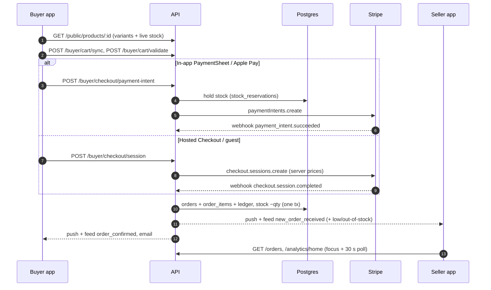
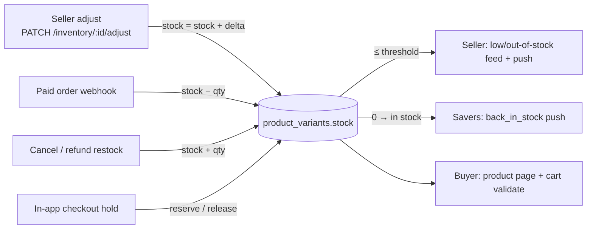
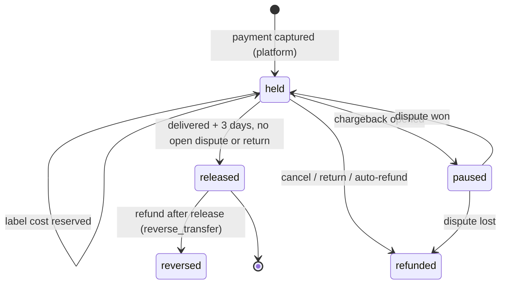
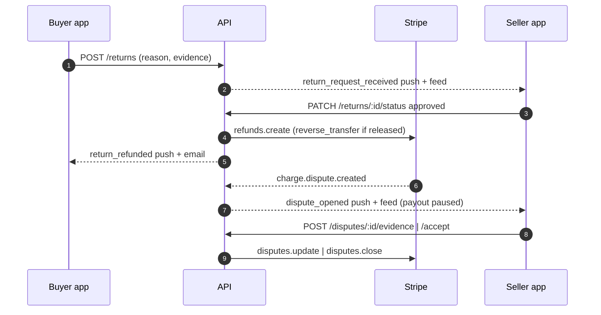
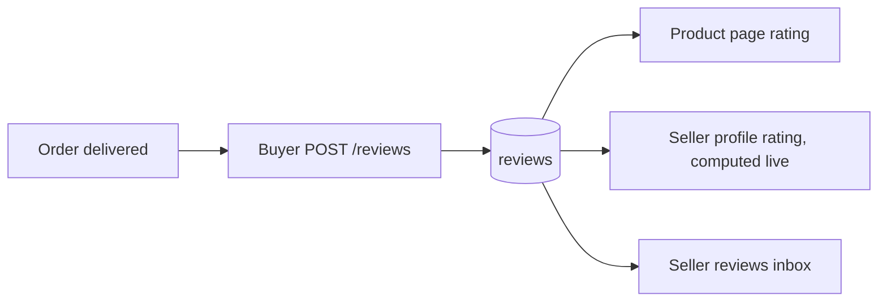
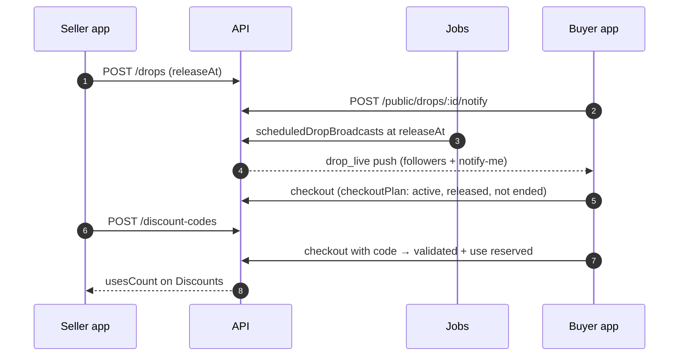
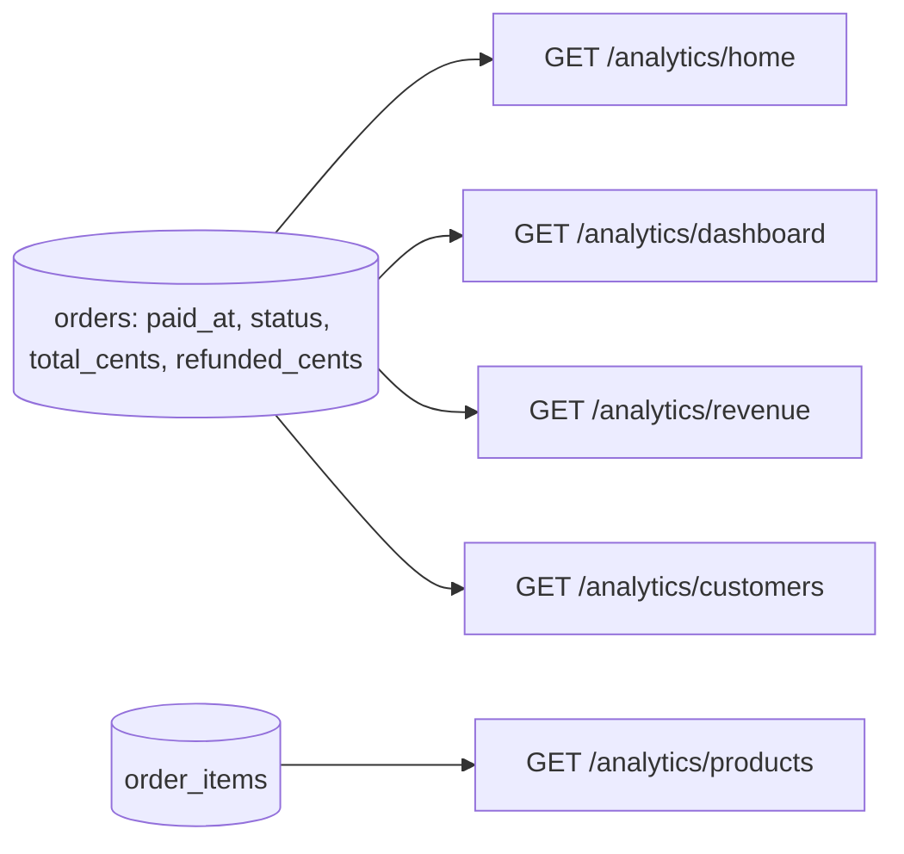

# Commerce flows — buyer ⇄ seller map

Every commerce flow that crosses from the buyer to the seller (and back),
traced screen → client call → API route → tables → jobs/webhooks → what the
**other** side sees. Paths: `mobile/` = `artifacts/mobile`, `api/` =
`artifacts/api-server/src`, `db/` = `lib/db`.

**Payout timing.** Production runs `PAYOUT_MODE=hold` (the default in
`lib/delivery/policy.ts`): in-stock orders are charged on Brandthread's
balance (`charge_model = transfer`) and the seller is paid after delivery +
3 days. The older test suites force `immediate` in `vitest.setup.ts`; the
commerce e2e suites run `hold`, so they test what production does.

How the other side finds out, in general:

- **There are no WebSocket events for orders, stock or money.** `api/ws` only
  carries Live and community chat. Orders, stock and money reach the other
  side through **push + the notifications feed + refresh-on-focus/polling**.
  Seller Orders tab and Home dashboard refresh on focus plus a 30 s poll, and
  the buyer order detail polls every 15 s.
- **One source of truth per entity:** `orders` / `order_items` (both sides
  read the same row through `GET /api/orders*` and `GET /api/buyer/orders*`),
  `product_variants.stock` (inventory), `order_refunds` + ledger (money),
  `notifications_feed` (activity, both sides).

The end-to-end test that walks these flows with two real users (one buyer,
one seller) through the **whole** Express app is
`api/routes/__tests__/commerce-lifecycle.integration.test.ts`. The "Status"
column in the breaks ledger at the bottom links each fix to its test.

---

## 1. Browse → product → cart → checkout → order

| Step | Mobile | Client call | Route | Tables | Other side sees |
|---|---|---|---|---|---|
| Browse / search | `(buyer)/discover.tsx`, `buyer-search.tsx` | `api.public.products` | `GET /api/public/products`, `/search` (`api/routes/public.ts`) | products, product_variants | — |
| Product page, size pick | `buyer-product-detail.tsx` | `getBuyerProduct` (`services/cartService.ts`) | `GET /api/public/products/:id` | products, variants (live `stock`, `claimedUnits`) | — |
| Cart | `(buyer)/cart.tsx` | `syncToDb` | `POST /api/buyer/cart/sync`, `GET /api/buyer/cart` (`cart-db.ts`) | cart_items | abandoned-cart job |
| Validate before pay | `cart.tsx` | `validateCart` | `POST /api/buyer/cart/validate` (`buyer.ts`) | variants, products, drops | — |
| Pay — hosted Stripe Checkout | `buyer-checkout.tsx` | `api.buyer.checkout.createSession` | `POST /api/buyer/checkout/session` (`buyer.ts`) | checkout_sessions | — |
| Pay — in-app PaymentSheet / Apple Pay | `buyer-checkout.tsx` (also `thread-checkout`) | `api.buyer.checkout.paymentIntent.*` | `POST /api/buyer/checkout/payment-intent` (`checkout-intent.ts`) | checkout_sessions, stock_reservations (units held 30 min) | — |
| Pay — guest | `buyer-checkout.tsx` | `api.guest.checkout.*` | `POST /api/guest/checkout/session` | checkout_sessions | — |
| Payment confirmed | — | — | Stripe → `POST /api/webhooks/stripe` (`checkout.session.completed` or `payment_intent.succeeded`) → `handleCheckoutPaid` | orders, order_items, ledger, stock decrement | **Seller:** `new_order_received` feed + push → Orders tab, Home dashboard, order detail. **Buyer:** `order_confirmed` feed + push, email |



## 2. Inventory and out-of-stock (both sides)

| Event | Route / code | Effect | Buyer sees | Seller sees |
|---|---|---|---|---|
| Seller edits stock | `StockEditorSheet` → `PATCH /api/inventory/:variantId/adjust` (`inventory.ts`) | atomic `stock = stock + delta` | product page stock / sold-out | inventory list; low-stock push |
| In-app checkout | `checkout-intent.ts` → `money/stockReservation.ts` | units held, released on fail/cancel/30-min expiry (`moneySweep`) | "Only N left" stays honest | — |
| Paid order | webhook `handleCheckoutPaid` | stock −qty once; oversold → automatic refund | out-of-stock on product page | `low_stock` / `out_of_stock` alert + push; oversold refund alert |
| Cancel / refund with restock | `money/refunds.ts` | stock +qty | back-in-stock alert to savers | stock back in inventory |



## 3. Fulfilment: to ship → label → tracking → delivered

| Step | Mobile | Route | Tables / jobs | Other side sees |
|---|---|---|---|---|
| Paid order lands "to ship" | Orders tab | — | `orders.status` | — |
| Buy label | `fulfill-order.tsx` → `services/orderService.ts` | `POST /api/shipping-labels/*` (`shipping-labels.ts`, Shippo) | shipping_labels, label cost reserved from the order's funds | — |
| Mark shipped / manual tracking | `fulfill-order.tsx`, `order-detail.tsx` | `PATCH /api/orders/:id/tracking`, `/status`, `/items-tracking` | status `shipped`; tracking registered with carrier | **Buyer:** `order_shipped` feed + push + email |
| Carrier updates | — | `POST /api/webhooks/shippo` + hourly poll (`jobs/deliveryDeadlines.ts` → `delivery/trackingSync.ts`) | order_tracking_events | **Buyer:** out-for-delivery / exception pushes |
| Delivered | carrier, or buyer "I received it" | `POST /api/buyer/orders/:id/confirm-receipt` | `delivered_at`, `payout_release_at` = delivered + 3 days | **Buyer:** `order_delivered`. **Seller:** `order_delivered_seller` (payout clock started) |
| Overdue | — | `delivery/autoRefund.ts` | order_refunds | both sides `order_auto_refunded*`; seller warnings at 5 d / 2 d / 12 h |

```mermaid
sequenceDiagram
  autonumber
  participant SA as Seller app
  participant API as API
  participant SH as Shippo
  participant B as Buyer app
  SA->>API: POST /shipping-labels/purchase (or PATCH /orders/:id/tracking)
  API->>SH: buy label / register tracking
  API-->>B: order_shipped push + feed + email
  SH-->>API: webhook / hourly poll: TRANSIT, OUT_FOR_DELIVERY, DELIVERED
  API-->>B: tracking pushes; order_delivered
  API-->>SA: order_delivered_seller (payout releases in 3 days)
```

## 4. Money: payout, fees, holds, Thread Cash

| Step | Code | What happens | Seller sees |
|---|---|---|---|
| Charge | `money/checkoutPlan.ts` (`PAYOUT_MODE`, default `transfer` = hold) | charge stays on the platform, `funds_state=held`, ledger `seller_held` | Finance → Held |
| Fees | `money/fees.ts` | 5 % platform fee + processing estimate, integer cents | order detail fee line |
| Release | `jobs/moneySweep.ts` → `money/cartTransfers.ts settleTransferOrder` gated by `payoutGate.ts` | transfer once delivered + 3 days, no open dispute/return | `payout_transfer_sent` feed + push |
| Bank payout | Stripe schedule → `payout.paid` webhook | — | `payout_sent` |
| Thread Cash | `lib/threadCash/*`, `routes/thread-cash.ts` | platform-funded discount at checkout; live gifts; cash-out | Thread Cash history |



## 5. Returns, refunds, chargebacks

| Step | Mobile | Route | Effect | Other side sees |
|---|---|---|---|---|
| Buyer requests return | `buyer-return-request.tsx` | `POST /api/returns` | returns row | **Seller:** `return_request_received` feed + push |
| Seller approves / denies | `return-detail.tsx` | `PATCH /api/returns/:id/status` → `refundOrder` | order_refunds, ledger, fee refunded pro-rata | **Buyer:** `return_refunded` / `return_denied` |
| Buyer cancels | `buyer-order-detail.tsx` | `POST /api/buyer/orders/:id/cancel` | refund + restock | **Seller:** `order_cancelled_by_buyer` |
| Seller cancels | `order-detail.tsx` | `PATCH /api/orders/:id/status` | refund + restock | **Buyer:** `order_cancelled` |
| Chargeback opened | — | Stripe `charge.dispute.created` → `handleDisputeCreated` | disputes row, order payout paused | **Seller:** `dispute_opened` feed + push → `dispute-detail`. **Buyer:** `order_refund_paused` |
| Seller responds / accepts | `dispute-detail.tsx` | `POST /api/disputes/:id/evidence`, `/accept` | evidence → Stripe; accept closes it on Stripe | — |



## 6. Reviews and ratings

| Step | Mobile | Route | Other side sees |
|---|---|---|---|
| Buyer reviews a delivered order | `buyer-order-detail.tsx` | `POST /api/reviews` (`lib/reviewOrderAuth.ts` requires delivered) | product page `GET /api/reviews/product/:id`, seller profile `GET /api/reviews/seller/:id`, seller inbox `seller-reviews.tsx` |
| Seller replies | `seller-reviews.tsx` | `POST /api/reviews/:id/reply` | buyer sees reply on the review |



## 7. Promotions: discounts, drops, bundles, saves

| Flow | Seller side | Buyer side | Enforced at |
|---|---|---|---|
| Discount code | `discounts.tsx` → `POST /api/discount-codes` | entered at checkout → `/discount-codes/validate` preview | re-validated when the charge is created; **use reserved atomically** (cap and once-per-customer) and recorded by the webhook |
| Drop / launch | `seller-drop-create.tsx` → `POST /api/drops` | `buyer-drop-detail.tsx`, notify-me `POST /api/public/drops/:id/notify` | `money/checkoutPlan.ts` (server clock: active, released, not ended); launch push via `jobs/scheduledDropBroadcasts.ts` |
| Bundle | `product-bundles.tsx` → `/api/bundles` | `GET /api/bundles/public` | — (see ledger) |
| Save / wishlist | — | `POST /api/buyer/saved` | back-in-stock + price-drop alerts (`lib/stockNotifications.ts`) |
| Gift cards | not on `dev` — built on the unmerged `claude/checkout-gift-cards` branch | | |



## 8. Analytics: Dashboard + Reports

| Screen | Route | Revenue definition |
|---|---|---|
| Home dashboard, Analytics tab | `GET /api/analytics/home` | paid orders, net of refunds, seller's timezone |
| Overview / Revenue / Products / Customers | `GET /api/analytics/dashboard`, `/revenue`, `/products`, `/customers` | **same definition as Home**: paid (`paid_at` set), not cancelled, net of `refunded_cents`, day buckets in the seller's timezone |



---

## Breaks ledger

What running these flows end to end found, and where each one went. "Other
session" = owned by a concurrent PR, left alone here so the PRs merge cleanly.
Each fixed row has a whole-app test that fails on `dev` and passes with the fix.

| # | Flow | Break | Status |
|---|---|---|---|
| 1 | Checkout | Stripe webhook auto-registration (`lib/ensureWebhookEvents.ts`) omitted `payment_intent.succeeded/payment_failed/canceled`, which create in-app (PaymentSheet / Apple Pay) orders and release held stock | Fixed — checkout/inventory PR (`ensureWebhookEvents.events.test.ts` pins every handled event to the subscription) |
| 2 | Inventory | Seller stock adjust read-modify-wrote an absolute value, losing a concurrent sale | Fixed — checkout/inventory PR |
| 3 | Inventory | Cancelling an unpaid seller-created order never restored its stock | Fixed — checkout/inventory PR |
| 4 | Orders | Order numbers came from `count(*)+1` with no lock: concurrent orders shared a number | Fixed — checkout/inventory PR |
| 5 | Inventory | Low-stock alerts from paid orders had no push and could fire only once per product, ever | Fixed — checkout/inventory PR |
| 6 | Cart | `cart/validate` compared `item.price` but the app sends `priceCents`, so price changes were never flagged | Fixed — checkout/inventory PR |
| 7 | Checkout | Seller was never told when an order was auto-refunded as oversold | Fixed — checkout/inventory PR |
| 8 | Inventory | Restock from a cancel/refund never sent back-in-stock alerts | Fixed — checkout/inventory PR |
| 9 | Disputes | Seller never notified of a chargeback; nothing in the app opened `dispute-detail` | Fixed — money PR |
| 10 | Disputes | Multi-seller carts: dispute attached to an arbitrary order of the PaymentIntent; other sellers' orders kept paying out | Fixed — money PR |
| 11 | Disputes | "Accept" only flipped a local row; Stripe was never told | Fixed — money PR |
| 12 | Disputes | API sent `amount` in dollars while the app reads `amountCents`; tracking evidence sent the description as the tracking number | Fixed — money PR |
| 13 | Delivery / payout | Seller not told when an order is delivered or when its payout transfer is sent | Fixed — money PR |
| 14 | Payout | Hold mode (production default) never paid the seller the platform-funded Thread Cash part of an order | Fixed — money PR |
| 15 | Discounts | `maxUses` only checked against paid orders; concurrent checkouts could redeem past the limit | Fixed — promotions/analytics PR |
| 16 | Drops | Ended drops were still purchasable; the cart didn't warn about locked drops | Fixed — promotions/analytics PR |
| 17 | Drops | Notify-me subscribers got no launch push unless the seller separately broadcast to followers | Fixed — promotions/analytics PR |
| 18 | Analytics | `/dashboard`, `/revenue`, `/products`, `/customers` counted unpaid and refunded orders; `/revenue` daily series capped at 10 rows, `lastMonth` unbounded, buckets in server timezone | Fixed — promotions/analytics PR |
| 19 | Analytics | `/home` chart dropped the current bucket when the range end was capped mid-bucket (`range=all`), so buckets summed to less than the headline | Fixed — promotions/analytics PR |
| 20 | Tests | Commerce/money suites red on `dev`: stale expectations (buyer order-confirmed push, active preorder drop, `requirePayoutsRead` mock, immutable ledger cleanup, live-gift caps, webhook secret, analytics boundary timestamps, drops `requireRole`) | Fixed — flow-map PR (+ promotions/analytics PR for the analytics/drops suites) |
| 21 | Reviews | Reviews posted without `productId` never reached the product page; sellers not alerted to new reviews | Other session — PR #657 (resolves the product server-side) |
| 22 | Shipping | `package-presets` router never mounted | Other session — PR #699 |
| 23 | Shipping | Shippo webhook unauthenticated when `SHIPPO_WEBHOOK_SECRET` is unset; label-only orders not polled | Other session — order tracking / auto-refunds |
| 24 | Returns | Approved returns refund immediately without restock or return shipping | Other session — PR #680 (prepaid return labels, refund on carrier scan) |
| 25 | Cart | Client cart stock flags frozen at add time; cart sync not atomic | Other session — PR #698 (cart) |
| 26 | Gift cards | Not on `dev` | Built on the unmerged `claude/checkout-gift-cards` branch |
| 27 | Disputes | A **lost** chargeback keeps the order's payout paused (the money stays on the platform), but nothing recovers it from a seller who was already paid | Open — needs Dev's policy call: claw back from the seller (transfer reversal) or absorb |
| 28 | Bundles | Buyers can't see bundles and bundle prices aren't applied at checkout | Open — needs a buyer-facing bundle surface (new UI) |
| 29 | Saves | The app saves posts, not products, so back-in-stock / price-drop alerts reach nobody | Open — needs a product save entry point (new UI) |
