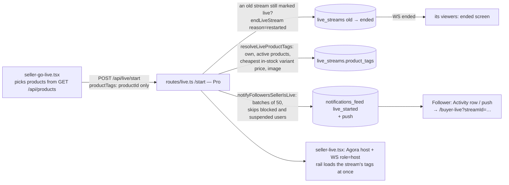
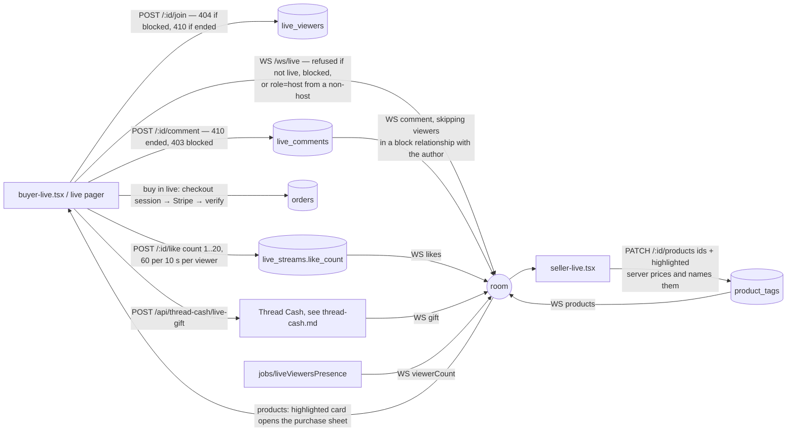
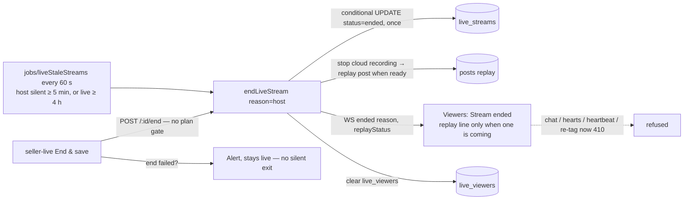

# Live shopping: go live → followers → watch, chat, hearts, buy → end → replay

Realtime goes through the `/ws/live` room for each stream (`ws/liveHub.ts`). `routes/live.ts` is the only write path. It commits a change and then broadcasts it to the room.

## Go live (seller) → followers told

## Watch, chat, hearts, pinned product, gifts (buyer ↔ host)

## End and replay

## Breaks found and fixed

| # | Break | Fix |
|---|---|---|
| 1 | Followers were **never told** a seller went live. Nothing was published on `/start`. | `notifyFollowersSellerIsLive` creates an Activity row plus push, type `live_started` → `targetType: live_stream`. Tapping it, or the push, opens `/buyer-live?streamId=`. |
| 2 | The live product picker was **always empty**. `GET /api/products` returns a bare array, but both screens read `r.products`. | They read the array and show only active products. |
| 3 | Product tags trusted the client's `productName` and `priceCents`, so viewers saw **$0.00** (the seller list has no price) and any price could be spoofed. Tags weren't checked for ownership, and could be edited after the stream ended. | `resolveLiveProductTags`: the seller's own active products only, priced from the cheapest in-stock variant, with an image and one highlight. Re-tagging an ended stream returns 410. |
| 4 | Products lined up before going live **didn't show on the host's rail** until the first socket broadcast. | `seller-live` loads the stream's tags on mount. Toggle and highlight use the server's copy and roll back with an alert on failure; this used to fail silently. |
| 5 | **Ending didn't tell viewers.** They inferred it from Agora `onUserOffline`, which also fires on a host network blip. The ended screen always promised a replay. | `endLiveStream` broadcasts `{type:"ended", reason, replayStatus}`. `onUserOffline` now confirms with the server, and the replay line shows only when one is coming. |
| 6 | **A crashed host stayed "LIVE" in the feed forever**, and their next `/start` returned 409 with no way out. | `/start` ends the seller's stale live (viewers are told). `jobs/liveStaleStreams` ends a live whose host has been silent for 5 minutes, using `host_last_seen_at` from the host's WS or HTTP heartbeat. The host token covers the 4-hour maximum. |
| 7 | **Chat was accepted on ended streams, and from users the host blocked.** The WS broadcast also reached viewers who had blocked the author. | 410 / 403. The broadcast skips anyone in a block relationship with the author, matching what `GET /comments` already filtered. |
| 8 | `/join`, `/heartbeat` and the **WS upgrade** didn't check stream status or blocks. Any signed-in user could open a socket for any id, and could also open one as host. | Join returns 404 when blocked; heartbeat returns 410 when ended (and refreshes host presence for the host). WS admission requires a live stream, no block, and the host role only for the seller. |
| 9 | Hearts were **client-only** (`sendLike` did nothing, `likeCount: 0`). | `POST /:id/like` with a per-viewer rate limit, `live_streams.like_count` (migration 272), a WS `likes` event, and the pager polls the total. |
| 10 | Gifts appeared in the room only as ordinary chat that the **buyer's own client typed**, so anyone could fake one. | The room shows a server-announced `gift` event; the broadcast itself ships with the Thread Cash PR. |
| 11 | A **failed End** silently left the screen, so the stream stayed live for buyers. | An alert, and the host stays live. `/end` no longer needs Pro, so a lapsed plan can't trap a host in a live. |
| 12 | A malformed stream id caused a 500 (`::uuid` cast). | 404 via `router.param`. |

Not built in this PR, and listed for Dev:
- **Co-hosts:** inviting a second publisher into the Agora channel needs an invite and accept model plus a publisher token for the guest.
- **Attributing an in-live purchase to the stream:** an order source field and a WS `purchase` event to the host.

## Tests
- `routes/__tests__/live-shopping-two-sided.integration.test.ts` uses the real router, the real WS hub on the same server, and Postgres. It checks:
  1. Go-live prices tags from the catalogue (not the request) and notifies a follower but not a blocked one.
  2. A buyer's join, chat, hearts and re-tag reach the host's socket and the viewer's.
  3. A blocked viewer can't join, chat or open a socket, and a non-host can't connect as host.
  4. A chat line never reaches a viewer who blocked its author.
  5. A malformed id returns 404.
  6. A crash restart ends the old live and tells its viewers.
  7. After the host ends, viewers get `ended` and chat, hearts, heartbeat and re-tagging return 410.
  8. A silent host's live is swept and leaves the feed, while a healthy one isn't.
- `live-realtime-e2e.test.ts` was updated: the tag broadcast is now server-priced.
- Mobile: a go-live push opens the live (`notificationNavigation.test.ts`).
