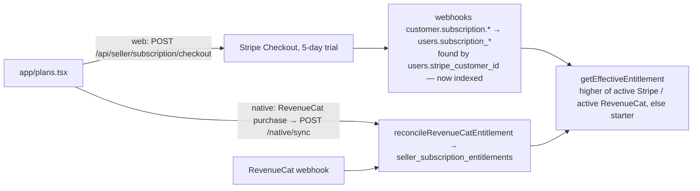
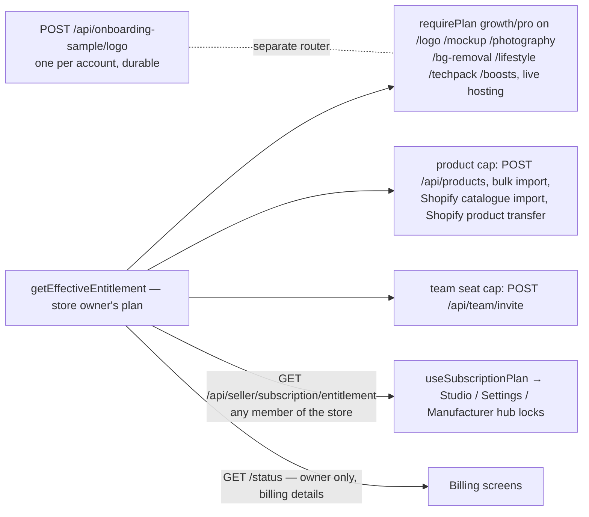

# Seller plans → paid tools (Starter / Growth / Pro)

## Buy or change a plan

## What unlocks, and where it's enforced

The app locks and the server gates now read the same value: the plan the server honours for the **store**, which is the owner's for team members.

## Breaks found and fixed

| # | Break | Fix |
|---|---|---|
| 1 | **Free unlimited logo generation.** `/api/onboarding-sample` mounted the entire paid logo router, so `POST /api/onboarding-sample/generate` (Growth-only at `/api/logo/generate`) ran with no plan check and no allowance. | A dedicated `onboardingSampleRouter` with only `/logo` (the one durable free sample). `/onboarding-sample/generate` returns 404. |
| 2 | The logo rate limiter read `req.auth?.userId`. In `@clerk/express` 2.x `req.auth` is a function, so **every seller shared one `"anon"` bucket** (5 a minute for the whole platform). | It's keyed by `requireAuth`'s `clerkUserId`. |
| 3 | **The app unlocked tools the server refused.** `/status` returns the billed plan even for `unpaid` or `incomplete` Stripe subscriptions, and the hook unlocked on it, so the seller then got 403s. | `/status` adds `entitledPlan`, and the new `/entitlement` returns the honoured plan. The hook uses it. |
| 4 | **Team members were locked out of Growth tools in the app.** `/status` is owner-only, so the hook errored and Studio showed the lock, while the server already let them through on the owner's plan. | `/entitlement` (any member, no billing details) returns the store's plan. |
| 5 | The plan cache was **module-global across user switches** on one device. | It's keyed by signed-in user plus selected store, and cleared on store switch. |
| 6 | **Shopify imports bypassed the Starter 25-product cap** (up to 250 per batch, and the product transfer had no check at all). | `remainingProductCapacity`, using the same lock and count as `POST /api/products`. The catalogue import stops with `PLAN_PRODUCT_LIMIT` ("Your plan allows 25 products, so N more weren't imported. Upgrade to import the rest."). The transfer records each skipped product. |
| 7 | `users.stripe_customer_id` had **no index**, and every subscription webhook updates by it. | Migration 273 (partial index). |

### Checked and left as is
- **Sandbox RevenueCat purchases count in production.** Apple's App Review buys with sandbox accounts against production builds, so refusing sandbox receipts would block review. RevenueCat already separates sandbox from production.
- **AI credits and metering**, including image-generation metering, are in #661. Gaps found there: retry routes aren't in its catalogue, it debits the actor instead of the store owner, and image calls aren't metered. They're listed for #661's author in this PR's description, not duplicated here.
- **Remove Background, AI Photoshoot and Design Studio** belong to other in-flight sessions and weren't touched. For them:
  - `bg-removal` never saves results, and `GET /bg-removal/results/*` always returns 401 (the same `req.auth` bug as #2).
  - "Use as product photo" writes only to the local product cache.
  - `exportProject` returns a `mock://` URI outside demo.

## Tests
- `routes/__tests__/plan-entitlements-e2e.integration.test.ts` (real routers and Postgres) checks:
  1. `/onboarding-sample/generate` returns 404.
  2. An unpaid Growth subscription gives `starter`, and an active one gives `growth`.
  3. A viewer on the team gets the store's `growth` and still a 403 on `/status`.
  4. A Starter seller with 23 products imports 2 of 4 and lands exactly on 25.
- Mobile: `useSubscriptionPlan` and the signed-out "no protected calls" hook tests were updated for `/entitlement` (34/34).
