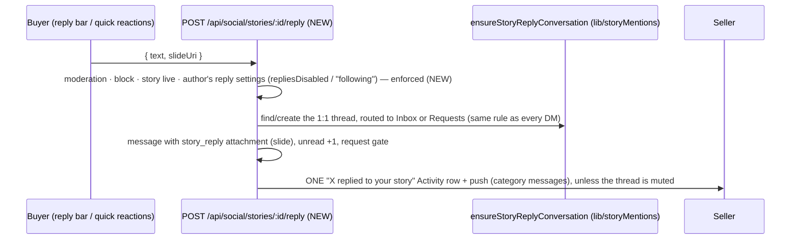
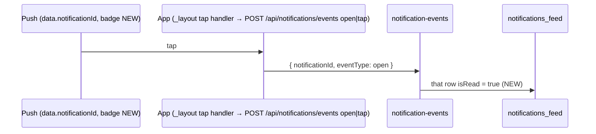

# Social flows — stories, Activity and push (buyer ⇄ seller)

How a story view, story reply, @mention or any Activity event reaches the
other person: in-app Activity, push, badges, and what a tap does.

Out of scope here (covered by open PRs): the buyer notification settings
screen (QA-0057) and its Live and Discover pieces (#698); drop push deep
links, `?id=` vs `dropId` (QA-0082, #699); preview and demo data on fresh
accounts (QA-0038, #700); "@you's" seed copy (QA-0039, #699 and #700); and
the seller Activity screen (#664).

## 1. Story views

```mermaid
sequenceDiagram
  participant B as Buyer (story viewer)
  participant API as POST /api/social/stories/:id/view
  participant DB as story_views (PK story+viewer) · stories.views_count
  participant S as Seller ("Seen by", viewers sheet)
  B->>API: once per story ACTUALLY SHOWN — every story tapped/swiped to (NEW; was only the first)
  API->>API: author's own open → no view (NEW)
  API->>DB: insert ON CONFLICT DO NOTHING; +1 only on a new row
  S->>API: GET /stories/:id/viewers → the buyer, never the seller
```

Before this, `buyer-story-viewer` recorded a view only for the story that
opened it, and sent the same request twice through two helpers. Every later
story in the tray showed 0 views for its author.

## 2. Story replies



| Before | Now |
|---|---|
| The client created a `buyer_to_buyer` conversation even when the author was a seller | The thread type follows the participants (`buyer_to_seller` with a seller) |
| "Replies off" was only a label in the UI | `REPLIES_DISABLED` / `REPLIES_LIMITED` from the server, shown in the error alert |
| The author got a generic "New message" | The author gets "replied to your story", with the slide thumbnail |

## 3. @mentions in post captions

`POST /api/posts` (published and visible) calls `notifyCaptionMentions`, which
sends a `post_mention` Activity row and push to each `@handle`, skipping the
author, blocked pairs and unknown handles, once per person per post. Before,
only comment mentions notified anyone.

## 4. Push preferences

| Event | Category | Buyer pref | Seller pref |
|---|---|---|---|
| follow, like, repost, comment, reply, mention, story like/mention | social | `friend_activity` | `friend_activity` (**NEW**: sellers could not turn it off, because `PUT` rejected the key) |
| DM, story reply | messages | `messages` | `customer_messages` |

Seller Settings › Notifications gained a **Social** row.

## 5. Opening a push, and badges



- A tap used to record only analytics, so the row stayed unread and the
  badge stayed up after the push had taken you there.
- Every push now carries `badge` set to the recipient's unread Activity
  count (the same query as `/unread-count`). Before, no push set a badge,
  so the app icon lagged.

## Test proof

- API, both sides: `artifacts/api-server/src/routes/__tests__/social-activity-e2e.integration.test.ts`
- Browser at 393×852: `artifacts/mobile/e2e/social-stories.spec.ts`. The
  buyer watches two seller stories, and both count for the seller. The buyer
  replies from the viewer; the seller gets the message with the slide and a
  "replied to your story" row on their Activity screen. The seller opening
  their own story adds no view.
