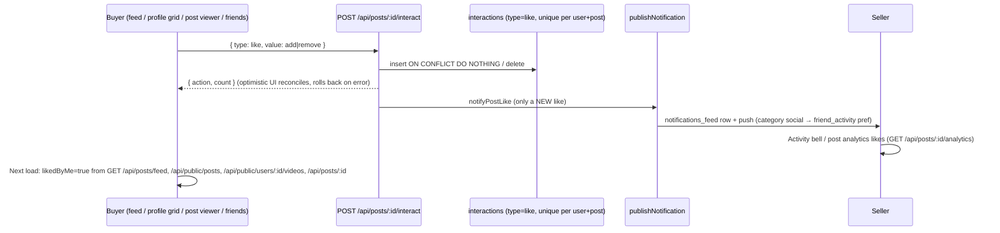
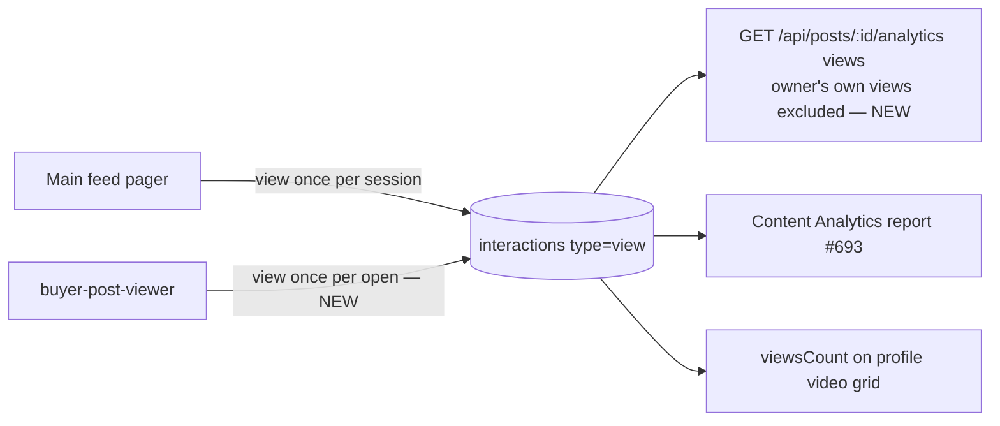
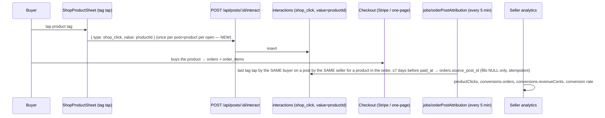

# Social flows — post engagement (buyer ⇄ seller)

How a buyer's like, save, repost, share, comment, view or product-tag tap travels
to the seller, and what each side sees afterwards. Each flow goes
screen → client call → API route → tables → jobs and notifications → the other side.

Out of scope here (covered by open PRs): the Discover post viewer and the
Live feed (#698), the Content Analytics screens (#693, #691), and private
accounts (#637).

## 1. Like / unlike



Client entry points:
- `app/(tabs)/feed.tsx` `handleLike` and `handleDoubleTapLike` (the latter now uses the same rollback and retry queue)
- `app/buyer-post-viewer.tsx` `handleLike` (now calls the real API)
- `app/(buyer)/friends.tsx` `handleLike`

## 2. Save / unsave

```mermaid
sequenceDiagram
  participant B as Buyer
  participant API as POST /api/buyer/saved · DELETE /api/buyer/saved/:id
  participant DB as saved_items (item_type=post)
  participant S as Seller
  B->>API: save / unsave
  API->>DB: insert / delete
  B->>B: savedByMe on every feed endpoint (lib/viewerPostState.ts)
  S->>S: savesCount on the post; saves in post analytics and Content Analytics
```

## 3. Repost / share

```mermaid
sequenceDiagram
  participant B as Buyer
  participant API as POST /api/posts/:id/interact
  participant DB as interactions (repost unique; share recorded per share)
  participant S as Seller
  B->>API: { type: repost, value?: remove } / { type: share }
  API->>DB: insert / delete
  API->>S: notifyRepost (new repost only) → notifications_feed + push
  S->>S: repostsCount, sharesCount; shares in post analytics (new)
```

`buyer-post-viewer` used to send `remove` for every repost of a post the buyer
didn't own, and `friends.tsx` never sent `remove`. Both now send the explicit
direction. Shares from the post viewer and from friends' activity are
recorded only after the share sheet actually shares.

## 4. Comment / reply

`app/buyer-post-comments.tsx` → `POST /api/posts/:id/comments` (`routes/post-comments.ts`) → `post_comments`.
`notifyCommentActivity` sends `post_comment` to the owner, `comment_reply` to
the parent comment's author, and `mention` to anyone @mentioned. Comment
counts come from `visibleCommentCounts` everywhere. They are now also in
`GET /api/posts/:id` and in post analytics. The trending and seller-ranking
jobs now count comments: they weighted `interactions.type='comment'`, which
nothing ever wrote.

## 5. Views



Looped feed copies (`<id>__loopN`) used to fail the UUID check, so their views
and engagement never reached the server. Every call now uses the real post id
(`feedPostId`).

## 6. Product tag → product → order (conversions)



Neither checkout path carries the source post, and checkout is being changed
by other sessions. Attribution is therefore done server-side from data the app
now records. It is last-click within a 7-day window, the same rule
Instagram and TikTok Shop use for "orders from this post".

## 7. "Not interested"

`feed.tsx` / `friends.tsx` → `interact {type: not_interested}` → `feed_not_interested`.
The ranked For You endpoint already honoured it. The general feed
(`GET /api/public/posts`, which backs the Threads tab) now excludes those posts for
that viewer, while the creator's own grid (`?ownerId=`) still lists them.

## 8. Search

`app/buyer-search.tsx` → `GET /api/public/search`:
- Video search now matches `posts.hashtags`, so `#tag` and `tag` both work, and it filters out blocked creators. Previously it didn't apply the block filter.
- Tapping a video result opens that video in the full-screen player. It used to open the author's profile and drop the post id.
- Sample "preview" videos and products only fill an empty result in preview mode. Real accounts used to see them.

## What was broken → fixed

| # | Break | Fix |
|---|---|---|
| 1 | Every feed mapped `likedByMe/savedByMe=false`, so after a reload a liked post looked unliked, the next tap was a server no-op while the UI showed +1, and you could never unlike or unsave | `lib/viewerPostState.ts`, returned by `/api/posts/feed`, `/api/public/posts`, `/api/public/users/:id/videos`, `/api/public/products/:id/feed-videos`, `/api/posts/:id`, and buyer posts; the client mapper reads it |
| 2 | Post viewer Like only toggled a local copy | Real `interact` with rollback |
| 3 | Post viewer Repost sent `remove` | Explicit direction with rollback |
| 4 | Post viewer Save was one-way with a silent local fallback | Save/unsave toggle with rollback |
| 5 | Post viewer couldn't open seller posts from share links, Saved, Collections or Recently watched | `getPostById` falls back to `GET /api/posts/:id` |
| 6 | Friends: un-repost never un-reposted; unsave was local; saved state always started empty; Share and Not interested weren't recorded | All fixed |
| 7 | Feed double-tap like swallowed errors with no rollback | Same contract as tap-like |
| 8 | Looped feed copies were local-only | Real id used for every call |
| 9 | Product clicks were always 0 | `shop_click` recorded on tag tap |
| 10 | Conversions and revenue were always 0 (`source_post_id` never written) | Attribution job |
| 11 | Post analytics had no shares or comments and counted the owner's own views | Added; owner excluded |
| 12 | Ranking jobs' comment weight was always 0 | Counts `post_comments` |
| 13 | "Not interested" posts came back in the Threads feed | Filtered |
| 14 | Search showed sample posts to real users; hashtags weren't searchable; blocked creators appeared in video results; tapping a video opened the profile | All fixed |

## Test proof

`artifacts/api-server/src/routes/__tests__/social-engagement-e2e.integration.test.ts`
covers seller S and buyer A against real Postgres and the real routers, asserting what the other side sees.
