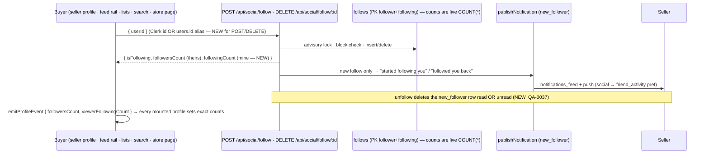

# Social flows — follow (buyer ⇄ seller)

Follow and unfollow between any two accounts (buyer→seller, buyer→buyer,
seller→seller), and how counts, Activity and other screens stay in sync.

Out of scope here (covered by open PRs): private accounts, follow requests and
Close Friends (#637), the Live feed Follow button and `FollowButton` (#698),
and the Discover viewer (#698).

## 1. Follow / unfollow

- `promotePendingRequestsOnFollow` moves a pending message request from the
  followed account into the follower's main inbox (`lib/conversationRouting.ts`, unchanged).
- Block: `POST /api/social/block` removes follows in both directions, and a
  follow attempt then returns `403 BLOCKED` (unchanged).

## 2. Counts — one source of truth

| Count | Source | Who shows it |
|---|---|---|
| Followers / following | `COUNT(*)` on `follows`, live | `GET /api/social/profile/:id`, `GET /api/social/status/:id`, the follow and unfollow responses |
| Posts | `COUNT(*)` of the account's live posts. Now sellers too; it used to be a buyer-only join, so sellers always showed 0 | profile header |
| Viewer's following count after a tap | the follow/unfollow response `followingCount` (NEW) | `(buyer)/profile`, `(tabs)/profile`, `seller-profile` (owner), via `followingCountAfter()` |

Profiles used to adjust Following by ±1 on every follow event. That drifted
whenever the server did nothing ("Follow all" on brands you already follow, a
retry, or a second emitter for the same tap). Events now carry the server's
exact number, and ±1 is only a fallback for events without it.

## 3. Batch follow state

`GET /api/social/status?ids=a,b,c` (up to 100, Clerk ids or aliases) returns
`{ [id]: { isFollowing, isFollowedBy, isMutual } }`. The home feed rail used to
make one `GET /status/:id` per seller on the page, and showed "not following"
until each one returned. It now makes one request (`getSellerFollowStates`).

## 4. Store page Follow

`app/product-store.tsx` is the seller's own "View store page" preview. For
the owner, the Follow button keeps its preview explanation, because you can't
follow yourself. For anyone else it is now a real follow
(`getSellerFollowState` / `setSellerFollowing`) with rollback. It used to be
an alert for everyone.

## What was broken → fixed

| # | Break | Fix |
|---|---|---|
| 1 | `POST /follow` and `DELETE /follow/:id` 404'd or no-op'd on a `users.id` alias, while `GET /status` and `/profile` accepted it | Alias resolved on both |
| 2 | Unfollow only removed the *unread* "started following you" row, so after the seller had seen it, Activity still listed a follower the count no longer had (QA-0037) | Removes it read or unread |
| 3 | A seller's profile post count was always 0 | Counts the seller's live posts, excluding drafts, deleted, archived and moderator-removed |
| 4 | The buyer's own Following count drifted with ±1 guesses | Exact server counts in responses and events |
| 5 | The feed rail made one status request per seller | One batch request |
| 6 | The store page Follow was an alert for non-owners | Real follow |

## Test proof

- API, both sides: `artifacts/api-server/src/routes/__tests__/social-follow-e2e.integration.test.ts`
- Browser, both sides, at 393×852: `artifacts/mobile/e2e/social-follow.spec.ts`
