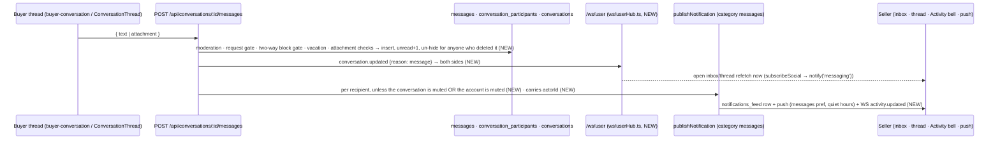
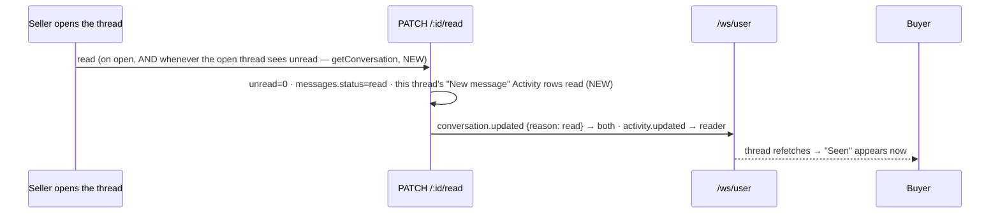

# Social flows — messaging (buyer ⇄ seller)

Every DM path between a buyer and a seller: what each side sees, and how
fast. #696 rebuilds the inbox and thread screens as shared components. These
fixes therefore live in the API and in `services/socialService.ts`, which
those components keep calling, so they work before and after #696.

## 1. Send → the other side sees it (now realtime)

Before this, DMs were poll-only: inbox on focus or every 30 seconds,
messages every 12–15 seconds, typing every 3 seconds. The polls stay as the
safety net. With `REDIS_URL` set, the hub fans out across instances through
Redis pub/sub.

## 2. Read receipts and unread

- Messages that arrived while the thread was open were never marked read, so
  the sender stayed at "sent" and the badge came back after leaving.
  `getConversation()` is called only by the open thread, on load and on its
  focused 3-second poll, so it now marks those read. A pending request is
  never marked read; only accepting it does that.
- The buyer tab badge adds unread conversations to unread Activity rows, and
  every DM also writes a `messages` Activity row. Reading the thread now
  clears those rows too, so a message counts once and the badge clears.

## 3. Typing

`PATCH /:id/typing` now also sends `conversation.updated {reason: typing}` to
the other side. Threads keep their 3-second `otherTyping` poll for the
indicator itself.

## 4. Archive and Delete are per viewer (migration 131)

| Action | Before | Now |
|---|---|---|
| Archive (swipe or menu) | Local storage only; reverted on the next refresh (server always returned `isArchived:false`) | `PATCH /:id/archive {archived}` sets `conversation_participants.archived_at` for that viewer only |
| Delete chat / decline request | **Hard-deleted the conversation for both sides**: a buyer deleting erased the seller's order thread, and any reported-message evidence | `DELETE /:id` sets `hidden_at` and `history_cleared_at` for that viewer only. A new message brings the chat back with only new history. The rows are removed once every member has deleted it and nothing in it is under report |

## 5. Inbox correctness

- **Previews** never show a moderator-removed, deleted or expired
  (disappearing) message, or one from before the viewer cleared the chat.
  They used to show the raw latest message.
- **Blocked 1:1 threads** leave both inboxes and return on unblock. The send
  gate was already enforced.

## 6. Cards in chat

| Card | Rule now |
|---|---|
| Order | Only the **other party on that order**: the seller to that order's buyer, or the buyer to that order's seller. Before, a seller could attach *any* of their orders to *any* chat, and the card showed that order's live status and tracking to an unrelated buyer |
| Post | Any public post can be shared into any DM (the share sheet's friends row). It used to return 403 in every friend DM ("Could not share this post") |
| Product | Unchanged: own product, or the seller's product in a seller chat |

## 7. Mute

| Mute | Where | Effect |
|---|---|---|
| Conversation mute (chat details) | `PATCH /:id/mute` (existing) | No push or Activity for that thread |
| **Account mute** (inbox swipe, profile ⋯, story ⋯, Discover) | `GET/POST/DELETE /api/social/mutes` (NEW, table `account_mutes`) | The muted account's DMs stop notifying, their posts leave the Following feed, and their stories leave the tray. Never visible to them. It used to live only in this device's storage and change nothing server-side: the swipe said "Muted X" while every message kept pushing |

## Test proof

- API, both sides, with a real `/ws/user` socket per user:
  `artifacts/api-server/src/routes/__tests__/social-messaging-e2e.integration.test.ts`
- Browser at 393×852: `artifacts/mobile/e2e/social-messaging.spec.ts`. The
  seller replies; the buyer's open inbox updates in under 100ms and the open
  thread in about 200ms; the buyer reading reaches the seller as `read`.
