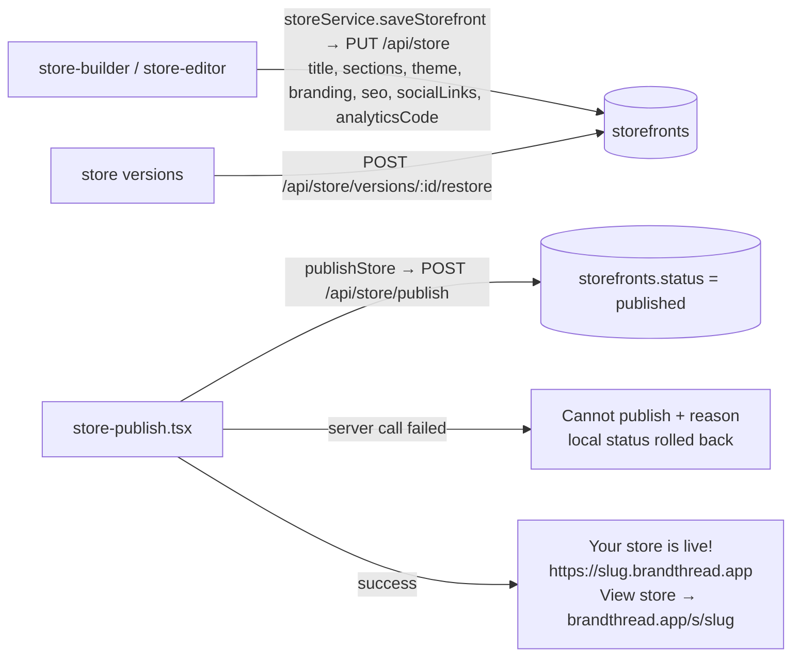
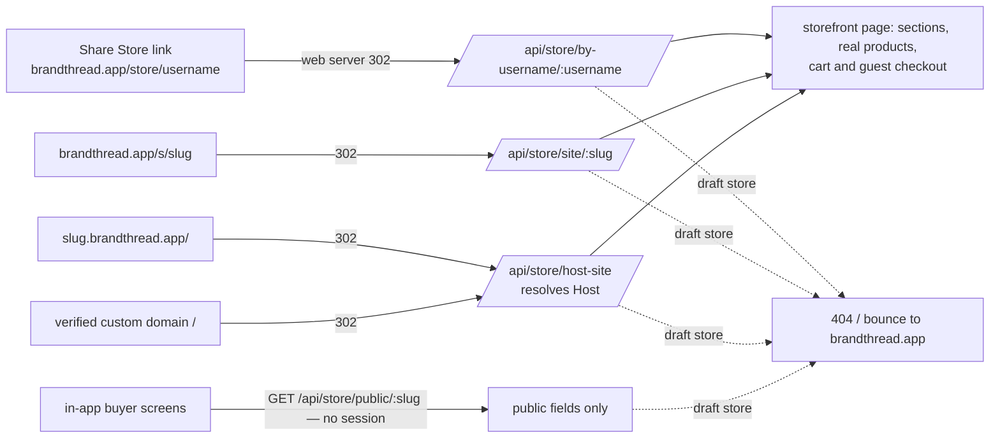
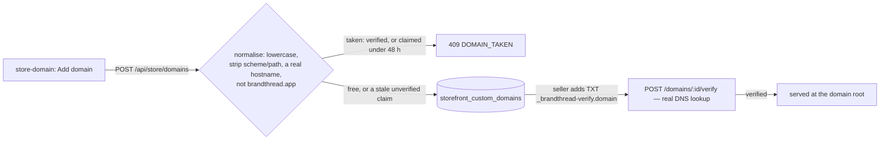

# Store builder → publish → domains → buyers

## Build and publish (seller)

## Buyers reach the published store

## Custom domains

## Breaks found and fixed

| # | Break | Fix |
|---|---|---|
| 1 | **Buyers could not reach a published store.** The Share Store link `brandthread.app/store/<username>` had no handler. Nothing served `<slug>.brandthread.app` or a verified custom domain. The only working address was `/api/store/site/<random slug>`, which nothing linked to. | `/api/store/by-username/:username` and `/api/store/host-site` (resolves the Host header). The web server (`server/storefrontRedirects.js`) redirects `/store/<username>`, `/s/<slug>`, store subdomains and custom-domain roots to them. Only published stores are ever served. |
| 2 | `GET /api/store/public/:slug` is meant to be public but sat **after `requireAuth`**, so signed-out buyers got 401. It also returned the **whole row**: preview-share token hash, analytics code, and other owner-only fields. | A public handler before `requireAuth` returns `publicStorefrontView` (public fields only). The old handler, now unreachable, can be deleted once #699 merges; it was left untouched to avoid a conflict. |
| 3 | **Social links and the analytics code never saved.** `PUT /api/store` and version restore wrote `social_links` / `analytics_code`, which Drizzle's `.set()` silently ignores. | They're mapped to the schema keys. |
| 4 | The publish screen showed and opened **`slug.brandthread.app.brandthread.app`** (before screenshot). | `lib/storeAddress.ts` normalises the host. "View store" opens `brandthread.app/s/<slug>`, which works without DNS. |
| 5 | **Publish reported "Your store is now live" even when the server call failed**, so the store stayed a draft to buyers. | The failure is returned (`Cannot publish: …`) and the local status rolls back. |
| 6 | **Domain squatting and a 500 on duplicates.** Domains weren't normalised; the column is globally unique even while unverified, so a duplicate threw a unique violation, and anyone could park a brand's real domain by adding it and never verifying. | Normalise and validate (400). A domain that's verified or freshly claimed by another store returns 409 `DOMAIN_TAKEN`. Unverified claims older than 48 hours are released. |
| 7 | `ad-campaigns.test.ts`: 19 tests were red on dev. The route gained `requirePermission("marketing")`, which reads Clerk directly, and the test never stubbed it. | The test stubs it, and 64/64 pass. Team gating has its own suite (#703). |

## Setup Dev needs, outside the code
- **`*.brandthread.app` subdomains:** a wildcard DNS record (`*.brandthread.app` CNAME to the deployment) plus a wildcard TLS certificate on the deployment. Until then, use `brandthread.app/s/<slug>` and the Share Store link, which already work.
- **Custom domains:** the seller adds the TXT record (verified in-app) and a CNAME to the deployment, and the deployment needs a TLS certificate for that domain (Replit Deployments → Custom domains).

## Tests
- `routes/__tests__/store-publish-buyer-reach.integration.test.ts` (real store router and Postgres; only identity is a header) checks:
  1. Social links and the analytics code persist.
  2. A draft store is invisible on every buyer path.
  3. Once published, a **signed-out** buyer gets public JSON without owner-only fields, the Share Store page (username case-insensitive), and the subdomain page. `www` never resolves to a store.
  4. Custom domains are normalised and verified before they're served, are never double-claimed, and stale squats are released.
- `server/storefrontRedirects.test.ts` covers the web-server redirects, and that app hosts are never treated as stores. `lib/__tests__/storeAddress.test.ts` covers the address helper.
- Playwright at 390×844 (`node artifacts/mobile/scripts/flows/store-publish-verify.mjs`) shows the address exactly once. The build from before the change shows the doubled address.
