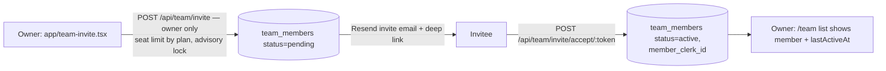
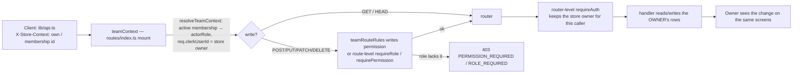

# Team and roles: invite → join → act on the owner's store

## Invite and join

## Every seller request

The rules live in `middlewares/teamRouteRules.ts`. `teamContext()` is already mounted on every seller router, and it applies the rule for the mount it runs on (`req.baseUrl`), so `routes/index.ts` is unchanged. Buyer-side or personal actions by someone who also works on a team (Live chat, reviews, posts, waitlists, discount validation at checkout, AI assistant history, freelancer profile, notification prefs) are `self` rules. They always act as the signed-in person.

## Permission map (server, `middlewares/requireRole.ts` → `ROLE_PERMISSIONS`)

| Router (mount) | Gate |
|---|---|
| products, inventory, drops | `requireRole("manager")` (existing) |
| orders, shipping-labels, shipping-zones, package-presets, shopify | `requireRole("staff")` (existing). Marketing and finance now rank below staff. |
| discount-codes, ad-campaigns | `requirePermission("marketing")` (existing) |
| finance, thread-cash cash-out, seller/connect | `payouts` or owner (existing) |
| **store, store/ai, bundles, seller profile, seller settings/locations/metafields, vacation, integrations, shopify-imports, waitlist (seller side), seller-hub, sample-orders, manufacturers/connect** | **writes need `products`** (new) |
| **returns, disputes, shipping-rates** | **writes need `orders`** (new) |
| **customers** | **writes need `customers`** (new) |
| **boosts, meta-ads** | **writes need `marketing`** (new) |
| **taxes, drop-wallets** | **writes need `payouts`** (new) |
| **seller/verification** | **writes owner only** (new) |

## Breaks found and fixed

| # | Break | Fix |
|---|---|---|
| 1 | **P0.** `teamContext()` at the mount switched `req.clerkUserId` to the store owner, then each router's own `requireAuth` reset it to the caller. A permitted manager's reads and writes hit **their own empty store** in about 35 routers. Tests stubbed `requireAuth`, which hid it. | `requireAuth` keeps the owner when the team context belongs to the same caller, unless the route acts as self. |
| 2 | Once break 1 is fixed, routers with **no write gate** would let a `viewer` publish the store, change returns and disputes, buy boosts, launch Meta ads, change taxes, and so on. | `writes` rules in `teamRouteRules.ts` (table above). |
| 3 | `marketing` and `finance` ranked as staff, so they passed order status, tracking, label and shipping-zone gates without any orders permission. | Ranked 0 (like viewer) for the legacy hierarchy. Their capability gates are unchanged. |
| 4 | Fixing break 1 alone would have made a team member's Live chat, reviews, posts, waitlist joins and discount validation act **as the owner**. The client sends `X-Store-Context` on every request. | `self` / `selfPaths` rules keep today's behaviour. |

## Tests

`routes/__tests__/team-store-context-e2e.integration.test.ts` runs the **real** `routes/index.ts`, the real middlewares and Postgres; only Clerk `getAuth` is stubbed. It checks:
1. A manager's store edit lands on the owner's storefront, and the owner sees it.
2. A viewer can read but gets 403 on writing.
3. The newly gated writes return 403 for the wrong role.
4. A marketing member gets 403 on order status.
5. A viewer's Live comment is stored as the viewer.
6. The owner keeps full access.
