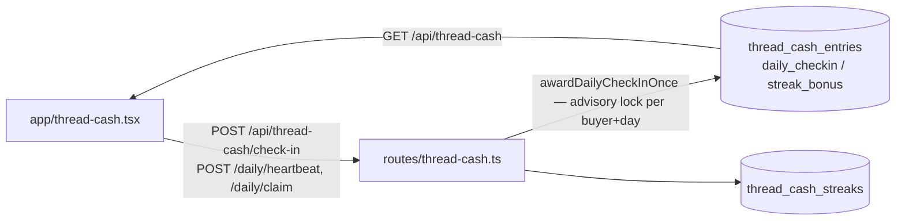
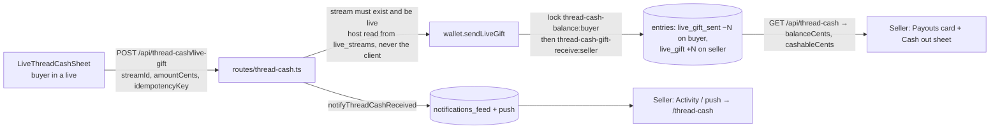
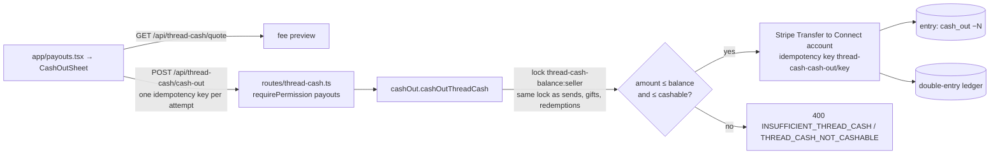

# Thread Cash: earn, gift in Live, balance, cash out

One ledger, `thread_cash_entries`, holds signed cent entries; every account's balance is `SUM(amount_cents)`. Buyers and sellers use the same endpoints: the ledger is per account, not per role.

## Earn (buyer)

## Gift in a Live (buyer → seller)

## Cash out (seller)

**Cashable** is `min(balance, earned − cashed out)`. Earned means the `live_gift` and `send_received` sources. Reward credit (check-ins, streaks, refunds, admin adjustments) can be spent in the app but never cashed out.

## Breaks found and fixed

| # | Break | Fix |
|---|---|---|
| 1 | Cash-out checked the **whole** balance, so a seller could turn free daily-check-in and streak credit into real Stripe transfers. | New `getCashableBalanceCents` is enforced in `cashOutThreadCash` (`THREAD_CASH_NOT_CASHABLE`). `GET /api/thread-cash` returns `cashableCents`, and the Cash out sheet caps at it. |
| 2 | Cash-out locked `thread-cash-cash-out:<id>` while sends, gifts and redemptions locked `thread-cash-balance:<id>`. A cash-out racing a gift could both pass the balance check, leaving a negative balance after a real transfer. | Cash-out takes the shared balance lock (`balanceLockKey`). A test reproduces −150 on the old code. |
| 3 | Idempotency keys are unique across **all** users, but lookups weren't scoped. A reused key replayed another seller's cash-out, or reported "gift sent" with nothing debited. | Both lookups check the owner and source of the entry; a mismatch returns `409 THREAD_CASH_IDEMPOTENCY_KEY_REUSED`. |
| 4 | Gifts were accepted into **ended** streams, and a non-UUID `streamId` caused a 500 (`::uuid` cast). | `409 LIVE_STREAM_NOT_LIVE` / `404`. |
| 5 | The seller's daily receive cap was checked under the buyer's lock only, so concurrent gifts from different buyers exceeded it (7,500 vs a 5,000 cap in the test). | Seller-scoped receive lock, always taken after the buyer's balance lock, so it can't deadlock. |
| 6 | The Cash out sheet minted a new idempotency key on every tap, so a retry after a lost response could pay twice. | One key per attempt, kept across retries and reset when the amount changes or the sheet reopens. |
| 7 | Existing tests were red on dev: the cash-out cleanup deleted from the append-only ledger, and two live-gift tests asserted the wrong row or the wrong cap. | Tests corrected. |

## Tests

- `lib/threadCash/__tests__/cashOut.integration.test.ts`: reward credit is never cashable, a mixed balance cashes out only what was earned, a reused key never replays another user's cash-out, and a cash-out racing a live gift can't overdraw.
- `routes/__tests__/thread-cash-live-gift.integration.test.ts`: cross-user key reuse is refused, and concurrent gifts from 8 buyers stay within the seller's receive cap.
- `routes/__tests__/thread-cash-live-two-sided.integration.test.ts` drives both sides through the real routes and Postgres:
  1. The seller's reward credit can't be cashed out.
  2. Gifts into an ended or invalid live are refused.
  3. A buyer's gift shows on the seller's wallet as cashable, the seller is notified, and a retried tap doesn't charge twice.
  4. The seller cashes out exactly what was earned, and the transfer goes to their Connect account.
