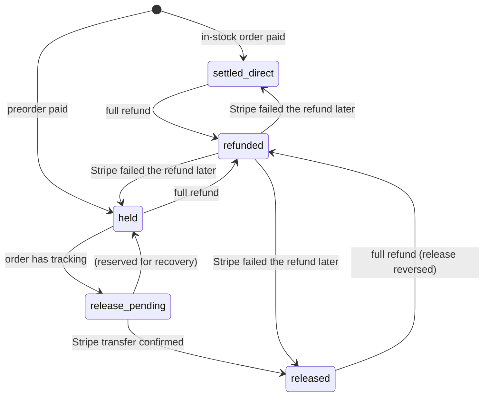
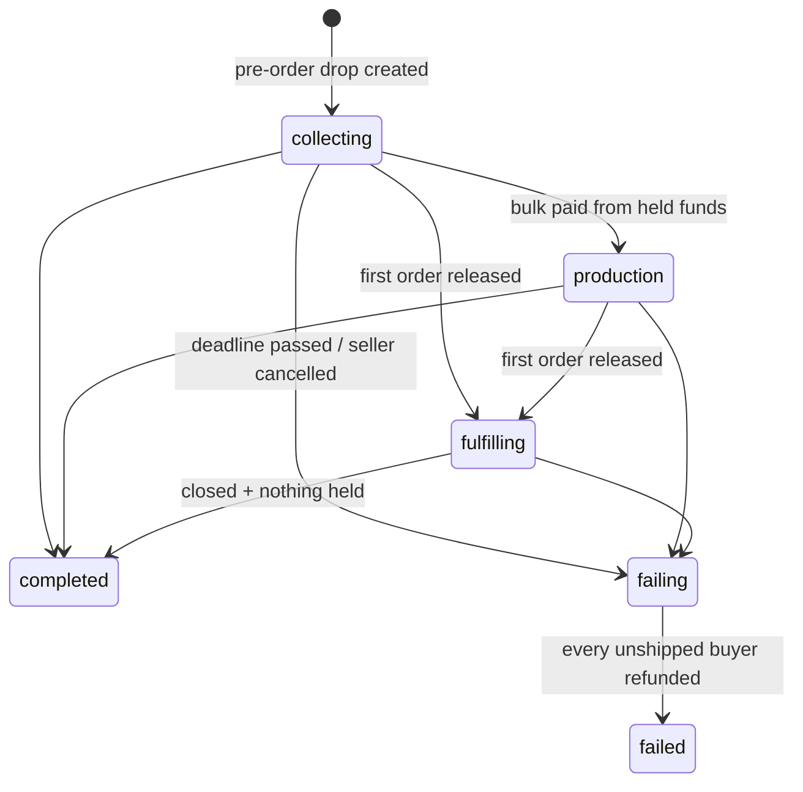
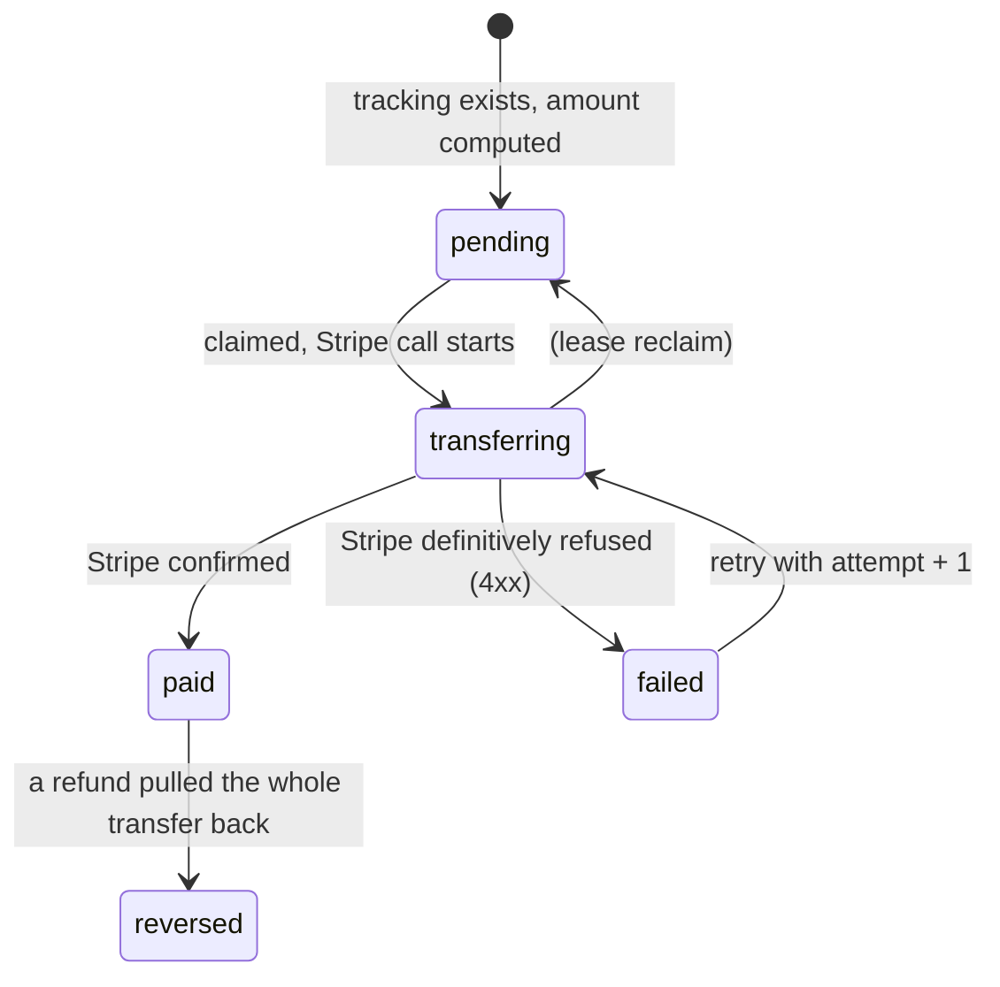

# Brandthread money flow

How money moves through Brandthread, every state it can be in, and what was
wrong before this change. Amounts are always **integer cents** (see
`replit.md`). The code lives in `artifacts/api-server/src/lib/money/`.

- [1. The owner's rules](#1-the-owners-rules)
- [2. The flows in plain English](#2-the-flows-in-plain-english)
- [3. Fees and rounding](#3-fees-and-rounding)
- [4. State machines](#4-state-machines)
- [5. The ledger](#5-the-ledger)
- [6. Webhooks](#6-webhooks)
- [7. Scheduled jobs](#7-scheduled-jobs)
- [8. Stripe limits and what the owner must confirm](#8-stripe-limits-and-what-the-owner-must-confirm)
- [9. Audit: bugs and gaps found](#9-audit-bugs-and-gaps-found)
- [10. Operating it](#10-operating-it)

---

## 1. The owner's rules

| Rule | Where it is enforced |
|---|---|
| Brandthread takes 5% of each sale plus standard Stripe processing, via Stripe Connect. | `fees.ts`, `checkoutPlan.ts`, `escrow.recordOrderPaid` |
| In-stock orders pay out normally. | Destination charge straight to the seller's Stripe account (`checkoutPlan.ts`). |
| Preorder drop money is **held** by Brandthread, even after Stripe confirms the payment. | Separate charge on the platform, `funds_state = held` (`escrow.recordOrderPaid`). |
| From held funds the seller pays the manufacturer's bulk card and buys shipping labels in-app. | `sample-orders.ts` pay-from-wallet → `recordBulkPaidFromHeld`; `shipping-labels.ts` → `recordLabelPurchased`. |
| Each order's money is released only when **that** order's tracking number exists, one order at a time, never a lump sum. | `escrow.requestOrderRelease` / `executeOrderRelease`, triggered by tracking or a bought label. |
| If a drop fails (bulk never delivered or deadline passes), buyers are refunded automatically. | `dropLifecycle.failDrop`, run by the `moneySweep` job and `POST /api/drops/:id/cancel-preorders`. |
| No Shopify-style arbitrary holds. | Removed the code that switched a seller's whole Stripe account to manual payouts. In-stock money is never held. |
| Manufacturers are paid through Stripe Connect (international). | Existing manufacturer Connect onboarding; bulk from held funds is a Stripe transfer. See §8 for cross-border limits. |

## 2. The flows in plain English

### 2.1 In-stock order (paid straight to the seller)

1. The buyer checks out. The server looks at the products: none belong to a preorder drop, so this is a **destination charge**.
2. Stripe charges the buyer and immediately moves the money to the seller's Stripe account, minus an
   *application fee* = 5% of merchandise + an estimate of Stripe's fee (2.9% + 30¢ of the pre-tax total).
3. The webhook creates the order, records the split, and posts the ledger entry `order_paid_direct`
   (`funds_state = settled_direct`).
4. If the seller buys a label in-app, Brandthread pays the carrier and recovers the cost by reversing that
   much of the order's transfer. If recovery fails, the seller's finance screen shows it as owed.

### 2.2 Preorder drop (held by Brandthread)

1. The seller creates a *pre-order* drop with a **fulfillment deadline** (default: estimated ship date + 30
   days; at most 180 days away). Its escrow state starts as `collecting`.
2. A buyer checks out a product from that drop. The server (not the app) decides this is a **held** charge:
   no `transfer_data`, and the money lands on Brandthread's balance, grouped under `transfer_group = drop_<id>`.
3. The webhook creates the order and, **in the same database transaction**, records the seller's net
   (gross − 5% − Stripe's exact fee from the balance transaction), deposits it in the drop wallet and posts
   `order_paid_held` (`funds_state = held`).
4. The seller pays the manufacturer's **bulk card** from the drop's held money (a Stripe transfer to the
   manufacturer's Connect account). The drop moves to `production`. The cost sits against the drop as a
   whole until orders ship.
5. For each order, the seller buys a label in-app. The label is paid from **that order's** held money.
6. The moment that order has a tracking number (from the label or typed in), its release runs:
   - release = that order's remaining held money − its **running pro-rata share of the bulk cost**;
   - one Stripe transfer to the seller, with `source_transaction` set to that order's own charge.
   The drop moves to `fulfilling`. Other orders are not touched.
7. When the drop is closed for sale and every order is released or refunded, the drop is `completed`.

### 2.3 Failed drop

If the deadline passes while any order is still unshipped, or the seller cancels the drop, the drop moves to
`failing`. Every unshipped buyer is refunded in full, the order is cancelled with a clear note, and loyalty
points are reversed. Orders that already shipped keep their release. When nothing is left, the drop is
`failed`.

If the bulk order was already paid from held money, the buyers still get all their money back; the
difference shows as a **shortfall the seller owes** (see §8, item 9 for how it gets collected).

### 2.4 Refunds (all of them)

Buyer cancellation, seller cancellation, approved return, failed drop and oversold order all go through
`refunds.refundOrder`:

- The amount is checked against what is still refundable, so refunds can never exceed the charge.
- In-stock orders: `reverse_transfer: true` pulls the seller's share back, and Brandthread returns its 5%
  proportionally (application-fee refund). Stripe keeps its processing fee, so the seller bears it.
- Held orders: the refund comes out of that order's held money. If the order was already released, that
  release transfer is reversed. Anything that cannot be covered becomes a drop shortfall.
- A full cancellation parks the order in `refund_pending` while Stripe works. On success it is cancelled
  and restocked; if Stripe refuses, it goes back to its previous status.
- Repeating a refund with the same key returns the first refund and never pays twice.

## 3. Fees and rounding

All in `fees.ts`, integer arithmetic only (basis points, `BigInt` for safety):

| Quantity | Rule |
|---|---|
| Platform fee | 5% of merchandise after discounts (not tax, not shipping), rounded **half-up** to the cent. `$10.10 → 51¢`, `9¢ → 0¢`, `10¢ → 1¢`. |
| Processing, in-stock | Estimated at session creation: 2.9% of the pre-tax total, half-up, + 30¢. The ledger records the difference from Stripe's actual fee as `processing_fee_variance`. |
| Processing, held | Stripe's exact fee from the charge's balance transaction. |
| Caps | Fees can never exceed the charge; the seller's net is never negative. |
| Refund of the 5% | Proportional to the refunded amount, half-up, never more than what is left unreturned. |
| Bulk cost per order | Running pro-rata: the bulk cost not yet charged is split across the orders still waiting, by their held amount. The last order takes the exact remainder, so shares always add up to the bulk cost to the cent. |

A test checks that the platform fee equals an exact decimal half-up reference for every amount from $0.00 to $1,000.00.

## 4. State machines

Defined once in `stateMachines.ts`. Every database change uses a conditional update
(`… WHERE state = <from>`), so illegal moves are impossible and replays are no-ops. Unit tests pin down the
exact set of allowed edges.

### 4.1 Order funds (`orders.funds_state`)



Partial refunds do not change the state; they add to `orders.refunded_cents`.

### 4.2 Drop escrow (`drops.escrow_state`, pre-order drops only)



New preorders are accepted only in `collecting`, before the deadline. Buyers can cancel a preorder only while
the drop is `collecting`. Bulk payments from held money are allowed only while the drop is open.

### 4.3 Per-order release (`order_releases.state`)



- Idempotency key: `order-release/<orderId>/<attempt>`. An ambiguous failure (network, 5xx) stays
  `transferring` and is retried with the **same** key after a 2-minute lease, so Stripe returns the original
  transfer instead of paying twice. Only a definitive 4xx bumps the attempt.
- A seller without a connected Stripe account stays `pending` (`SELLER_ACCOUNT_NOT_READY`) and is paid by
  the sweep once they connect.

### 4.4 Refund (`order_refunds.state`)

```mermaid
stateDiagram-v2
  [*] --> processing
  processing --> succeeded: Stripe accepted; ledger posted once
  processing --> failed: Stripe refused; order status restored
  failed --> processing: retried with the same key, attempt + 1
  succeeded --> failed: Stripe failed it later; ledger reversed
```



### 4.5 Order status (`orders.status`, buyer-facing)

Kept separate from money so a label change can never move money.

| From | Allowed to |
|---|---|
| pending / processing / fulfilled | each other, `label_purchasing`, `shipped`, `cancelled`, `refund_pending` |
| label_purchasing | pending, processing, fulfilled, shipped |
| shipped | delivered, cancelled *(only a completed full return refund; the seller endpoint refuses it)* |
| delivered | cancelled *(same)* |
| refund_pending | cancelled, or back to pending / processing / fulfilled if Stripe refuses |
| cancelled | — (final) |

A preorder cannot be marked `shipped` without a tracking number.

## 5. The ledger

`ledger_transactions` + `ledger_postings` (migration `084`):

- **Double entry.** Each business event is one transaction whose postings sum to zero. A deferred
  constraint trigger rejects any unbalanced transaction at commit.
- **Append-only.** Triggers reject every UPDATE and DELETE. Corrections are new, opposite transactions (for
  example `refund_failed_after_success`).
- **Idempotent.** Each event has a deterministic key (`order-paid/<order>`, `order-release/<order>`,
  `label/<label>`, `bulk-payment/<sampleOrder>`, `order-refund/<refund>` …), so replays never post twice.
- **Posted in the same database transaction** as the state change it describes.

| Account | Meaning |
|---|---|
| `buyer_payments` | Money in from buyers (negative) / refunded to them (positive). |
| `seller_held` | Preorder money held for a seller, per drop and per order. Drop-level (no order) entries hold the bulk cost until it is charged to shipped orders. |
| `seller_paid_out` | Money sent to the seller's Stripe account. |
| `platform_revenue` | Brandthread's 5%. |
| `stripe_processing_fees` | Stripe's fees. |
| `processing_fee_variance` | In-stock processing estimate minus Stripe's real fee. |
| `platform_funds_advanced` | Money Brandthread fronted for a seller (negative = the seller owes it). |
| `manufacturer_paid` | Paid to a manufacturer. |
| `shipping_carrier` | Paid for labels. |
| `seller_card_payments` | A seller's own card paying a sample or bulk card. |
| `legacy_opening` | Opening balances for money held before the ledger existed. |

`drop_wallets` is kept as a friendly, cached view: `balance − released = ledger seller_held for the drop`,
and `reserved` = amounts in flight. The tests check this after every scenario.

## 6. Webhooks

`POST /api/webhooks/stripe`:

1. **Signature**: `stripe.webhooks.constructEvent` with `STRIPE_WEBHOOK_SECRET`. A forged or tampered body is
   rejected with 400 before anything is recorded.
2. **Replay of a captured request**: Stripe's signature includes a timestamp; anything older than the SDK
   tolerance (5 minutes) is rejected.
3. **Wrong mode**: a live event on a test key (or the reverse) is rejected (`LIVEMODE_MISMATCH`).
4. **Duplicates**: the existing `stripe_webhook_events` ledger claims each event id once (with a lease for
   concurrent deliveries). On top of that, every money handler is idempotent on its own (unique checkout
   session per order, ledger keys, conditional state updates), so even a *different* event about the same
   payment cannot double-count.
5. **Stripe unreachable**: if the charge details cannot be fetched, the handler fails, the event is marked
   failed and Stripe retries; no order is recorded with a guessed fee.

| Event | Money handling |
|---|---|
| `checkout.session.completed` / `async_payment_succeeded` | Create the order + fee split + ledger + held deposit, atomically. Oversold → automatic refund. |
| `charge.refunded` | Manufacturer card reversal as before. For buyer orders, records refunds made **outside** Brandthread (Stripe dashboard) so the books match Stripe. |
| `charge.refund.updated` (status `failed`) | A refund Stripe accepted then failed: reverse its ledger entry and restore the order's refunded total. |
| `transfer.created/updated/reversed` | Manufacturer bulk payment from held funds (+ ledger). |

## 7. Scheduled jobs

`jobs/moneySweep.ts`, every 5 minutes, fully idempotent:

1. Drops past their deadline with unshipped orders → `failDrop` (automatic refunds). Drops past the deadline
   with everything shipped → `completed`.
2. Drops stuck in `failing` → retry the remaining refunds.
3. Releases left `pending` / `failed` / stale `transferring` → finish them (same idempotency key).
4. Held orders that have tracking but no release (for example, a crash between tracking and release) → release.
5. In-stock label costs not yet recovered → retry recovery.

## 8. Stripe limits and what the owner must confirm

Research notes (September 2026; Stripe's docs site was not reachable from the build sandbox, so these come
from Stripe documentation excerpts, search results, and card-network rules; each is linked below):

- **Separate charges and transfers** let the platform charge first and transfer later, to one or more
  connected accounts. A transfer with `source_transaction` can never exceed that charge and waits until the
  charge's funds are available. This is what the design uses for held preorders.
- **Manual payouts** (holding money in the *connected account's* balance) have hard limits: **2 years in the
  US, 90 days in most other countries, 10 days in Thailand.** The design does **not** rely on this; held
  money stays on the platform balance until each order ships.
- **Funds segregation** (private preview) can keep separate-charge money in a protected holding state that
  can only be transferred to connected accounts. It is available on request.
- **Cross-border**: transfers generally require the platform and connected account to be in the same region
  (US/CA/UK/EEA/CH are interoperable). For other countries, `recipient` accounts and Global Payouts apply.
  Recipient accounts cannot process payments, and transfers to them take an extra 24 hours.
- **Disputes on preorders**: cardholders can dispute "not received" up to **120 days after the expected
  delivery date, up to 540 days from purchase**. Long preorder windows extend Brandthread's chargeback exposure.
- Stripe may place a **reserve** on accounts with delayed-fulfillment risk (preorders are named explicitly).

**Design choices made to stay inside these limits**

- Held money never sits in a seller's Stripe balance, so no manual-payout limit applies and sellers'
  in-stock payouts are never held.
- Preorder deadlines are capped at **180 days** (`MAX_PREORDER_HOLD_DAYS`), well inside the dispute window
  and before card refunds get unreliable. Past the deadline, buyers are refunded automatically.
- Every release uses `source_transaction`, so it is tied to that buyer's charge and never spends someone
  else's money.

**The owner must confirm with Stripe before long drops go live**

1. That holding preorder money on the **platform balance** for up to 180 days (separate charges and
   transfers) is acceptable for Brandthread's account, and whether Stripe will require a reserve.
2. Whether to enable **funds segregation** so held buyer money is protected from platform operations.
3. That `transfers.create` with `source_transaction` has **no maximum age** relative to the charge (for
   180-day drops).
4. **Which countries sellers and manufacturers are in.** Sellers outside the US/CA/UK/EEA/CH region, and
   manufacturers outside it, need cross-border payouts or Global Payouts. Confirm the manufacturer Connect
   account type and service agreement (`recipient` vs `full`). The bulk-payment transfer to a manufacturer
   is a cross-border transfer when the manufacturer is abroad.
5. **Stripe Tax on held charges.** Checkout sets `automatic_tax.liability` to the seller's account even
   though the preorder charge is on the platform (no `on_behalf_of`). Confirm this is valid and who files
   and remits that tax. Held-order tax is currently included in the seller's released amount.
6. **Processing fee pass-through.** The in-stock estimate uses 2.9% + 30¢ (US cards). Confirm Brandthread's
   actual pricing (international cards, currency conversion, IC+). The constants are `STRIPE_PROCESSING_BPS`
   and `STRIPE_PROCESSING_FIXED_CENTS`.
7. **Negative balances.** Label recovery and refund clawbacks reverse transfers from Express accounts.
   Confirm the platform's liability when a seller's balance is insufficient, and whether account debits
   are enabled.
8. **Disputes on held orders** land on the platform charge. Decide whether the disputed amount is deducted
   from the drop or the order's release (today: recorded by the existing disputes flow, not deducted).
9. **Collecting what sellers owe** (a failed drop's shortfall, unrecovered labels). It is recorded and shown
   to the seller, but not collected automatically. Decide the policy: deduct from future releases, account
   debits, or invoices.
10. **Who bears Stripe's fee on a refund.** Today the seller does (Stripe keeps it). Confirm that policy,
    especially for failed drops.

Sources:
[Separate charges and transfers](https://docs.stripe.com/connect/separate-charges-and-transfers) ·
[Accept a payment with separate charges and transfers](https://docs.stripe.com/connect/marketplace/tasks/accept-payment/separate-charges-and-transfers) ·
[Funds segregation](https://docs.stripe.com/connect/funds-segregation) ·
[Manual payouts](https://docs.stripe.com/connect/manual-payouts) ·
[Payouts to connected accounts](https://docs.stripe.com/connect/payouts-connected-accounts) ·
[Cross-border payouts](https://docs.stripe.com/connect/cross-border-payouts) ·
[Service agreement types](https://docs.stripe.com/connect/service-agreement-types) ·
[Account balances](https://docs.stripe.com/connect/account-balances) ·
[Risk management with Connect](https://docs.stripe.com/connect/risk-management) ·
[Disputes](https://docs.stripe.com/disputes) ·
[Chargeback time limits (120/540 days)](https://stripe.com/zh-my/resources/more/chargeback-time-limits-in-the-uk) ·
[Reserves FAQ](https://support.stripe.com/questions/reserves-frequently-asked-questions)

## 9. Audit: bugs and gaps found

Severity is about money: *Critical* = money can be taken or lost; *High* = wrong party pays or funds are
stranded; *Medium* = incorrect balances or missing safety; *Low* = hygiene.

| # | Severity | Problem found | Status |
|---|---|---|---|
| 1 | Critical | Any seller could credit their own drop wallet with any amount (`POST /drop-wallets/:id/deposit`) and then "release" it as a real Stripe transfer of Brandthread's money. | **Fixed**: endpoint returns 410; deposits happen only from a paid Stripe checkout. |
| 2 | Critical | Preorder holding was decided by a client-sent `dropId`. The app never sent it, so **no preorder money was ever held** (all went straight to sellers). Anyone could also send any `dropId` to put an in-stock charge on the platform balance. | **Fixed**: the server decides from the products; mixed carts are refused; a client `dropId` is only checked. |
| 3 | Critical | Refunds on in-stock (destination) charges did not reverse the transfer. **Brandthread paid every buyer cancellation, return and oversold refund** while the seller kept the money. | **Fixed**: `reverse_transfer` + proportional 5% return. |
| 4 | High | Seller cancellation (`PATCH /orders/:id/status` → cancelled) did not refund the buyer or restock. | **Fixed**: refund first; cancel only on success. |
| 5 | High | Approving a return had no status guard (approving twice refunded twice), no amount validation or cap, and cancelled the order even on a partial refund. | **Fixed**: one refund per return, capped, partial returns keep the order open. |
| 6 | High | The held-funds deposit ran after the order transaction, was skipped when the seller had not pre-created a wallet, and errors were swallowed. Held money could go unrecorded. | **Fixed**: in the order transaction; the wallet is created automatically. |
| 7 | High | Wallets were credited the **subtotal** only. Shipping and tax on preorders were stranded on the platform, and the 5% was taken again at release. | **Fixed**: held amount = gross − 5% − Stripe's exact fee. |
| 8 | High | Auto-release on ship had no Stripe idempotency key, used a different path from manual release (a second transfer was possible after a crash), and called Stripe while holding a DB transaction. | **Fixed**: single release path, deterministic keys, crash-safe phases. |
| 9 | High | Releases ignored money already spent from the pool (bulk payment, labels), so later orders could be unpayable or earlier ones overpaid. Label reservations never cleared. | **Fixed**: per-order label + running pro-rata bulk share. |
| 10 | High | Creating a drop wallet switched the seller's **entire** Stripe account to manual payouts: a blanket hold on all their in-stock money. | **Removed.** |
| 11 | Medium | `pay-shipping` reserved wallet money and marked the order shipped without buying a label or paying anyone; the reservation never cleared. | **Removed** (in-app labels only). |
| 12 | Medium | In-stock label costs were paid by Brandthread and never recovered, yet every "spent" label was subtracted from the seller's cash-out balance **forever**, while automatic payouts ignored it. | **Fixed**: recovered by transfer reversal; only in-flight labels reduce cash-out. |
| 13 | Medium | Brandthread kept only 5% on in-stock sales while paying Stripe's processing fee itself (owner's rule: 5% **plus** processing). | **Fixed**: processing passed through (estimate on in-stock, exact on held). |
| 14 | Medium | Fees used float multiplication (`Math.round(x * 0.05)`). | **Fixed**: integer basis points, proven exact. |
| 15 | Medium | Preorder drops had no deadline and no failure path; buyers could wait forever. | **Fixed**: deadline, automatic refunds, seller cancel. |
| 16 | Medium | The tracking endpoint could turn a cancelled or refunding order into "shipped" (and trigger a release). | **Fixed.** |
| 17 | Medium | The seller status endpoint allowed any move (for example, shipped → pending). | **Fixed**: order status state machine. |
| 18 | Medium | Refunds issued in the Stripe dashboard were invisible to Brandthread's books. | **Fixed**: reconciled from `charge.refunded`, flagged for review. |
| 19 | Medium | Bulk payments could use any wallet at any time, including a failing drop's money that belongs to refunds. | **Fixed**: open drops only. |
| 20 | Medium | Oversold orders stayed `refund_pending` forever even after a successful refund. | **Fixed**: cancelled (out of stock) on success. |
| 21 | Low | Sellers could write `drops.payoutStatus` / `stripePayoutId`. | **Fixed**: read-only. |
| 22 | Low | Webhooks from the other Stripe mode were accepted. | **Fixed.** |

**Gaps flagged, not fixed in this change**

| Gap | Why / what is needed |
|---|---|
| A cart with one seller's preorder **and** in-stock items | The app groups checkout by seller. The server now refuses these with a clear `MIXED_PREORDER_CART` message. The app should split checkout groups by (seller, preorder drop). |
| Collecting money sellers owe (drop shortfalls, unrecovered labels) | Recorded in the ledger and shown on the finance screen; collection policy is an owner decision (§8, item 9). |
| Disputes on held preorders | Not deducted from the order's release (§8, item 8). |
| A label voided **after** its order was released | The refund goes back into that order's held balance and needs a manual payout. Rare. |
| Manual transfer reversals made in the Stripe dashboard on release transfers | Not reconciled automatically. |
| Sample/bulk cards paid by the seller's card | Brandthread's 5% applies (existing); Stripe's fee on those charges is paid by Brandthread and not tracked in the ledger. Bulk payments from held funds carry no platform fee. Owner decision. |
| USD only | Currency is fixed to USD across checkout and payouts. |
| Admin tooling | No admin screen yet for the ledger; see §10 for queries. |
| Pre-existing: migrations `077`/`078` fail on a brand-new database (drizzle creates `json`, the migration builds a GIN index that needs `jsonb`). | Unrelated to money; left for its owner. |

## 10. Operating it

**Environment**: `STRIPE_SECRET_KEY` and `STRIPE_WEBHOOK_SECRET` (test mode in development). The webhook
endpoint must subscribe to the events in `lib/ensureWebhookEvents.ts` (now including
`charge.refund.updated`).

**Endpoints**

| Endpoint | Purpose |
|---|---|
| `GET /api/finance/summary` | Seller's held / on the way / available / pending / paid out / owed, per-drop breakdown, recent money activity. |
| `GET /api/drop-wallets/:dropId` | One drop: held amount, shortfall, releases with their state, wallet activity. |
| `POST /api/drop-wallets/:dropId/release-order/:orderId` | Retry one order's release (the same release that runs automatically). |
| `POST /api/drops/:id/cancel-preorders` `{ confirm: true }` | Seller cancels a drop: refunds every unshipped buyer. |
| `POST /api/drops` | Pre-order drops accept `fulfillmentDeadlineAt` (default: ship date + 30 days, max 180). |

**Health checks (SQL)**

```sql
-- Must return no rows: every ledger transaction balances.
SELECT transaction_id FROM ledger_postings GROUP BY transaction_id HAVING SUM(amount_cents) <> 0;

-- Drop wallets must match the ledger.
SELECT w.drop_id, w.balance_cents - w.released_cents AS wallet, COALESCE(SUM(p.amount_cents), 0) AS ledger
FROM drop_wallets w
LEFT JOIN ledger_postings p ON p.account = 'seller_held' AND p.drop_id = w.drop_id AND p.party_id = w.seller_id
GROUP BY w.drop_id, w.balance_cents, w.released_cents
HAVING w.balance_cents - w.released_cents <> COALESCE(SUM(p.amount_cents), 0);

-- Releases that need a person (repeatedly refused by Stripe).
SELECT * FROM order_releases WHERE state = 'failed' AND attempt > 3;

-- Refunds made outside Brandthread, or failed after success.
SELECT * FROM order_refunds WHERE reason = 'stripe_dashboard' OR failure_code = 'failed_after_success';
```

**Tests**: `lib/money/__tests__/` covers every state transition, fee rounding edge cases, partial, full,
duplicate and over-limit refunds, duplicate, forged, replayed and wrong-mode webhooks, a failed drop,
concurrent releases racing a refund, and a multi-seller cart. They use a real Postgres and an in-memory,
test-mode Stripe fake; no network or real keys.
