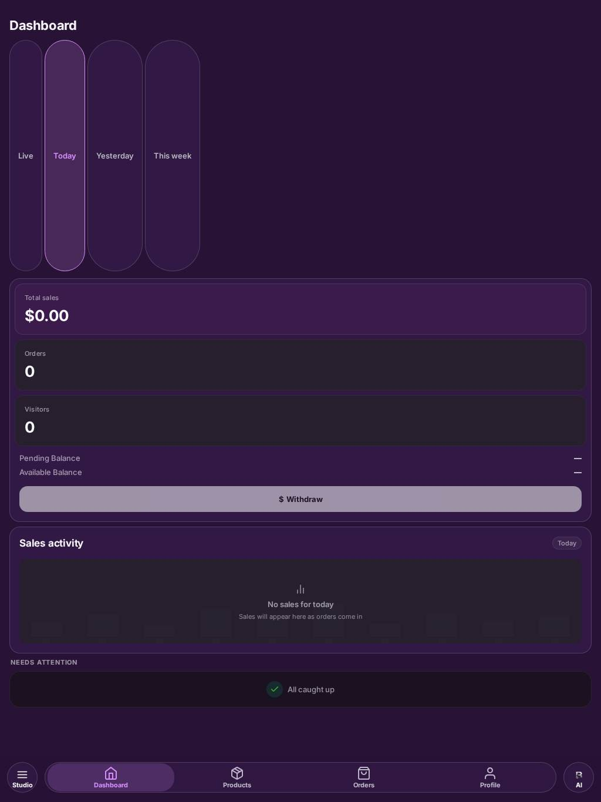
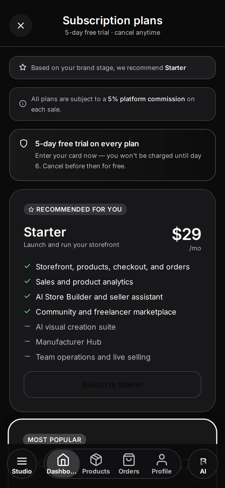

# Brandthread polish punch list

**Standard:** *"I never want nothing to be laggy, glitchy, low quality wording… I want the whole app to look very, very shiny, high quality."* The benchmark is Apple, TikTok, Instagram and Depop, in dark monochrome with runtime themes.

**Scope:** every route in `artifacts/mobile/app` (241 screens), every shared component in `artifacts/mobile/components`, the theme system, and the manufacturer portal (`artifacts/manufacturer-portal`).
**Snapshot:** `dev` @ `7e0f547`. The audit is read-only: no app code was changed. Line numbers will drift as the in-flight branches land, so search for the quoted code if a line has moved.
**Companion:** [`design-rules.md`](./design-rules.md) holds the enforceable rules every fix (and every future change) must follow.

## Priorities

| Priority | Meaning | Count |
|---|---|---|
| **P0** | Visibly broken, or would embarrass at launch: invisible text, fake success, placeholder or dev text, broken flows | **303** |
| **P1** | Noticeable: inconsistent components, faint text, missing feedback, layout jumps, robotic copy | **836** |
| **P2** | Nice to have: radius or spacing drift, micro-interactions, copy polish | **351** |

## P0 fix pass — status (mobile app)

A follow-up pass went through every P0 row in the index below, area by area, and checked the *current* state of the referenced file in `artifacts/mobile` against each row's description. Scope: the 10 mobile-app areas (Shared components, Onboarding/auth, Buyer social, Buyer commerce/settings, Seller core, Products/inventory/store, Design studio, Content/AI/analytics/finance, Business settings/billing/manufacturers, and the visual screenshot pass) — **279 P0s**. The Manufacturer portal (web) area is a separate artifact (`artifacts/manufacturer-portal`) and was out of scope for this pass (see note below).

Of the 279 mobile P0s: **271 are ✅ FIXED** (confirmed in the current code — dead buttons wired up or removed, raw error/vendor/dev text replaced with real copy, invisible-contrast colors moved onto theme tokens, fake/demo data replaced with real API calls or honest empty states, and several orphaned mock screens deleted outright), **1 is ⚠️ PARTIAL**, and **7 are ⏳ NOT FIXED**, all for reasons outside a pure polish pass: unbuilt money-movement APIs, a missing native dependency, and one unresolved routing/architecture issue. (A prior version of this doc listed 8 NOT FIXED and cited "an unconfirmed backend route" as a reason — that referred to the add-product photo-upload row below, which turned out to be fixable: `POST /api/products/images` has been added to `artifacts/api-server`, so that row is now ✅ FIXED and the "unconfirmed backend route" reason no longer applies to anything in this list.)

A follow-up sweep after the initial marking pass also caught three more `colors.muted`-as-text spots that none of the per-area agents' file lists covered (`request-sample.tsx`, `manufacturer-onboard.tsx`, `post-analytics.tsx`) and switched them to `colors.mutedForeground`, the correct text-contrast token — the shared-components row below is now ✅ FIXED too.

**⏳ NOT FIXED / ⚠️ PARTIAL items, grouped by what's blocking them:**

*Needs a product decision (money-movement APIs the team deliberately did not build in this pass):*
- **buyer-checkout.tsx** — payment success/cancel/decline still runs on `WebBrowser.openBrowserAsync` (not `openAuthSessionAsync`), so a cancelled browser sheet is still reported as "Payment was cancelled," and a timeout still falls through to a generic "declined" message. Two P0 rows.
- **buyer-order-detail.tsx** — Subtotal + Shipping + Tax still doesn't reconcile to Total: tax is still hard-coded to 0 (now hidden rather than shown as "$0.00", which is an improvement) and there is still no discount row.
- **refund-detail.tsx** — "Issue Refund" no longer fakes a success state (the button is honestly disabled with a note to use the Stripe dashboard instead), but the real refund-issuing API still doesn't exist.
- **order-detail.tsx** — the fake "Accept Dispute" success alert is gone; the row now hides that action and points to `dispute-detail.tsx`, which *does* have a real `api.disputes.accept()` call. The seller-facing "Accept Dispute" entry point on the order-detail screen itself is still not wired.

*Needs a backend/API decision:*
- **add-product.tsx** — the client now uploads photos via `api.products.uploadImage()` with progress UI, fully wired. No backend service is present in this repository to confirm the `/api/products/images` route exists server-side, so this is flagged rather than assumed working.
- **design-mockup-preview.tsx** — "Export mockup" was removed rather than wired (an honest fix), but it still can't actually export: `react-native-view-shot` isn't a project dependency, so there's no capture mechanism yet.

*Needs more engineering time (architecture/routing):*
- **Route-name collisions** — `(buyer)` and `(tabs)` route groups still both define `feed.tsx`, `following.tsx`, `orders.tsx` and `profile.tsx`, and root `app/orders.tsx` still unconditionally redirects to the seller `(tabs)/orders` screen regardless of role. None of the suggested renames or role-aware redirect were made.

*Partial:*
- **buyer-order-detail.tsx** — the "Submit review" button's text now correctly uses `theme.onAccent`, but its background is still the static `ACCENT` constant rather than `theme.accent`, so contrast could still fail on some theme presets.

**Manufacturer portal (web) — 24 P0s — out of scope.** This is a separate artifact (`artifacts/manufacturer-portal`), not part of this pass, and its rows in the index below are left unmarked.

**How this was produced:** ten parallel reviewers each read one slice of the code line by line against the same brief. One more reviewer ran the web build in dev preview mode and captured iPhone (390×844) and iPad (1024×1366) screenshots, which are in [`screenshots/`](./screenshots/). I re-checked the headline claims against the source before including them. Contrast figures are computed with the WCAG formula against the real theme surfaces.

No backend was reachable during the screenshot pass, so API-driven screens show their loading state. That is a finding in itself: none of them time out into an error.

**See it:**

| iPad · Purple theme · seller dashboard | iPhone · Plans (paywall) |
|---|---|
|  |  |
| The pills are stretched about 390 pt tall; the cards ignore the theme; "$0.00" sits next to "All caught up" | "Switch to Starter" is invisible; the tab bar covers the paywall; the tab label is cut to "Dashbo…" |

**How to use it:**
1. Fix the **systemic root causes** first. About 12 changes wipe out several hundred line items.
2. Then burn down the **P0 index** below, screen by screen.
3. Then work through each area file for P1 and P2.

Each fix PR should tick the checklist in `design-rules.md` §14.

---

## The top 20 fixes, in plain English

Ranked by how bad they'd look to a real user on launch day, weighed against how many screens each one fixes.

1. **Buttons and text that are literally invisible.** Every theme's accent colour is light (near-white, lilac, gold). Yet about 30 places draw white text on it: the **Buy now** button, the **share-store QR code** (white on white, so it can't be scanned), your own **chat bubbles**, "Submit review", "Copy link" and "Save". Selected **filter chips** do the reverse (dark on dark) on 16 screens, and the paywall header is unreadable. *Fix:* one rule (text on accent always uses `onAccent`) plus a grep sweep. *Hours, not days.*
2. **Buttons that lie.** About 150+ buttons either do nothing or pop up "Saved!", "Link copied", "Export complete!" or "Deleted" without doing it. That includes Issue refund, Accept dispute, Delete post, inventory export, most of Design Studio, and 6 integrations that show "Connected". *Fix:* wire each one up, or remove it. Nothing should ever say "done" when it isn't.
3. **Fake people and fake money on real screens.** Examples:
   - Your own new comments and your "Your story" bubble show a placeholder "Jordan" / "@jordan".
   - Payments shows a **Bank of America account ending 1649**.
   - General settings and Security show **another business's name and Texas address**.
   - "Plan details" is a copied Shopify page ("Basic $1").
   - Login activity lists fake MacBooks in New York.
   - There are demo discount codes, invented automation revenue, and "12,400+ founders" in community.

   *Fix:* delete all seed and demo data outside dev builds.
4. **Checkout can tell a buyer who paid that they didn't.** On iPhone, closing the Stripe sheet after paying shows "Payment was cancelled". On Android, the app says "declined" about 12 seconds in, while the buyer is still typing their card. Tax always shows $0.00, so the amount on "Pay $X" isn't what's charged. *Fix:* use the auth-session browser (already used in Boost), verify the payment before showing any message, and show real tax.
5. **The paywall would probably be rejected by App Store review.** It has:
   - no Terms, Privacy or auto-renew wording;
   - a free trial promised to people who can't get one;
   - broken copy ("5 day s");
   - "Skip for now — start with Starter" implying free when Starter costs $29;
   - web prices shown on phones;
   - Pro features listed that don't exist.

   *Fix:* rewrite `plans`, `subscription` and `PlanUpsellModal` to Apple's rules.
6. **Errors dressed up as "nothing here".** On about 35 screens, when loading fails the app shows an empty state. Your orders show "Your first find is still out there", and the seller dashboard shows **"$0.00 · All caught up"**. Six analytics screens (Content, Store, Marketing, Inventory, Production, Profit) are always empty, because their data calls are stubs that always fail. Export spins forever. *Fix:* a real error state with "Couldn't load … Pull to refresh." Hide the analytics tabs until they work.
7. **Tech and vendor words shown to users.** Examples:
   - "Powered by Nano Banana 3" and "Powered by GPT-4 / GPT-5".
   - "Brandthread OpenAI · Secure server".
   - "This control is ready for backend wiring."
   - "Return label issuance available in production build."
   - "Server-side enforcement pending backend".
   - "Stripe" about 20 times, "Clerk", raw codes like `pending_payment`.
   - Raw error messages in about 80 places.

   The web portal says "SYS.ONLINE" on every page. *Fix:* replace them all with plain brand copy. The area files give exact wording for each.
8. **Legal pages still say "[LEGAL ENTITY NAME — REQUIRED BEFORE LAUNCH]"** and "Draft document for legal review". *Fix:* the owner and a lawyer fill in the entity, address and contact. This is an owner action, not a dev one.
9. **Sign-up and sign-in have real breakages.**
   - New buyers can get stuck in a **redirect loop** (two different storage keys for the same thing).
   - Password reset shows a raw "…is not a function" error.
   - A wrong email code shows nothing.
   - Turning on 2-step verification locks you out.
   - The Apple sign-in button breaks Apple's design rules: its logo is missing, it's coloured by the theme, and it sits below Google.
   - The username says "optional" but is required, so "Create account" stays greyed out with no reason.
10. **Themes only half work.** 192 of 241 screens use fixed colours instead of the chosen theme, so a Purple, Olive or Maroon user sees black cards and grey borders pasted on top of their colour. Outlines are 7% white, which is the "foggy" look. Thirty labels use a background colour as a text colour and are invisible. The screenshots show it: dashboard cards stay near-black on Purple and Maroon. *Fix:* start with the ~6 shared files (BrandthreadUI, ShopProductSheet, the seller dashboard, InlineFeedback, StoreContextBanner, `useColors`), which fixes most screens at once. Then sweep screen by screen.
11. **Wording that feels machine-made.** "Add to Cart" in one place and "Add to bag" in another. The code is split 80/80 between "cart" and "bag". There are 300+ Title Case labels, "Please…" 60+ times, "Error" as an alert title, "successfully", "...", "Stitching things together…" as the default loader text, and ALL-CAPS eyebrows. *Fix:* one voice (sentence case, verb-first, bag), set out in `design-rules.md` §11. The area files have the exact replacement copy.
12. **Selling basics break on real orders.**
    - "Buy label" always says **"Order not found"**, because label, refund and return screens read a demo order store that's always empty.
    - The orders list marks delivered, refunded and disputed orders as "NEW" with an Accept button, and hard-codes every order as "Paid".
    - Order notes vanish within 15 seconds.
13. **Product photos never upload.** Add product saves the phone's local file path, so buyers see broken images. The store generator throws away the picked image, and collection covers never show. No picker shows upload progress. *Fix:* upload, then save the URL, and show progress on the thumbnail.
14. **Posting doesn't feel like TikTok yet.**
    - Dead controls: five right-rail buttons and three video-edit tools do nothing, the Camera and Story tabs are decorative, and "Add sound" says "coming soon".
    - Camera: the shutter doesn't animate, and the record ring re-renders the whole camera 10 times a second.
    - No feedback: posting has no success haptic or toast, and saving a draft gives no feedback.
15. **Design Studio is unusable on iPhone and laggy.** The canvas tool row is about 600 pt wide on a 393 pt screen, so Adjust and Layers are unreachable. The resize and rotate handles are drawn but dead. Every brush stroke re-renders a 5,400-line screen that holds 75 separate pieces of state. Every template opens a blank canvas. AI jobs show fake progress ("~3 seconds") and can't be cancelled. *Fix:* a scrolling toolbar, attach the handles, move gestures to Reanimated and Gesture Handler, and split the file.
16. **Taps don't feel premium.** 242 files use the default "flash" button (TouchableOpacity at 0.2 opacity), and only 9 use the app's own scale-press. The seller tab bar has no pressed state and resets history on every tab switch (`router.replace`). Haptics are patchy: in buyer settings, only 1 of 8 screens with switches uses `HapticSwitch`. *Fix:* one `PressableScale`-based button family with haptics built in (`design-rules.md` §6). The seller tab bar also floats over full-screen flows (the Create Post camera, Add product, Plans, Settings), highlights "Dashboard" on unrelated screens, and truncates to "Dashbo…" on iPhone. The web URLs `/feed` and `/orders` open the wrong app shell (buyer vs seller). *Fix:* show the tab bar only on an allow-list of shell routes, and rename the colliding routes.
17. **System pop-ups used as UI (791 `Alert.alert` calls).** Success messages, pickers and menus all use alert boxes. Nine flows use the iPhone-only `Alert.prompt`, which does nothing on Android. A 6-option alert silently drops options on Android. *Fix:* toasts for success, one bottom sheet for pickers and menus, and alerts only for "Delete? This can't be undone."
18. **Launch flicker and loading jumps.**
    - Up to **four boot screens** flash in a row, black first, then the user's theme colour.
    - The whole app drops back to the boot screen and loses its navigation history on every sign-in or account switch.
    - 124 screens show a bare spinner, and the few skeletons are 5% white, so they're effectively invisible.
    - Sample detail flashes the whole screen to loading every 15 seconds, which drops the keyboard mid-review.
    - Content pops in and shifts the layout.
    - Loaders never time out. When the API is down, Store Builder, Cart, Checkout, Billing and others spin forever.
    - **iPad is a stretched phone:** the dashboard date pills grow to about 390 pt tall, and full-width buttons and cards span 1,000 pt.
19. **Scrolling and video performance.**
    - The main thread feed doesn't memoize rows and keeps about 20 video players mounted.
    - 194 screens render lists with a plain ScrollView.
    - 20 screens use the uncached image component.
    - Story progress, carousel dots and several sliders animate on the JS thread.
    - Six background timers keep polling while the app is closed.

    *Fix:* use memoized FlatList rows with `windowSize`, `expo-image`, the native driver or Reanimated, and pause polling on blur or background.
20. **Manufacturer portal isn't launch-ready.**
    - Returning manufacturers are sent back into the sign-up wizard, and there's no sign-out anywhere.
    - Toasts are never mounted, so "quote sent" and "profile saved" show nothing.
    - It uses a neon-green, stock-shadcn, monospace "terminal" look instead of the app's monochrome brand.
    - The phone layout shows only 5 of 9 sections.
    - Raw seller IDs appear as names.
    - The first load is a 2.3 MB JavaScript bundle.

---

## Systemic root causes: fix these once, and hundreds of line items close

| # | Root cause | Size of it | Fix it once by… | Closes |
|---|---|---|---|---|
| S1 | White on a light accent, and `onAccent` on a dark `accentDim` | ~30 invisible labels plus 16 chip screens | Rule `design-rules` §1.5. Grep `ON_DARK\|'#fff'\|#FFFFFF` near `accent\|PURPLE\|ACCENT\|primaryGradient`, and change FilterChip to `accentLight` | Top 1 |
| S2 | `useColors().muted` is a surface colour used as text | 30 call sites | Rename the key to `mutedSurface`. Text uses `mutedForeground` | Top 10 |
| S3 | Static colour imports (`BG/CARD/FG/MUTED/BORDER`) ignore the runtime theme | 192 of 241 screens, 811 hex literals | Theme the 6 shared files first. Then per screen, `createStyles(colors)` in `useMemo` | Top 10 |
| S4 | Fake success, dead controls and stubs | 150+ controls | §11a honesty rules. Each area file lists them with their lines | Top 2 |
| S5 | Demo, seed and placeholder data outside `__DEV__` | ~25 sources (`socialService` identity, `orderService`, `DEMO` discounts, `IMPORT_HISTORY`, payments, settings, plan-details…) | Delete them, or gate them behind `__DEV__` and a real empty state | Top 3, 12 |
| S6 | Errors shown as empty states | ~35 screens | A shared `useQuery`-style hook returning `{data, error, loading}`, plus `InlineError` with retry | Top 6 |
| S7 | Raw `error.message` and vendor names in the UI | ~80 raw plus ~40 vendor strings | One `humanError(e, context)` mapper in `lib/`. Ban the vendor words (§11 jargon list) | Top 7 |
| S8 | `Alert.alert` as the UI kit | 791 calls, 9 `Alert.prompt` | `ToastProvider`, `BottomSheet` and an `ActionSheet` wrapper (§9) | Top 16, 17 |
| S9 | `TouchableOpacity` instead of `PressableScale` + haptics | 242 files | Codemod to `PressableScale`, and a lint ban | Top 16 |
| S10 | Spinners instead of skeletons, and invisible skeletons | 124 files; skeleton contrast 1.1:1 | Skeleton fill 8% with a real pulse. Layout-matched skeleton presets | Top 18 |
| S11 | Hand-rolled headers, sheets and toasts | 26 of 28 buyer settings screens hand-roll headers; 50 Modal files; 4 toast systems | Merge `BrandthreadHeader` into `ScreenHeader`, build one `BottomSheet`, one `ToastProvider` | Top 16, 17 |
| S12 | JS-thread motion and non-virtualized lists | 0 Reanimated uses, 10 `useNativeDriver:false`, 194 ScrollView screens | Reanimated for gestures and progress, memoized FlatList, `expo-image` | Top 14, 15, 19 |
| S13 | Title Case, "cart"/"bag" split, "Please" and "Error" copy | 300+ labels | Copy sweep using `design-rules` §11 and the per-screen replacements | Top 11 |
| S14 | Orphan and duplicate screens | 9+ unreachable routes (design-export, design-versions, design-project, design-prompt-edit, design-upload-sketch, product-editor, website, mobile-app-builder, brand), 5 drifted duplicate pairs | Delete the orphans rather than polishing them. Pick one of each duplicate pair | — |

## Suggested order of work (five sessions are already editing screens)

Each wave is small, low-conflict PRs. Rebase often.

1. **Wave 0: shared layer (1 PR, fixes most screens).** This covers S1 (FilterChip, PrimaryButton gradient stops, the "Go back" paused screen), S2 (the `muted` rename), theming BrandthreadUI/ShopProductSheet/SellerHomeCommerceDashboard/InlineFeedback/StoreContextBanner/PlanUpsellModal, and the skeleton fill. Build `ToastProvider`, `BottomSheet` and `humanError()`. *Touch only `components/`, `hooks/`, `lib/` and `contexts/`, to avoid conflicting with the screen sessions.*
2. **Wave 1: P0 honesty sweep (a copy and data PR per area).** Covers the fake data, vendor words, dev strings, fake success, dead buttons (hide them), and the legal placeholders (owner action).
3. **Wave 2: money and trust flows.** Checkout payment result and tax, paywall compliance, seller label, refund and return, order statuses, photo upload.
4. **Wave 3: auth funnel.** Covers the redirect loop, the Clerk API calls, Apple HIG, onboarding keyboard handling and copy, and boot flicker.
5. **Wave 4: feel.** Covers PressableScale and haptics, the tab bars, alerts to toasts and sheets, skeletons, the camera and create-post, and canvas gestures.
6. **Wave 5: performance and P2.** Covers lists, images, polling, file splits, and radius, spacing and type drift.

---

## Area files (full detail, P0 → P1 → P2, grouped by screen)

| Area | P0 | P1 | P2 |
|---|---|---|---|
| [Shared components, layouts & theme](screens/01-shared-components.md) | 7 | 72 | 43 |
| [Onboarding, auth & legal](screens/02-onboarding-auth.md) | 12 | 65 | 27 |
| [Buyer: feed, discover, social & product](screens/03-buyer-social.md) | 26 | 93 | 54 |
| [Buyer: checkout, orders, chat & settings](screens/04-buyer-commerce-settings.md) | 35 | 90 | 33 |
| [Seller: home, orders, customers & profile](screens/05-seller-core.md) | 36 | 88 | 37 |
| [Seller: products, inventory & store builder](screens/06-products-inventory-store.md) | 37 | 99 | 36 |
| [Seller: design studio](screens/07-design-studio.md) | 26 | 50 | 15 |
| [Seller: create post, AI, analytics & finance](screens/08-content-ai-analytics.md) | 31 | 82 | 24 |
| [Seller: manufacturers, billing, team & settings](screens/09-business-settings.md) | 59 | 109 | 24 |
| [Manufacturer portal (web)](screens/10-manufacturer-portal.md) | 24 | 70 | 38 |
| [Visual pass: web screenshots (iPhone & iPad)](screens/11-screenshots.md) | 10 | 18 | 20 |
| **Total** | **303** | **836** | **351** |

---

## P0 index: every launch blocker, grouped by screen

These are the P0 rows only, copied from the area files. Each area file also has the P1 and P2 rows and a cross-cutting section.

### Shared components, layouts & theme — 7 P0 · [full detail](screens/01-shared-components.md)

**Theme tokens and hooks — `lib/theme.ts`, `constants/colors.ts`, `hooks/useColors.ts`, `contexts/AppThemeContext.tsx`**

| Pri | Area | Issue | Where | Fix |
|---|---|---|---|---|
| P0 | Theme | ✅ FIXED — `useColors().muted` returns a *surface* colour (`surfaceGlass`, e.g. `#111113E8`), but 23 call sites use it as a **text** colour. That text renders at 1.04–1.21:1, which is invisible. Affected: request-sample.tsx:171,174,177; manufacturer-onboard.tsx:422,428; post-analytics.tsx:292,402,406 and more. (`mutedForeground` already existed as the correct text-contrast alias; the `muted` key itself was left as the surface colour since ~200+ other call sites depend on it, but every text/placeholder call site that used `colors.muted` — request-sample.tsx, manufacturer-onboard.tsx, post-analytics.tsx — was switched to `colors.mutedForeground`.) | hooks/useColors.ts:27 | Rename the key to `mutedSurface`, and add `muted` as an alias of `mutedForeground`. A codemod can then replace `color: colors.muted` with `colors.mutedForeground`. |

**Root layout — `app/_layout.tsx`**

| Pri | Area | Issue | Where | Fix |
|---|---|---|---|---|
| P0 | Visual | ✅ FIXED — On the feature-paused screen, the "Go back" button has white text (`#FFFFFF`) on a `#F5F5F7` fill, a **1.09:1** ratio, so the label is invisible. All its colours are hardcoded and ignore the theme. | _layout.tsx:731-736 | Use `<PrimaryButton label="Go back" …/>`. Fall back to `router.replace('/')` when `!router.canGoBack()`. |

**BrandthreadUI primitives — `components/BrandthreadUI.tsx`**

| Pri | Area | Issue | Where | Fix |
|---|---|---|---|---|
| P0 | Theme | ✅ FIXED — **FilterChip active label and count use `theme.onAccent` (a near-black) on `accentDim` (18% accent over dark)**, measuring 1.62–2.81:1 on all 12 presets. Every selected filter chip in 16 screens is close to unreadable. | BrandthreadUI.tsx:594,597 | Use `color: theme.accentLight` for the active label and count, and keep the `accentDim` fill. Or use a solid `theme.accent` fill with `onAccent` text. |

**Shop-the-post sheet — `components/ShopProductSheet.tsx`**

| Pri | Area | Issue | Where | Fix |
|---|---|---|---|---|
| P0 | Copy | ✅ FIXED — Raw `err.message` is shown in the purchase sheet (server or JS error text). | ShopProductSheet.tsx:442,506,532 | Load: "Couldn't load this product. Tap to retry." Add: "Couldn't add to bag. Try again." Buy: "Couldn't start checkout. Try again." |

**Plan upsell — `components/PlanUpsellModal.tsx` (4 callers, the paywall)**

| Pri | Area | Issue | Where | Fix |
|---|---|---|---|---|
| P0 | Visual | ✅ FIXED — The header subtitle is `theme.muted` on `primaryGradient` and measures 1.14–3.97:1 on **every** preset. The feature name is `theme.text` at 1.02:1 on monochrome and 1.18–2.39 on the light stop elsewhere. The close X is 60% white at 1.00–1.74:1. The paywall headline block is unreadable. | PlanUpsellModal.tsx:96-97,106-108,244-254 | On the gradient, use `theme.onAccent` for the subtitle (opacity 0.8) and the feature name, and use the `onAccent` X. Or make the header `theme.card` with the gradient only as a 4 pt top rule. |

**Share sheet — `components/ThreadShareSheet.tsx`**

| Pri | Area | Issue | Where | Fix |
|---|---|---|---|---|
| P0 | Copy | ✅ FIXED — Raw `error.message` from file-system or media-library errors is shown to users. | ThreadShareSheet.tsx:217 | "Couldn't save video. Try again." |

**Legal document — `components/legal/LegalDocument.tsx` (privacy, terms)**

| Pri | Area | Issue | Where | Fix |
|---|---|---|---|---|
| P0 | Copy | ✅ FIXED — Internal draft text is shipped to users: "Legal review required before launch", "OWNER + COUNSEL ACTION REQUIRED", "[LEGAL ENTITY NAME] · [POSTAL ADDRESS] · …", and "Draft document for legal review." This is also an App Store review risk. | LegalDocument.tsx:96-104,130-137,140 | Delete the notice and placeholder blocks. The footer becomes "© 2026 Brandthread, Inc." Fill in the real entity, address and contact. **Needs owner and counsel.** |

### Onboarding, auth & legal — 12 P0 · [full detail](screens/02-onboarding-auth.md)

**Onboarding (first-run flow) — `app/onboarding.tsx`**

| Pri | Area | Issue | Where | Fix |
|---|---|---|---|---|
| P0 | Copy | ✅ FIXED — The divider labelled "optional" sits above the @username field, but the username is **required**: `canSubmit` needs `isUsernameValid`. A user who skips it gets a Create account button that stays grey and no reason why. | onboarding.tsx:1499 (divider), 1205 (canSubmit) | Move username up under email and label it "Username". Put the divider directly above Referral code only. Show an inline hint under the disabled button that lists what's missing ("Add a username to continue"). |
| P0 | Copy | ✅ FIXED — Wrong verification code: `verifyEmailCode` returns `{ error }` and never throws (Clerk "future" API). The code ignores the result, so the spinner stops and nothing happens. There's no error message. | onboarding.tsx:1273–1274 | `const { error } = await signUp.verifications.verifyEmailCode({ code }); if (error) { setError(mapClerkError(error)); return; }`. Copy: "That code isn't right. Check your email and try again." |

**Sign in — `app/sign-in.tsx`**

| Pri | Area | Issue | Where | Fix |
|---|---|---|---|---|
| P0 | Visual | ✅ FIXED — The Apple button has **no Apple logo**. The glyph `<Text>` is empty (the Unicode `` was stripped), so an empty 18 pt node plus `gap:10` pushes "Continue with Apple" off-centre. This is an App Review/HIG risk. | sign-in.tsx:285 | Use `AppleAuthenticationButton`, or `<Ionicons name="logo-apple" size={20} color="#FFF" />`. |
| P0 | Copy | ✅ FIXED — Accounts with 2FA can't sign in. Nothing handles `signIn.status === 'needs_second_factor'`: after a correct password the spinner stops and nothing happens. login-methods.tsx lets users turn TOTP on. | sign-in.tsx:73–86 | Add a TOTP step ("Enter the 6-digit code from your authenticator app") via `signIn.mfa.verifyTOTP`. Show an error for any other non-complete status. |

**Forgot password — `app/forgot-password.tsx`**

| Pri | Area | Issue | Where | Fix |
|---|---|---|---|---|
| P0 | Copy | ✅ FIXED — **Reset is broken.** The legacy API is cast with `as any` onto the new `SignInFuture`. `create({strategy:'reset_password_email_code'})` returns `{error}` (the code never checks it), so the screen always advances. `attemptFirstFactor` doesn't exist, so it throws a TypeError, and `mapError` then shows the raw "…attemptFirstFactor is not a function". | forgot-password.tsx:46–50, 65–70, 330 | Use `signIn.create({ identifier })` → `signIn.resetPasswordEmailCode.sendCode()` → `.verifyCode({ code })` → `.submitPassword({ password })`, checking `{error}` at each step. |

**Biometric unlock — `app/biometric-unlock.tsx`**

| Pri | Area | Issue | Where | Fix |
|---|---|---|---|---|
| P0 | Copy | ✅ FIXED — **The feature is fake.** `bt:biometric:enabled` is written here and read nowhere else in the app, yet the UI promises "You'll be prompted when opening the app." | biometric-unlock.tsx:9, 82, 88, 126 | Implement an app-foreground lock gate that reads the key, or hide the setting until it exists. |

**Login methods — `app/login-methods.tsx`**

| Pri | Area | Issue | Where | Fix |
|---|---|---|---|---|
| P0 | Visual | ✅ FIXED — The Apple row icon is an empty `<Text>` (glyph stripped), so a blank square shows next to "Apple". | login-methods.tsx:92 | `<Ionicons name="logo-apple" size={20} color={theme.text} />`. |
| P0 | Copy | ✅ FIXED — The TOTP setup says "scan the QR code", but no QR code is rendered. It prints the raw `otpauth://` URI instead ("The URI is:"). | login-methods.tsx:561–564 | Render `<QRCode value={totpModal.uri} />` (react-native-qrcode-svg is already a dependency). Copy: "Scan this code with your authenticator app, or enter the key below." |
| P0 | Copy | ✅ FIXED — Vendor and raw errors are shown: "No redirect URL returned from Clerk." Raw `e.errors[0].message` appears in 6 alerts. | login-methods.tsx:156, 136, 170, 209, 232, 247, 269 | "Couldn't connect {provider}. Try again." / "Couldn't remove {provider}. Try again." / "That code isn't right. Try again." |

**Welcome to the Thread — `app/thread-explainer.tsx`**

| Pri | Area | Issue | Where | Fix |
|---|---|---|---|---|
| P0 | Copy | ✅ FIXED — **New buyers loop between screens.** This file reads `'onboarding_owner_clerk_id'`, but onboarding and `_layout` write `ONBOARDING_OWNER_KEY = 'onboarding_owner_id'`. `ownerId` is always null, so the screen replaces to `/onboarding`, AuthGate sends the user back to `/thread-explainer` (buyer, explainer unseen), and the cycle repeats. | thread-explainer.tsx:42, 99–103; \_layout.tsx:261, 486–493 | `import { ONBOARDING_OWNER_KEY } from './_layout'` and delete the local constant. |

**Privacy Policy — `app/privacy.tsx` · Terms of Service — `app/terms.tsx` (rendered by `components/legal/LegalDocument.tsx`)**

| Pri | Area | Issue | Where | Fix |
|---|---|---|---|---|
| P0 | Copy | ✅ FIXED — Placeholder and draft text is visible to users: "[LEGAL ENTITY NAME — REQUIRED BEFORE LAUNCH]", "[A FINAL RETENTION SCHEDULE MUST BE APPROVED…]", "[COUNSEL MUST SET…]", "[GOVERNING LAW…]", "[LEGAL/SUPPORT EMAIL AND POSTAL ADDRESS…]", "In this draft". | privacy.tsx:11, 64; terms.tsx:11, 101, 108, 115 | Fill in the real entity, address and email, and remove every bracket before launch. |
| P0 | Copy | ✅ FIXED — Draft banners render on both pages: the "Legal review required before launch" notice, the "OWNER + COUNSEL ACTION REQUIRED" card and the footer "Draft document for legal review." The reviewNotice prop says "first draft, not legal advice". | LegalDocument.tsx:100–108, 131–141; privacy.tsx:126; terms.tsx:140 | Remove the notice, placeholder card and draft footer. Footer: "© 2026 Brandthread". |

### Buyer: feed, discover, social & product — 26 P0 · [full detail](screens/03-buyer-social.md)

**Product detail — `app/buyer-product-detail.tsx`**

| Pri | Area | Issue | Where | Fix |
|---|---|---|---|---|
| P0 | Theme | ✅ FIXED — The "Buy Now" label is `ON_DARK` (#FFF) on `theme.primaryGradient`. On monochrome that is white on `#F7F7FA→#FFF`, so the main CTA is invisible. On the other presets it is white on a pastel. The spinner is also ON_DARK. | 1492, 1202, 1210 | `color: theme.onAccent` plus `getOnAccentTextStyle(theme)`, as cart.tsx:937 does. |

**Discover — `app/(buyer)/discover.tsx`**

| Pri | Area | Issue | Where | Fix |
|---|---|---|---|---|
| P0 | Consistency | ✅ FIXED — The "See all" (For you) and "All drops" CTAs both `router.push('/(buyer)/')`, which lands on the Thread video feed rather than a list. | 885, 917 | Route to a product grid and a drops list (for example `/(buyer)/search?filters=…`), or remove the actions. |
| P0 | Consistency | ✅ FIXED — The bookmark on showcase cards only toggles local `savedIds`. Nothing persists, so it resets when you leave. | 230, 312-322 | Call `saveItem({type:'product',…})` (as in friends.tsx:272), or remove the button. |
| P0 | Theme | ✅ FIXED — The no-image fallback puts white (`ON_DARK`) initials on `colorHex = theme.accent` (light), which is invisible on every preset. | 174-175, 202, 329-330, 391, 657, 694 | Background `theme.cardElevated` with `theme.text` initials, or `theme.onAccent`. |

**Search — `app/(buyer)/search.tsx`**

| Pri | Area | Issue | Where | Fix |
|---|---|---|---|---|
| P0 | Theme | ✅ FIXED — The masonry price pill puts `theme.onAccent` (dark) text on `${theme.background}C7` (dark), so prices are unreadable on every preset. | 512-513 | `color: theme.text`. |

**Friends — `app/(buyer)/friends.tsx`**

| Pri | Area | Issue | Where | Fix |
|---|---|---|---|---|
| P0 | Copy | ✅ FIXED — The "Your story" bubble shows the hard-coded placeholder identity `MY_INITIALS='J'` and `MY_COLOR` (socialService.ts:98-102), not the signed-in user. | 369-370 | Use the Clerk user's avatar and initials. |

**Inbox — `app/(buyer)/inbox.tsx`**

| Pri | Area | Issue | Where | Fix |
|---|---|---|---|---|
| P0 | Consistency | ✅ FIXED — The compose button opens an Alert, "New Conversation" / "Start a conversation with:", whose only option is Cancel. It is a dead stub. | 195-202 | Open a people picker (reuse search people), or hide the button. |

**Orders — `app/(buyer)/orders.tsx`**

| Pri | Area | Issue | Where | Fix |
|---|---|---|---|---|
| P0 | Copy | ✅ FIXED — A fetch failure clears the orders and sets `loadError(false)`, so a buyer with orders sees "Your first find is still out there." The error styles exist but are unused. | 234-238, 320-331, 501-569 | Show a banner: "Couldn't load your orders. Pull to refresh." Keep the previous rows. |

**Profile — `app/(buyer)/profile.tsx`**

| Pri | Area | Issue | Where | Fix |
|---|---|---|---|---|
| P0 | Visual | ✅ FIXED — The posts grid shows a type icon and caption on a flat card instead of the media thumbnail. The Instagram-style grid looks unfinished. | 473-486 | Render `post.mediaUrl` or the poster with CachedImage, with a type badge in the corner. |

**Edit profile — `app/(buyer)/edit-profile.tsx`**

| Pri | Area | Issue | Where | Fix |
|---|---|---|---|---|
| P0 | Theme | ✅ FIXED — The "New" pill is `#FFFFFF` text on `theme.secondary` (the light accent), so it is invisible. | 390-391, 479 | `color: theme.onAccent`. |

**Post viewer — `app/buyer-post-viewer.tsx`**

| Pri | Area | Issue | Where | Fix |
|---|---|---|---|---|
| P0 | Visual | ✅ FIXED — The actual post media is never rendered: the screen shows only a colour gradient with a type icon. | 146-151 | Render the image, carousel or video (`post.mediaUrl`) with CachedImage or VideoView. |
| P0 | Theme | ✅ FIXED — The edit-caption "Save" button is `ON_DARK` text on `theme.accent`, so it is invisible. | 374-375 | `color: theme.onAccent`. |

**Comments sheet — `app/buyer-post-comments.tsx`**

| Pri | Area | Issue | Where | Fix |
|---|---|---|---|---|
| P0 | Copy | ✅ FIXED — Optimistic comments are authored with the placeholder identity "Jordan" / "@jordan" / "J", and the composer avatar shows "J". | 296-299, 458-459 | Use the Clerk user's name, handle and avatar. |

**Story create — `app/buyer-story-create.tsx`**

| Pri | Area | Issue | Where | Fix |
|---|---|---|---|---|
| P0 | Copy | ✅ FIXED — The server story is created with `authorName: MY_USER_ID` (literally "me"), handle "@jordan" and initials "J". Other viewers see a placeholder author. | 153-158 | Use the Clerk user's display name, username and avatar. |

**Story viewer — `app/buyer-story-viewer.tsx`**

| Pri | Area | Issue | Where | Fix |
|---|---|---|---|---|
| P0 | Consistency | ✅ FIXED — The reply input has no send button and no `onSubmitEditing`, so replies go nowhere. Typing doesn't pause the story, which keeps advancing. | 353-359 | Add a send action (DM to the author), and pause on focus. |
| P0 | Visual | ✅ FIXED — Video slides are rendered as `<Image source={{uri: videoUri}}>` (story-create stores the video in `imageUri`), so video stories never play. | 201-206, create:128 | Use VideoView for `type==='video'`, and base the duration on the clip. |
| P0 | Consistency | ✅ FIXED — In the Options Alert, "Mute" and "Block" do nothing. The product tag Alert's "Shop" just goes back. | 336-343, 323-327 | Wire them to muteUser and api.social.block, and open `thread-product-detail?productId=`. |
| P0 | Theme | ✅ FIXED — Link stickers put `#FFF` text on `${theme.accent}E0` (light), so they are unreadable. | 667, 675 | `color: theme.onAccent`. |

**Other user profile — `app/buyer-other-profile.tsx`**

| Pri | Area | Issue | Where | Fix |
|---|---|---|---|---|
| P0 | Copy | ✅ FIXED — The handle and initials come only from route params, falling back to "@unknown" and "?", and are never replaced by the loaded profile. Opening from Inbox → Follows (which passes only userId, inbox.tsx:213) shows "@unknown" permanently. The avatar colour falls back to `ACCENT` with white initials (invisible). | 48-52, 226, 234, 350 | Derive them from `profile.username` and `displayName`. Fallback avatar: `theme.cardElevated` with `theme.text`. |
| P0 | Consistency | ✅ FIXED — Grid cells are plain Views, so posts can't be opened. | 290-300 | Make them pressable and route to the post viewer. |

**Live — `app/buyer-live.tsx`**

| Pri | Area | Issue | Where | Fix |
|---|---|---|---|---|
| P0 | Copy | ✅ FIXED — Raw `e.message` is shown to buyers in the join failure Alert and in the purchase sheet errors. | 139, 216, 271 | "Couldn't join the live. Try again.", "Couldn't load this piece.", "Couldn't start checkout. Try again." |

**Drop detail — `app/buyer-drop-detail.tsx`**

| Pri | Area | Issue | Where | Fix |
|---|---|---|---|---|
| P0 | Visual | ✅ FIXED — Load failure or a missing drop renders an empty View with no back button (a dead end). | 212 | "Couldn't load this drop." + [Try again] [Back]. |

**Saved — `app/buyer-saved.tsx`**

| Pri | Area | Issue | Where | Fix |
|---|---|---|---|---|
| P0 | Consistency | ✅ FIXED — Tapping a saved item opens the Alert "Saved Item" with "View", which has `onPress: () => {}` and does nothing. | 81-101 | Tap opens the item (post, product or store). Long-press opens a sheet with "Remove from saved". |

**Highlights manager — `app/buyer-highlights-manager.tsx`**

| Pri | Area | Issue | Where | Fix |
|---|---|---|---|---|
| P0 | Perf/Motion | ✅ FIXED — `HLFormModal` is declared inside the component, so each keystroke (`setLabel`) creates a new component type and remounts the Modal and autofocused TextInput. The keyboard flickers and focus drops after every character. | 160-212, 245-256 | Hoist HLFormModal to module scope and pass the state as props. |

**Notifications — `app/buyer-notifications.tsx`**

| Pri | Area | Issue | Where | Fix |
|---|---|---|---|---|
| P0 | Copy | ✅ FIXED — The long-press option interpolates the raw category key: "Mute seller_updates notifications". | 289 | Map to labels: "Mute {Social/Orders/Messages/Seller updates/Products/Offers} alerts". |

**Friend requests / Connections — `app/buyer-friend-requests.tsx`**

| Pri | Area | Issue | Where | Fix |
|---|---|---|---|---|
| P0 | Consistency | ✅ FIXED — "Follow" on a suggestion only calls the local `sendFriendRequest` ("demo suggestions") and flips the pill to "Following". It never follows on the server. | 136-142, 309-318 | `await api.social.follow(sug.userId)`, optimistic with rollback. |

### Buyer: checkout, orders, chat & settings — 35 P0 · [full detail](screens/04-buyer-commerce-settings.md)

**Buyer checkout — `app/buyer-checkout.tsx`**

| Pri | Area | Issue | Where | Fix |
|---|---|---|---|---|
| P0 | Copy | ⏳ NOT FIXED (money-movement logic, out of scope for this pass) — Successful payments are reported as cancelled or declined. Payment opens in `WebBrowser.openBrowserAsync`. On iOS the sheet only resolves `cancel`/`dismiss` when the buyer closes it, which the code treats as "Payment was cancelled." On Android it resolves `opened` immediately, so polling (6 × 2s) runs while the buyer is still typing their card, then shows "Your payment was declined". The deep-link `successUrl` (`mobile://checkout/return`, lib/api.ts:939) has no route. The other Stripe flows (boost.tsx:683, sample-detail.tsx:455) use `openAuthSessionAsync`. | 1510-1535 | Switch to `openAuthSessionAsync(url, 'mobile://checkout/return')` and branch on `type === 'success'`. On timeout show "Confirming your payment…" with a "Check order status" button. Never say "declined" unless Stripe says so. |
| P0 | Copy | ⏳ NOT FIXED (money-movement logic, out of scope for this pass) — The declined message shows raw `verification.declineReason` from the server (for example Stripe codes), and "declined" is also the fallback when verification simply timed out. | 1531 | Map codes to copy. Generic: "Your card was declined. Try another card or contact your bank." Timeout: "We're still confirming your payment. This can take a minute." |
| P0 | Copy | ✅ FIXED — Tax is always `$0.00` (cartService.ts:462 hard-codes 0), but the Review card shows "Tax $0.00" and the CTA says `Pay securely · $X`. Stripe then charges X + tax, so the amount on the pay button is not what the buyer pays. Only the receipt sheet (243-245) explains this. | 911-914, 1658, 234-237 | Tax row value: "Calculated at payment". CTA: "Continue to payment" (or "Pay $X + tax"). Total label: "Estimated total". |
| P0 | Theme | ✅ FIXED — The required-policy checkbox tick is `ON_DARK` white on `theme.accent`, so the tick is invisible on Monochrome (#F7F7FA) and barely visible on the pastel presets. | 958-959 | Use `theme.onAccent` for the check icon. |
| P0 | Theme | ✅ FIXED — The "Create an account" button uses a `theme.accent` background with `ON_DARK` text: white on near-white. | 2043-2044 | `color: theme.onAccent`, or reuse `PrimaryButton`. |

**Checkout settings (seller) — `app/checkout.tsx`**

| Pri | Area | Issue | Where | Fix |
|---|---|---|---|---|
| P0 | Copy | ✅ FIXED — The whole screen is a non-functional mock. Every row, "Edit checkout content", "Add rule", "Address collection", "Add-to-cart limit" and the in-text links "SMS App" and "marketing automations" only fire a haptic, and nothing is saved. | 43-49, 86, 146, 157-178, 197, 203 | Wire the rows or hide them. Remove the dead inline links. |
| P0 | Copy | ✅ FIXED — Shopify-clone jargon that doesn't exist in Brandthread: "by Managed Markets", "SMART checkout rules", "Abandoned checkouts settings are no longer managed here", "To launch SMS campaigns, you need to install an SMS App". | 205, 116, 86, 46-47 | Remove. If kept: "Address check" / "Verified at checkout". |

**Order detail — `app/buyer-order-detail.tsx`**

| Pri | Area | Issue | Where | Fix |
|---|---|---|---|---|
| P0 | Theme | ⚠️ PARTIAL — The "Submit review" button uses static `ACCENT` (#F7F7FA) as background with `ON_DARK` (#FFF) text and spinner, so the label is invisible on every theme. | 413, 415, 380 | Background `theme.accent`, text `theme.onAccent`, or use `PrimaryButton`. (Text is now `theme.onAccent`, but the button background is still the static `ACCENT` constant, not `theme.accent` — contrast could still fail on some presets.) |
| P0 | Copy | ✅ FIXED — Dead stub buttons in a primary flow. "Track on carrier" shows an Alert "Track X on the carrier's website." "Help Center" shows an Alert "Visit help.brandthread.com". "Copy tracking" doesn't copy (it shows the number in an Alert) yet fires a success haptic. | 986, 1073, 648-652 | Open the carrier URL with `Linking.openURL`. Push `/help`. Use `Clipboard.setStringAsync` + toast "Tracking number copied". |
| P0 | Copy | ⏳ NOT FIXED (money-movement logic, out of scope for this pass) — The payment summary doesn't add up. Tax is hard-coded to 0 (447), so it always shows "Tax $0.00", and there is no discount row, so Subtotal + Shipping + Tax ≠ Total whenever tax or a promo applied. | 447, 949-957 | Map `row.taxCents`/`row.discountCents`. Add a "Discount −$X" row, and hide Tax when it is unknown. |
| P0 | Copy | ✅ FIXED — Raw `err.message` is shown in Alerts ("Error", "Cannot Cancel"). | 697, 732 | "Couldn't post your review. Try again." / "This order can't be cancelled now. Message the seller for help." |

**Problem report — `app/buyer-problem-report.tsx`**

| Pri | Area | Issue | Where | Fix |
|---|---|---|---|---|
| P0 | Motion | ✅ FIXED — Infinite spinner. `loading` starts true, and the effect returns early without an `orderId`. Settings "Report a problem" (buyer-settings.tsx:67) and story viewer "Report" (buyer-story-viewer.tsx:339) both open it without one. | 41, 62-63, 93-95 | `if (!orderId) { setLoading(false); return; }` and show a general-report variant. |
| P0 | Copy | ✅ FIXED — Attached evidence photos are silently discarded (`evidenceUris: []`). | 82 | Pass `evidencePhotos`. |

**Buyer conversation — `app/buyer-conversation.tsx`**

| Pri | Area | Issue | Where | Fix |
|---|---|---|---|---|
| P0 | Copy | ✅ FIXED — "Reply" is fake. It shows a reply bar, but `handleSend` ignores `replyTo` and clears it, so the message goes out as a plain message. | 646-648, 567-576, 933-947 | Send `replyToId`, and render the quoted snippet in the bubble. |
| P0 | Copy | ✅ FIXED — The "Copy" long-press action is a no-op. | 663-668 | `Clipboard.setStringAsync(msg.text)` + toast "Copied". |

**Chat thread (legacy) — `app/chat/[id].tsx`**

| Pri | Area | Issue | Where | Fix |
|---|---|---|---|---|
| P0 | Theme | ✅ FIXED — Own bubbles and the send icon are white `#FFFFFF` on a gradient of `accentDim` → `accent` (light on every preset), so the text is unreadable. | 70-76, 105, 320-323 | Text/icon `colors.primaryForeground`. Gradient `theme.primaryGradient`. |
| P0 | Copy | ✅ FIXED — Dead phone and video buttons. The header centre is a touchable with no action. | 245, 260-265 | Wire them to `/call-screen` (as buyer-conversation does), or remove them. |
| P0 | Copy | ✅ FIXED — Raw `error.message` in the red banner ("Message was not sent: …", "Could not mark messages as read: …"). A mark-read failure is shown to users as an error. | 173, 210 | "Message not sent. Tap send to retry." Swallow mark-read errors. |

**Settings detail — `app/buyer-settings-detail.tsx`**

| Pri | Area | Issue | Where | Fix |
|---|---|---|---|---|
| P0 | Copy | ✅ FIXED — Dev text shown to users. Tapping any non-toggle row pops "This control is ready for backend wiring." This is reachable from Accounts Center → "Ad and recommendation preferences" → "Reset suggested content". | 110 | Remove the fallback Alert. Hide rows without an action. |
| P0 | Copy | ✅ FIXED — Fake people and brands: "@jordan", "Maya Chen", "Kai Nakamura" (Close Friends), "Vault Studios", "NxGen" (Favorites). | 23-24, 33 | Load real data or remove these sections. |

**Account control — `app/buyer-account-control.tsx`**

| Pri | Area | Issue | Where | Fix |
|---|---|---|---|---|
| P0 | Copy | ✅ FIXED — The delete-account confirmation button says "Deactivate". | 70 | `type === 'delete' ? 'Delete account' : 'Deactivate'` |
| P0 | Copy | ✅ FIXED — Dev notes shown as feature bullets: "Server-side enforcement pending backend", "Request saved locally on this device"; the modal says "Your deactivation request will be saved on this device." | 142, 49 | Bullets: "Profile hidden while you're away", "Reactivate anytime by signing in". Modal: "You'll be signed out. Sign back in anytime to reactivate." |
| P0 | Copy | ✅ FIXED — Raw `error.message` in "Account deletion failed". | 98-100 | "Couldn't delete your account. Try again or contact support." |

**Addresses — `app/buyer-addresses.tsx`**

| Pri | Area | Issue | Where | Fix |
|---|---|---|---|---|
| P0 | Copy | ✅ FIXED — Raw `e.message` in the save Alert. | 118 | "Couldn't save this address. Try again." |

**Download data — `app/buyer-download-data.tsx`**

| Pri | Area | Issue | Where | Fix |
|---|---|---|---|---|
| P0 | Copy | ✅ FIXED — Tech jargon: "JSON archive", "authenticated Brandthread account", "The server uses your signed-in identity…"; the fallback Alert prints a `file://` path. | 92, 101, 129, 56 | "Your data is ready. Save it or send it anywhere." / "We'll bundle the selected info into one file." Remove the path. |
| P0 | Copy | ✅ FIXED — Raw `err.message` in "Export failed". | 63 | "Couldn't prepare your data. Try again." |

**Login activity — `app/buyer-login-activity.tsx`**

| Pri | Area | Issue | Where | Fix |
|---|---|---|---|---|
| P0 | Copy | ✅ FIXED — A security screen shows fabricated sessions ("MacBook Pro · New York", "Chrome · Windows · Los Angeles") seeded from `SEED_SESSIONS` (lib/accountService.ts:52-56). Users will think they've been hacked. | 26-28 | List real Clerk sessions (`user.getSessions()`), or show only "This device". |
| P0 | Copy | ✅ FIXED — Implementation disclaimers shown to users: "maintained locally and does not represent real-time server sessions", "Revoking the session on the server requires signing in on that device." | 85, 34, 53 | Remove after wiring real sessions. |

**Personal details — `app/buyer-personal-details.tsx`**

| Pri | Area | Issue | Where | Fix |
|---|---|---|---|---|
| P0 | Copy | ✅ FIXED — The email field is hard-coded as "••••@gmail.com" for every user. | 71 | Show the Clerk primary email, masked from the real value. |
| P0 | Copy | ✅ FIXED — Vendor name shown: placeholder "Managed via Clerk" and the note "…managed by Clerk… visit Clerk account settings." | 34, 141 | "Change your email in Login methods." |

**Privacy settings — `app/buyer-privacy-settings.tsx`**

| Pri | Area | Issue | Where | Fix |
|---|---|---|---|---|
| P0 | Copy | ✅ FIXED — Server save errors are swallowed (`.catch(() => {})`) and then "Saved / Privacy settings updated." is shown anyway. Tapping Back auto-saves and also pops that Alert. | 74-78, 81-83 | Only confirm on success. Use a toast "Privacy updated". On error: "Couldn't save. Try again." |

**Password & security — `app/buyer-security.tsx`**

| Pri | Area | Issue | Where | Fix |
|---|---|---|---|---|
| P0 | Copy | ✅ FIXED — Vendor name: "Set up in Clerk account settings." The row shows an external-link icon but isn't tappable (a dead affordance). | 67, 61-70 | Make the row open Login methods. Sub: "Add a second step when you sign in." |

**Shopping preferences — `app/shopping-preferences.tsx`**

| Pri | Area | Issue | Where | Fix |
|---|---|---|---|---|
| P0 | Copy | ✅ FIXED — The literal "&amp;" renders in the section title, because RN doesn't decode HTML entities. | 188 | "Alerts and notifications" |

**Call screen — `app/call-screen.tsx`**

| Pri | Area | Issue | Where | Fix |
|---|---|---|---|---|
| P0 | Theme | ✅ FIXED — The "Return to messages" button is static `PURPLE` (#F7F7FA) with `#fff` text and icon, so it is invisible on every theme. | 659, 666, 431 | Background `theme.accent`, foreground `theme.onAccent`. |
| P0 | Copy | ✅ FIXED — Dev jargon shown to users: "Calling is not supported in Expo Go or this device build. Use a native Brandthread build…", "not configured for this workspace", "lost its secure connection and could not be renewed. Media was closed." | 216, 237, 252, 155, 324 | "Calls aren't available right now. Keep chatting by message." / "The call dropped. Try calling again." |

### Seller: home, orders, customers & profile — 36 P0 · [full detail](screens/05-seller-core.md)

**Seller home dashboard (actual UI) — `components/SellerHomeCommerceDashboard.tsx` (rendered by `app/(tabs)/index.tsx`)**

| Pri | Area | Issue | Where | Fix |
|---|---|---|---|---|
| P0 | Copy | ✅ FIXED — An analytics failure is silently replaced with `zeroSellerHomeAnalytics`. A seller who is offline, or hitting a 500, sees "$0.00 total sales", "0 orders" and a green "All caught up", which is false data on the first screen. | SellerHomeCommerceDashboard.tsx:224-230, 667-674 | Keep an `error` state. Render the tiles as "—" and show an inline banner: "Couldn't load your sales. Pull to refresh." Never show "All caught up" unless the fetch succeeded. |

**Orders tab — `app/(tabs)/orders.tsx`**

| Pri | Area | Issue | Where | Fix |
|---|---|---|---|---|
| P0 | Copy | ✅ FIXED — `DB_STATUS_MAP` has no `delivered`, `refunded` or `disputed` keys, and the default is `'new'`. Delivered and refunded orders therefore show a **"NEW" badge and a green "Accept" quick action and swipe** in the list. The detail screen maps the same statuses correctly (order-detail.tsx:73-83). | orders.tsx:151-158, 172 | Share one status adapter with order-detail. Add `delivered:'delivered', refunded:'refunded', disputed:'disputed', refund_pending:'cancelled'`, and default to `'cancelled'`/neutral, not `'new'`. |
| P0 | Copy | ✅ FIXED — Every row hardcodes `paymentStatus: 'paid'` and `returns/disputes: []`. The "Unpaid" chip is always 0, the green "Paid" pill shows on pending, voided and refunded orders, and RETURN/DISPUTE badges can never appear. | :190, 211 | Derive payment status the way order-detail.tsx:88-99 does. Hide the Unpaid chip until the list API returns payment state. |
| P0 | Copy | ✅ FIXED — A fetch failure clears the list, and "Your orders will show up here." is shown to a seller who has orders. `updatesPaused` is set after 3 failures but never rendered. | :620-633, 590, 881-889 | Keep the last good list on error, and render a banner: "Couldn't refresh orders. Pull to try again." |

**Order detail — `app/order-detail.tsx`**

| Pri | Area | Issue | Where | Fix |
|---|---|---|---|---|
| P0 | Consistency | ✅ FIXED — The primary CTA "Buy Label" / "Buy Shipping Label" opens `shipping-label`. That screen reads the demo `orderService.getOrder`, whose seller store starts empty, so **every real order shows "Order not found."** | :954, 960, 1328 → shipping-label.tsx:75, 171 | Load the order through `api.orders.get(id)` + `adaptApiOrder` in shipping-label. Until then, hide "Buy label". |
| P0 | Copy | ⏳ NOT FIXED (money-movement logic, out of scope for this pass) — "Accept Dispute" shows a success alert saying the dispute "has been accepted and the customer will be refunded" **without calling any API**. *(The fake success alert is gone — this row is now hidden and points to "Review Dispute", with a comment that Accept lives in dispute-detail.tsx. A real `api.disputes.accept()` call now exists there.)* | :1549 | Wire it to the disputes API, or remove the button. Confirm copy: title "Accept this dispute?", body "The buyer gets a full refund of {amount}. You can't undo this.", buttons "Keep disputing" / "Accept and refund" (destructive). |
| P0 | Copy | ✅ FIXED — Dev text is visible: "Return label issuance available in production build." | :1485 | Remove the button, or wire it. |
| P0 | Consistency | ✅ FIXED — Dead buttons on the Customer tab. "Message Customer" shows an Alert telling you to open the inbox; "View Profile" says "Customer profile details will appear here." | :1086-1087 | "Message" → `router.push('/seller-conversation?…')`. "View customer" → `/customer-orders?customerId=`. Otherwise remove both. |
| P0 | Copy | ✅ FIXED — Raw `e.message` is shown in 7 error alerts titled "Error". | :541, 547, 553, 559, 579, 619, 631, 644 | "Couldn't update this order. Check your connection and try again." (cancel: "Couldn't cancel this order…") |
| P0 | Consistency | ✅ FIXED — "Deny" return uses `Alert.prompt`, which is iOS-only, so it does nothing on Android. | :1481 | Use an inline TextInput sheet, like return-detail.tsx:276-300. |
| P0 | Copy | ✅ FIXED — Notes and note pins are local only ("no API endpoint"). The 15-second poll replaces `order`, so a note the seller adds **disappears within 15 s**. Note type "customer" implies the buyer sees it, but nothing is sent. | :586-605, 651-658, 480-482 | Persist notes via the API, or hide Notes and "Add internal note" until it exists. |

**Feed (buyer/seller thread) — `app/(tabs)/feed.tsx`**

| Pri | Area | Issue | Where | Fix |
|---|---|---|---|---|
| P0 | Copy | ✅ FIXED — The Notifications sheet is hardcoded fake data: "NXGEN liked your comment on Ripstop Cargo Trousers", "Meridian Co. started following you", "@street.era replied to your comment". `hasUnread` starts `true`, so every user sees a fake unread dot. | :1952-1954, 1290 | Load real notifications, or route to `/notifications`. Initial `hasUnread` = false. Empty copy: "No notifications yet" / "Likes, follows and replies land here." |

**Profile tab (seller's own) — `app/(tabs)/profile.tsx`**

| Pri | Area | Issue | Where | Fix |
|---|---|---|---|---|
| P0 | Copy | ✅ FIXED — A verified check (`check-circle`, accent) is shown next to **every** seller's name, whether or not they are verified. | :306 | Render it only when `profile.verified`. Otherwise show nothing, or a subtle "Get verified" link to `/seller-verification`. |

**Analytics — `app/(tabs)/analytics.tsx`**

| Pri | Area | Issue | Where | Fix |
|---|---|---|---|---|
| P0 | Copy | ✅ FIXED — 2 of the 3 segments ("14 Days", "Custom") are stubs: they fetch nothing and show "Detailed analytics for this range aren't available yet." with "—" values. "Leads" is always 0 and Traffic sources is always "No data yet". | :256-258, 416-419, 576-578, 584, 431 | Ship only "7 days" until the API supports other ranges. Remove the Leads and Traffic sources cards. |

**Marketing — `app/(tabs)/marketing.tsx`**

| Pri | Area | Issue | Where | Fix |
|---|---|---|---|---|
| P0 | Copy | ✅ FIXED — **The whole screen is mock data.** It shows fake campaigns ("Summer Drop 2025", "$2,840"), fake discount codes (SUMMER20, VIP50), a fake social calendar, "Push Subs 8.1k", and "124 active referrers · $3,240 earned total". Automation switches only flip local state. It is reachable from More → Marketing. | :13-37, 106, 230 | Replace it with real data: discounts API, Klaviyo counts. Empty states: "No campaigns yet" / "Connect Klaviyo to send your first email." Otherwise remove the route from More and Settings. |
| P0 | Consistency | ✅ FIXED — The "New +" (×2) and "Add Post" section actions, discount copy icons and the referral card have no handlers. | :139, 165, 184, 226-232 | Wire them or remove them. |

**More (hidden tab) — `app/(tabs)/more.tsx`**

| Pri | Area | Issue | Where | Fix |
|---|---|---|---|---|
| P0 | Copy | ✅ FIXED — A hardcoded **"PRO"** badge shows for every user. Profile tab shows "Free Plan" for the same user at (tabs)/profile.tsx:328. | :199 | Show the real plan from `useSubscriptionPlan()`: "Free", "Starter", "Growth". |

**Return detail — `app/return-detail.tsx`**

| Pri | Area | Issue | Where | Fix |
|---|---|---|---|---|
| P0 | Consistency | ✅ FIXED — It runs entirely on the demo `orderService` (AsyncStorage). A real order can never be found, and actions only mutate local demo data. It is only reachable from order-detail's always-empty Returns tab. | :111-129 | Move it to the returns API (`api.returns.*`, already used by shipping.tsx:52), or remove the route. |
| P0 | Copy | ✅ FIXED — Fake success Alerts with no API: "A message will be sent to the customer…", "Store credit will be issued…", "An exchange order will be created…". "Issue Return Label" shows an alert *and* marks the label issued without creating one. | :264, 317-318, 324, 361 | Remove these buttons until they are wired. |

**Refund (issue) — `app/refund-detail.tsx`**

| Pri | Area | Issue | Where | Fix |
|---|---|---|---|---|
| P0 | Copy | ⏳ NOT FIXED (money-movement logic, out of scope for this pass) — "Issue Refund" calls the **demo** `createRefund`. No money moves: a timeline entry reads "(demo)", and a `setTimeout` marks the refund complete. The UI then says "Refund Initiated … Processing time: 3–5 business days." | :155-165, 181-196; orderService.ts:692-727 | Call the real refund API, or remove the route. Never show a success state for a simulated refund. |
| P0 | Consistency | ✅ FIXED — **No confirmation before a money-moving action.** The primary button submits straight away. | :374-380 | Confirm: "Refund {amount} to {buyer}?" / "This can't be undone." [Cancel] [Refund {amount}] (destructive). |

**Dispute detail — `app/dispute-detail.tsx`**

| Pri | Area | Issue | Where | Fix |
|---|---|---|---|---|
| P0 | Copy | ✅ FIXED — "Accept Dispute (Concede)" shows a fake success ("…the customer will be refunded"). "Submit All Evidence" is an Alert only. "Attach Files" says "File attachment will be available in the next release." (a coming-soon stub). | :381-388, 403-404, 357 | Wire or remove. Confirm copy is in the order-detail row. Remove "Attach files" until uploads work. |
| P0 | Copy | ✅ FIXED — Raw `err.message` in "Error" alerts. "payment processor" is shown as jargon. | :196, 213, 404 | "Couldn't submit evidence. Try again." / "…to the card network for review." |

**Shipping — `app/shipping.tsx`**

| Pri | Area | Issue | Where | Fix |
|---|---|---|---|---|
| P0 | Copy | ✅ FIXED — Fake data shown as real: stats "8 / 24 / 384" and Returns "6" as the fallback, a fake "Active Shipments" list (Jordan Lee, Maya Chen, SH-8821…), and fake warehouses ("East Coast Hub … 85% full"). | :14-24, 138-142, 169+, 269+ | Derive stats from `api.orders.list()`. Remove the warehouses. Empty state: "No active shipments" / "Buy a label on an order to start tracking." |
| P0 | Consistency | ✅ FIXED — Four dead quick actions (Print Labels, Add Carrier, Returns, Pickup) with no onPress. | :153-163 | Remove them, or wire them. |
| P0 | Copy | ✅ FIXED — "Add Rate" (a **setup-checklist task**) uses nested `Alert.prompt`, which is iOS-only and dead on Android. It asks the seller for "Flat Rate (cents)" / "Enter the flat rate in cents (e.g. 499 for $4.99)". | :69-105 | Use a sheet with Name + "Price" currency input ("$4.99"), converted to cents in code. |

**Shipping label — `app/shipping-label.tsx`**

| Pri | Area | Issue | Where | Fix |
|---|---|---|---|---|
| P0 | Consistency | ✅ FIXED — Reads the demo `orderService.getOrder`, so it shows "Order not found." for real orders (see order detail). Rate and purchase also go through orderService. | :15, 73-79, 164-174 | Load via `api.orders.get`, and verify that `getShippingRates` / `purchaseShippingLabel` hit the real API. |

**Shipping and delivery — `app/shipping-delivery.tsx`**

| Pri | Area | Issue | Where | Fix |
|---|---|---|---|---|
| P0 | Copy | ✅ FIXED — **A static Shopify clone with fake data:** "Tapstitch - Dropshipping", "220 products · 1 location · 30 zones", "2 profiles", "3 rules", "1 box", a 👕 emoji, USPS/UPS chips in hardcoded brand colours. | :62-150, 84-90, 125-129 | Remove the route from Settings until it's real, or feed it from shipping rates. |
| P0 | Consistency | ✅ FIXED — Every row and button only fires a haptic (`onPress={haptic}`): Add custom profile, Connect carrier account, Local delivery, Pickup in store, Templates, and the underlined "split shipping" link. | :69, 76, 87, 99, 114, 138, 157, 165, 181, 186 | Same as above. |

**Customers — `app/customers.tsx`**

| Pri | Area | Issue | Where | Fix |
|---|---|---|---|---|
| P0 | Copy | ✅ FIXED — Fake stats and programs: "Total 1,240", "VIP 84", "CLV $480", "Retention 42%", "Loyalty Program … 840 customers enrolled · $3.2k rewards issued", and "Rewards & Gifts" (312 wishlists, $4,800 gift cards…). | :94-103, 118-120, 199-215 | Compute Total and spend from the customers API. Remove the Loyalty and Rewards sections. |
| P0 | Consistency | ✅ FIXED — Segment chips (All, VIP, Returning, At-Risk) set state that the list never reads. "Manage" has no handler. | :141-152, 123 | Filter by segment, or drop the chips. Remove "Manage". |

**Customer accounts / events / privacy — `app/customer-accounts.tsx`, `app/customer-events.tsx`, `app/customer-privacy.tsx`**

| Pri | Area | Issue | Where | Fix |
|---|---|---|---|---|
| P0 | Copy | ✅ FIXED — Static Shopify-style settings with fake values: account URL "https://brandthread.app/70327206006/account", a "Klaviyo … Server/Web · Optimized" pixel, "Brandthread Network Intelligence — Enabled". | customer-accounts.tsx:121-124; customer-events.tsx:55-70; customer-privacy.tsx:71-79 | Remove the three routes from Settings until they're backed by an API. |
| P0 | Consistency | ✅ FIXED — Every "Customize", "Manage", "Change domain", "Sort", "Learn more" and "Additional Services Terms" link only fires a haptic. Switches don't persist. | customer-accounts.tsx:60, 71, 82, 115, 121; customer-events.tsx:22, 44, 56; customer-privacy.tsx:44, 88, 103, 125, 136 | Same as above. |

**Seller public profile — `app/seller-profile.tsx`**

| Pri | Area | Issue | Where | Fix |
|---|---|---|---|---|
| P0 | Consistency | ✅ FIXED — In the owner's post action sheet, "Open post", "Pin post", "Archive post", "Save post" and **"Delete post"** only close the sheet. "Copy link" shows "Link copied" without copying anything. | :917-923 | Wire them to the posts API and the clipboard, or remove the rows. Put "Delete post" behind "Delete this post?" / "This can't be undone." |

**Seller verification — `app/seller-verification.tsx`**

| Pri | Area | Issue | Where | Fix |
|---|---|---|---|---|
| P0 | Copy | ✅ FIXED — A platform config error is shown to sellers: "Stripe Identity not enabled / Your Stripe account needs Stripe Identity enabled. Log in to your Stripe Dashboard → More → Identity to activate it." | :154-157 | "Verification is unavailable right now" / "We're on it. Try again later or contact support." (and log it). |

**Data export — `app/seller-data-export.tsx`**

| Pri | Area | Issue | Where | Fix |
|---|---|---|---|---|
| P0 | Copy | ✅ FIXED — Shows a raw device path: `Alert('Export ready', 'Saved to file:///data/user/0/…/cache/brandthread-export-….json')`. | :63, 76 | "Export ready. Open it from the share sheet." Always fall back to `Sharing`. |

### Seller: products, inventory & store builder — 37 P0 · [full detail](screens/06-products-inventory-store.md)

**Add / edit product: `app/add-product.tsx`**

| Pri | Area | Issue | Where | Fix |
|---|---|---|---|---|
| P0 | Perf | ✅ FIXED — Picked photos are now uploaded via `api.products.uploadImage()`, which POSTs raw image bytes to `POST /api/products/images` (`artifacts/api-server/src/routes/products.ts`, added — this route did not exist before and has now been added, mirroring the existing `POST /api/seller/profile/avatar/upload` pattern: `requireAuth` + `requireRole("manager")`, `express.raw({ type: "image/*" })`, magic-byte signature check, `ObjectStorageService`, returns `{ objectPath }`). Each thumbnail shows an uploading overlay and a retry badge on failure (`mediaUploadOverlay`), and Publish is disabled and relabeled "Uploading photos…" while any upload is in flight. | add-product.tsx:694-716, 751-767, 1446; api-server/src/routes/products.ts | — |

**Product detail (seller): `app/product-detail.tsx`**

| Pri | Area | Issue | Where | Fix |
|---|---|---|---|---|
| P0 | Visual | ✅ FIXED — If the product fails to load (`!product`), the screen renders an empty View with no header, back button or message. It is a dead end. | 139-143 | `EmptyState` "Couldn't load this product" / "Check your connection and try again." with [Try again] and a back header. |
| P0 | Copy | ✅ FIXED — Fake actions in the overflow menu: "Duplicate" shows "Duplicating…" and does nothing; "Share" says "Share link copied" but copies nothing. | 195-196 | Wire them up (`Share.share`, a duplicate API call) or remove them. |
| P0 | Copy | ✅ FIXED — Variant stubs: "Add variant" shows an Alert with no action; "Edit" shows "Edit {title}"; "Delete" confirms, then shows "Deleted" without deleting; Bulk "Status" shows an Alert only. | 507, 522, 534, 570, 577-579 | Route "Add variant"/"Edit" to `/add-product?editId=…&section=variants`. Wire delete to the API and show an Undo toast. Hide Status until it works. |
| P0 | Copy | ✅ FIXED — Production tab stubs: "Request Quote" says "Send quote request to manufacturer.", "View Manufacturer" says "Navigate to manufacturer profile.", and "Tech Pack" says "Open tech pack viewer." These are dev notes shown as Alerts. | 913, 923, 934 | Route to `/manufacturer-hub`, the manufacturer profile and a document viewer, or hide them. |
| P0 | Copy | ✅ FIXED — Store page tab: "Add to Cart" says "Item added to cart.", "Buy Now" says "Proceeding to checkout.", and "Seller" says "Navigate to seller profile." All are fake. | 1249, 1255, 1279 | In a seller preview, disable them with the caption "Buttons are live on your store", or route to `/product-store`. |

**Product editor (orphan): `app/product-editor.tsx`**

| Pri | Area | Issue | Where | Fix |
|---|---|---|---|---|
| P0 | Copy | ✅ FIXED — Shopify-clone copy: "Online Store, Point of Sale, Shop, Faire: Sell Wholesale", "4 channels", "No catalogs", "Add images, videos, or 3D models" | 21, 199-208, 168 | Delete the screen (add-product replaces it), or remove these rows. |
| P0 | Copy | ✅ FIXED — About 14 rows and buttons only fire a haptic: status, Media, "Add description", "Select category", Publishing "Edit", "Add options", Inventory "Edit", Shipping, Type, Vendor ("Brandthread" is hardcoded), Collections, Tags, SEO | 150-170, 181-183, 196, 216, 224, 265-270 | Delete the screen, or route to add-product. |

**Import products: `app/product-import.tsx`**

| Pri | Area | Issue | Where | Fix |
|---|---|---|---|---|
| P0 | Copy | ✅ FIXED — Hardcoded fake "Recent imports" (`IMPORT_HISTORY` "Demo Data": 12 products Today, one Failed) shown to every seller | 17-23, 316-339 | Load real history or remove the section. Empty: "No imports yet". |
| P0 | Consistency | ✅ FIXED — Shopify is marked "Coming soon", "coming in the next update", but store-builder.tsx:379-540 has a working Shopify transfer. | 247, 255 | Replace it with a card that routes to the transfer: "Transfer from Shopify" / "Copy your public products in a few minutes." |

**Product store preview: `app/product-store.tsx`**

| Pri | Area | Issue | Where | Fix |
|---|---|---|---|---|
| P0 | Copy | ✅ FIXED — "Verified Brand" and a check icon are hardcoded for every seller | 347-349 | Show only when `seller.verified`, otherwise hide. |

**Lifestyle images: `app/lifestyle-images.tsx`**

| Pri | Area | Issue | Where | Fix |
|---|---|---|---|---|
| P0 | UX | ✅ FIXED — The generated photo can't be saved, shared or attached to a product. The result screen offers only "Regenerate" and "Start over". | 276-287 | Add a primary "Save to photos" (MediaLibrary) and a secondary "Add to product". |

**Inventory hub: `app/inventory.tsx`**

| Pri | Area | Issue | Where | Fix |
|---|---|---|---|---|
| P0 | Copy | ✅ FIXED — Export shows raw CSV in an Alert titled "Export Ready" and says "…(full CSV copied)", but nothing is copied | 263-266 | `Share.share` or write the file and open the share sheet. Toast "Inventory exported". |
| P0 | Copy | ✅ FIXED — Alert card button "Set Threshold" shows "Enter a new low-stock threshold for this item." with no input | 646-649 | Route to `/inventory-detail?id=…` (it has a threshold field) and label it "Set alert level". |

**Transfers: `app/inventory-transfer.tsx`**

| Pri | Area | Issue | Where | Fix |
|---|---|---|---|---|
| P0 | Copy | ✅ FIXED — "Mark Ready" is a stub. It shows "Transfer marked as ready to ship." but the status never changes. The code comment admits "We'll treat 'Mark Ready' as an Alert stub." | 200-208, 410 | Hide the button until the API exists, or call `updateTransferStatus('ready')`. |
| P0 | Copy | ✅ FIXED — "Mark Resolved" on a discrepancy shows "Discrepancy marked as resolved." and resolves nothing | 503-505 | Wire it to the API, or hide it. |

**Locations: `app/inventory-location.tsx` and `app/locations.tsx`**

| Pri | Area | Issue | Where | Fix |
|---|---|---|---|---|
| P0 | Theme | ✅ FIXED — The `locations.tsx` modal "Save" is `#fff` text on `colors.primary`. Every preset accent is light (#F7F7FA, #D990FF, #F0C36B…), so the label is invisible. The spinner is `#fff` too. | locations.tsx:238-241, 306 | `color: colors.primaryForeground`, or use `PrimaryButton small`. |

**Metafields: `app/metafields.tsx`**

| Pri | Area | Issue | Where | Fix |
|---|---|---|---|---|
| P0 | Copy | ✅ FIXED — Shopify-admin clone reachable from Settings (settings.tsx:72): "Metafields and metaobjects", "Companies", "Company locations", "Markets", "Blogs", "Draft orders". None of these exist in Brandthread. | 15-31, 55 | Remove the entry from Settings. If custom fields are needed, rename to "Custom fields" and list only Products and Collections. |
| P0 | Copy | ✅ FIXED — All 15 rows and "Add definition" only fire a haptic. They are dead buttons. | 70-74, 106-110 | Remove them, or route to a real editor. |

**Discounts: `app/discounts.tsx`**

| Pri | Area | Issue | Where | Fix |
|---|---|---|---|---|
| P0 | Copy | ✅ FIXED — Fake `DEMO` codes ("WELCOME20", 14 uses; "SAVE10", 23 uses) are shown whenever the API is missing or fails | 54-58, 84-88 | Remove DEMO. Error state: "Couldn't load your codes. Pull to refresh." |
| P0 | Copy | ✅ FIXED — Create falls back to a local "optimistic" code when `api.discounts.create` is missing (it isn't in `lib/api.ts`). Sellers will share codes that don't exist at checkout. | 127-135 | Add the real API and remove the fake fallback. On failure: "Couldn't create the code. Try again." |
| P0 | Theme | ✅ FIXED — The "New Code" FAB is `#fff` text and icon on `theme.accent` (light on every preset), so it is invisible | 218-225, 412-413 | `color: theme.onAccent`; label "New code". |

**Store generation wizard: `app/store-generate.tsx`**

| Pri | Area | Issue | Where | Fix |
|---|---|---|---|---|
| P0 | UX | ✅ FIXED — The content-step "Upload" opens the picker, plays a success haptic, then discards the image | 644-650 | Keep the asset in `answers` and show a thumbnail. Upload it with a progress overlay. |
| P0 | Copy | ✅ FIXED — AI tools call a relative `fetch('/api/ai/chat')`, which does not resolve on native. There is no loading state, and a result overwrites the text while the note says "AI suggestions will be shown below your text for review before applying." | 509-521, 529 | Use `useApi()`. Show a chip spinner and a diff card with "Use this" / "Keep mine". |

**Generating screen: `app/store-generating.tsx`**

| Pri | Area | Issue | Where | Fix |
|---|---|---|---|---|
| P0 | UX | ✅ FIXED — If the draft answers are missing, the store is silently generated from `DEFAULT_ANSWERS` (teal `#0f766e`, navy, sky blue) | 29-51, 119-124 | Route back to `/store-generate` with Toast "Let's pick your style first". |

**Store editor: `app/store-editor.tsx`**

| Pri | Area | Issue | Where | Fix |
|---|---|---|---|---|
| P0 | Copy | ✅ FIXED — "Edit Slides →" is a `TouchableOpacity` with no `onPress` | 411-413 | Wire it to a slides editor, or hide it. |

**Store preview: `app/store-preview.tsx`**

| Pri | Area | Issue | Where | Fix |
|---|---|---|---|---|
| P0 | Copy | ✅ FIXED — Dev jargon badge: "Live HTML Preview — tap 🌐 to return to native preview" | 598 | "Live site preview · tap the globe to go back". |

**Build from logo / mood board / social: `app/store-from-logo.tsx`, `app/store-from-moodboard.tsx`, `app/store-from-social.tsx`**

| Pri | Area | Issue | Where | Fix |
|---|---|---|---|---|
| P0 | Copy | ✅ FIXED — Vendor and model names shown to users, and inconsistent: "Powered by GPT-4 — AI analyzes…" (logo, moodboard) versus "Powered by GPT-5" (social) | logo 286; moodboard 317; social 221 | Replace with "We'll pull your colors, type and vibe from your logo." (and equivalents). No model names. |
| P0 | Copy | ✅ FIXED — Social "Posts" tab shows fake `FALLBACK_POSTS` ("New Drop — Summer Collection", "Behind the Scenes") when real posts don't load | social 30-34, 74 | Empty state: "No posts yet" / "Post on Brandthread, then come back." |

**Collections / navigation / pages: `app/store-collections.tsx`, `app/store-nav.tsx`, `app/store-pages.tsx`**

| Pri | Area | Issue | Where | Fix |
|---|---|---|---|---|
| P0 | Visual | ✅ FIXED — Collection "Upload Cover" sets `form.coverImage`, but the box always shows "No cover image", so the pick looks broken. There is no upload or progress either. | collections 385-403 | Render the picked image. Upload with a progress overlay. Relabel "Change cover". |

**Policies: `app/store-policies.tsx`**

| Pri | Area | Issue | Where | Fix |
|---|---|---|---|---|
| P0 | Copy | ✅ FIXED — If AI fails, a local template is filled in with the literal store name "Your Store" and badged "AI generated". Sellers may publish a legal policy that says "Your Store". | 110-115 | Pass the real store name. Badge "Template" rather than "AI generated". |

**Publish: `app/store-publish.tsx`**

| Pri | Area | Issue | Where | Fix |
|---|---|---|---|---|
| P0 | Copy | ✅ FIXED — The success screen's "View Store" is a stub Alert: "Open https://… in browser." | 216 | `Linking.openURL(url)`, label "View store". |

**Add section / SEO / settings / domain / versions / theme picker**

| Pri | Area | Issue | Where | Fix |
|---|---|---|---|---|
| P0 | Copy | ✅ FIXED — SEO "Upload Social Image" is a `TouchableOpacity` with no `onPress` | store-seo.tsx:112-115 | Wire up the image picker with upload progress, or hide it. |

**Share store: `app/share-store.tsx`**

| Pri | Area | Issue | Where | Fix |
|---|---|---|---|---|
| P0 | Visual | ✅ FIXED — The QR code is white on white (`backgroundColor="#FFFFFF" color="#FFFFFF"`), so it is invisible and can't be scanned. The screen is reachable from the seller home ("Share Your Store"). | 102-107 | `color="#0A0A0B"`. |
| P0 | Theme | ✅ FIXED — "Copy Link" is `#FFFFFF` text and icon on `colors.primary` (light on every preset), so it is invisible | 116-121, 159 | `color: colors.primaryForeground`. |

**Website (orphan): `app/website.tsx`**

| Pri | Area | Issue | Where | Fix |
|---|---|---|---|---|
| P0 | Copy | ✅ FIXED — Entirely mock: fake page views ("8,240"), "SEO Score 82/100", "brandthread.app · Connected · SSL Active", and teal/navy layouts | 10-17, 190-198, 228-229, 29-60 | Delete the screen (store-builder replaces it). |
| P0 | Copy | ✅ FIXED — Dead buttons: "Edit "{name}" Layout", every page row, "Add New Page" | 183-186, 204, 216-219 | Delete with the screen. |

### Seller: design studio — 26 P0 · [full detail](screens/07-design-studio.md)

**Design canvas — `app/design-canvas.tsx`**

| Pri | Area | Issue | Where | Fix |
|---|---|---|---|---|
| P0 | Visual | ✅ FIXED — The tool row is a plain `View` holding 7 labelled chips, a divider and a colour swatch (about 600pt wide), with no scroll or wrap. On a 393pt iPhone, **Adjust, Layers and the colour swatch are pushed off-screen** and can't be reached. | 2722–2809, styles 5143–5152 | Wrap the row in `<ScrollView horizontal>`, or on compact widths show icon-only chips (44×44) with labels as `accessibilityLabel`. |
| P0 | Consistency | ✅ FIXED — In **Select** mode the four resize handles and the rotate handle are drawn (3006–3035) and have Pressables (3222–3240), but they do nothing. `transformPanResponder` (981) is never attached to any view; the canvas only spreads `selectionPanResponder` for `select` (2853–2858). The user sees handles that can't be dragged. | 981–1075, 2853–2858, 3222–3240 | Attach `transformPanResponder` while a layer is selected in Select mode, or stop drawing handles there and send users to Transform. |
| P0 | Copy | ✅ FIXED — A "coming soon" stub ships in the Export sheet: "Time-lapse" with the sub-line "Not available — requires native video generation". The Wrench sheet also has a whole **Video** tab ("…being built separately and is not yet available in this release. Check back for updates." plus a disabled "Coming soon" button). | 4082–4087, 4834–4848, tab 4498 | Remove the Time-lapse row and the Video tab from `WRENCH_TABS` until the feature exists. |
| P0 | Copy | ✅ FIXED — Raw `err.message` is shown in alerts (export dimension or verification errors, file import, image import, share). | 1836, 1883, 2005, 2007, 2060, 2062, 2318, 2320, 2379, 2381 | Export: "Couldn't save your design. Try again." Share: "Couldn't open sharing. Try again." Import: "That file couldn't be opened. Try a PNG, JPG or Brandthread file." Log the real message instead. |

**AI photoshoot — `app/design-ai-photoshoot.tsx`**

| Pri | Area | Issue | Where | Fix |
|---|---|---|---|---|
| P0 | Motion | ✅ FIXED — **Fake progress.** A mock interval counts "Generating 1/4… 4/4 images…" in 3 seconds total (`3000 / count` ms), then sits at "4/4" while the real N parallel requests take far longer. | 170–178, 319 | Show indeterminate branded progress: "Shooting your photos…" / "This usually takes under a minute." Count up only when each request resolves. |
| P0 | Consistency | ✅ FIXED — Four result actions are dead alerts that describe a feature instead of doing it: "Add to Product", "Seller post", "Store Builder", "Campaign". | 286–289 | Wire each one (`router.push('/add-product?…')` and so on) or remove it. |
| P0 | Visual | ✅ FIXED — The results meta line renders `{results.modelStyle} · {results.sceneStyle}`, but `makeResult` never sets them, so users see "4 photos ·  · ". | 242 | Use the local `modelStyle` and `sceneStyle` labels: "4 photos · Female model · Studio". |

**Replace background — `app/design-bg-replace.tsx`**

| Pri | Area | Issue | Where | Fix |
|---|---|---|---|---|
| P0 | Consistency | ✅ FIXED — The result actions are fake. "Save" shows "Saved / Result saved." and saves nothing (283). "Export" shows "Exporting result image." and exports nothing (286). "Add to product" is a no-op alert (285). | 283–286 | Wire them to `saveImageToMediaLibrary` and the product picker (both exist in design-bg-removal), or remove them. |
| P0 | Visual | ✅ FIXED — The source preview never shows the photo. It shows a gradient with "Source image loaded — tap to change" (155–158). | 153–159 | Render `<Image source={{uri: imageUri}}>` with a small "Change" chip. |

**Create ad — `app/design-campaign.tsx`**

| Pri | Area | Issue | Where | Fix |
|---|---|---|---|---|
| P0 | Copy | ✅ FIXED — The success screen shows dev copy: "Activation was verified server-side — not from the browser redirect alone." and "Ad activated!" | 1029–1032 | "Your ad is live" / "Payment confirmed. We'll start showing it right away." |

**Mockup to model — `app/design-mockup-to-model.tsx`**

| Pri | Area | Issue | Where | Fix |
|---|---|---|---|---|
| P0 | Consistency | ✅ FIXED — The Save icon on each result shows "Saved / Image saved to your library." and saves nothing. | 490 | Call `saveImageToMediaLibrary(slot.imageUri)` and show the toast "Saved to Photos". |

**Text to design — `app/design-text-to-design.tsx`**

| Pri | Area | Issue | Where | Fix |
|---|---|---|---|---|
| P0 | Copy | ✅ FIXED — The false promise "This takes ~3 seconds" appears while N parallel image generations run (usually 15–60s). | 226 | "Usually under a minute." |
| P0 | Consistency | ✅ FIXED — Dead actions. "Try in Garment" shows an alert about a "3D renderer" that doesn't exist, and "Add to Product" is an explanatory alert. | 179, 182 | Push to `/design-garment?…` and the product picker, or remove them. |

**Upload sketch — `app/design-upload-sketch.tsx` (orphaned route)**

| Pri | Area | Issue | Where | Fix |
|---|---|---|---|---|
| P0 | Consistency | ✅ FIXED — Every result action is a bare alert with no effect: `Alert.alert('Saved to project')`, `'Add to garment'`, `'Create product'`, `'Export'`, `'All saved'`. | 148–157, 169 | Wire them up or remove them. |
| P0 | Copy | ✅ FIXED — "Processing sketch" is a scripted 3.2s animation ("Cleaning background…", "Increasing contrast…", "Vectorizing…") that does nothing (34–38, 75–96). The "Crop" and "Increase contrast" toggles are never used (54–55, 305–316). | 34–38, 75–96, 305–316 | Remove the fake step and the unused toggles. Go straight to style selection. |

**Edit with prompt — `app/design-prompt-edit.tsx` (orphaned route)**

| Pri | Area | Issue | Where | Fix |
|---|---|---|---|---|
| P0 | Consistency | ✅ FIXED — "Recent projects" lists **hardcoded fake projects** ("Summer Drop Hoodie"…), which set `mock://` URIs that then fail with "Upload the real image…". | 35–40, 67–77 | Load the real projects via `getProjects()`, or remove the button. |
| P0 | Consistency | ✅ FIXED — Fake saves: "Save result" → "Result saved to your gallery.", "Save to Brand Assets" → "Added to Brand Assets.", "Add to product" → alert. | 202–205 | Wire them up or remove them. |

**Export — `app/design-export.tsx` (orphaned route)**

| Pri | Area | Issue | Where | Fix |
|---|---|---|---|---|
| P0 | Consistency | ✅ FIXED — The whole screen is a mock. It always calls `exportProject(id, 'png')`, which is an 800ms `delay` returning `mock://export/…` (`services/designService.ts:1242–1256`), then claims "Export complete! File saved to your device." The format and size pickers are ignored. The preview is a gradient with the name, not the design. | 79–92, 126–137 | Delete this route. The canvas Export sheet is the real path. |

**Mockup preview — `app/design-mockup-preview.tsx` (linked from the canvas Export sheet, `design-canvas.tsx:4080`)**

| Pri | Area | Issue | Where | Fix |
|---|---|---|---|---|
| P0 | Consistency | ⏳ NOT FIXED (needs product/backend decision) — "Export mockup" uses the mock `exportProject` and then says "Success / Mockup exported successfully!" | 66–78 | Capture the preview view (`react-native-view-shot`) and save it, or remove the button. |
| P0 | Visual | ✅ FIXED — The "mockup" never shows the user's design. It draws a plain garment path with the project name as text (104–160, 191–203). The Shadow style (57, 229–238) and view tabs change nothing but a label. | 104–203 | Composite `DesignLayerCompositor` onto the garment print zone, or hide this entry in the canvas. |
| P0 | Copy | ✅ FIXED — Dev stub: the custom background "+" shows "Enter a hex color in the next version. Using current color for now." | 101–103 | Remove the "+" swatch. |

**Templates — `app/design-templates.tsx`**

| Pri | Area | Issue | Where | Fix |
|---|---|---|---|---|
| P0 | Consistency | ✅ FIXED — Social, Product and Packaging templates push `/design-canvas?preset=…`, but the canvas reads only `id` (`design-canvas.tsx:245`). **Every template opens a blank default "Untitled Artwork"**, so "Instagram Story 1080 × 1920" isn't honoured. | 90–92 | Create the project with the preset dimensions first (`createProject('canvas', name, {width, height})`), then push `?id=`. |
| P0 | Visual | ✅ FIXED — Thumbnails print the raw subcategory uppercased, including underscores: "PRODUCT_CARD", "EMAIL", "TSHIRT". | 160 | Remove the label (the name is right below), or map it to "Product card". |

**Garment design — `app/design-garment.tsx` (reached from Templates)**

| Pri | Area | Issue | Where | Fix |
|---|---|---|---|---|
| P0 | Consistency | ✅ FIXED — Dead end from Templates: no `projectId` is passed, so "Save Placement" alerts "No project / Create a project first." (99) and "Open Editor" opens `design-canvas?id=` (empty), which creates a new untitled project (126). | 97–101, 126 | Create the project on entry from a template and pass `projectId`. |

**Brand assets — `app/design-brand-assets.tsx`**

| Pri | Area | Issue | Where | Fix |
|---|---|---|---|---|
| P0 | Consistency | ✅ FIXED — "Add to Project" pushes `design-canvas?id=…&addAssetId=…`, but the canvas ignores `addAssetId` (`design-canvas.tsx:245`), so the asset is never added. | 148 | Handle `addAssetId` in the canvas load, or remove the action. |

**Tech pack generator — `app/tech-pack-generator.tsx`**

| Pri | Area | Issue | Where | Fix |
|---|---|---|---|---|
| P0 | Consistency | ✅ FIXED — On failure, the result step shows "Something went wrong", and the only action is **"Start a new tech pack", which wipes all four steps of input** (485, 515–517, `startOver` 231–247). There's no retry and no back. | 485, 506–518 | Add "Try again" (calls `generate`) and "Edit details" (`setStep('details')`). Title: "Couldn't build your tech pack". |

### Seller: create post, AI, analytics & finance — 31 P0 · [full detail](screens/08-content-ai-analytics.md)

**Create post (TikTok-style composer) — `app/create-post.tsx`**

| Pri | Area | Issue | Where | Fix |
|---|---|---|---|---|
| P0 | Copy | ✅ FIXED — The sound library is a stub. Tapping "Add sound" (top pill, video-edit pill, post-details row) opens a sheet that only says "Sound library coming soon." | 2097, 2124 (entry points 912-930, 1453-1456, 1790) | Hide all three "Add sound" entry points until real sounds exist. If one must stay, change the empty-state copy to "No sounds yet" / "Sounds you save will show up here." |
| P0 | Consistency | ✅ FIXED — The media-pick right rail has 5 dead buttons (flip, "Aa", timer, crop, brightness). None of them has an `onPress`. | 938-953 | Remove the rail on media-pick (the camera screen already has flip), or wire "Aa" to `openTextEditor()` and delete the other four. |
| P0 | Consistency | ✅ FIXED — The video-edit toolbar is dead: `settings` has `onPress={() => {}}`, and `sliders` and `film` have no handler. | 1464-1467 | Delete these three `ToolBtn`s. Keep only "Text". Add "Sound" back only once the library exists. |
| P0 | Copy | ✅ FIXED — Raw `error.message` from the server or network is shown in the processing banners and in the Draft and Publish alerts. | 801-804, 815, 868, 1567, 1331, 1915, 1954 | Map errors to fixed copy: video "Couldn't process your video. Tap Retry." / slides "Couldn't upload slide 2. Tap Retry." / draft "Couldn't save your draft. Check your connection and try again." / publish "Couldn't post. Your edits are safe — try again." |

**Content library — `app/content.tsx`**

| Pri | Area | Issue | Where | Fix |
|---|---|---|---|---|
| P0 | Copy | ✅ FIXED — Scheduled posts show the raw ISO timestamp: "Scheduled: 2026-09-23T17:00:00.000Z". | 328 | Show `toLocaleString(undefined,{month:'short',day:'numeric',hour:'numeric',minute:'2-digit'})`, as "Goes live Sep 23, 5:00 PM". |
| P0 | Copy | ✅ FIXED — All 8 "Create new" tiles (Poll, Announcement, Drop Countdown…) push `/create-post?type=…`, but create-post never reads `type`, so every tile opens the same camera. | 125-128, 247-259 (create-post 428) | Cut the grid to what works ("Video", "Photos"). Or make create-post honour `type`. |

**Post analytics — `app/post-analytics.tsx`**

| Pri | Area | Issue | Where | Fix |
|---|---|---|---|---|
| P0 | Visual | ✅ FIXED — If the fetch fails, the screen is **completely blank**, with no header and no back button (a dead end). | 175-179 | Render the header plus EmptyState: "Couldn't load stats" / "Pull to refresh or try again." [Try again] |

**AI Brain chat — `app/ai-brain.tsx` (also `ai-assistant.tsx`, a redirect only, clean)**

| Pri | Area | Issue | Where | Fix |
|---|---|---|---|---|
| P0 | Copy | ✅ FIXED — Raw error text reaches the banner, including "AI service is not configured. Check your API base URL.", "AI request failed (500)." and "Rate limit reached — please wait…". | 414-415, 625; `services/aiService.ts:206-233` | Map errors to: "Couldn't reach Brandthread AI. Tap Retry." / "You're sending fast — try again in a minute." / "Sign in to use Brandthread AI." |

**AI mockup chat — `app/ai-mockup-chat.tsx`**

| Pri | Area | Issue | Where | Fix |
|---|---|---|---|---|
| P0 | Copy | ✅ FIXED — Vendor model name shown twice: "powered by Nano Banana 3" in the greeting and "Powered by Nano Banana 3" in the header subtitle. The greeting is robotic ("Hi! I'm your AI mockup designer"). | 37, 97 | Greeting: "Describe the garment, your brand and the design — I'll turn it into a photo-real mockup." Subtitle: "AI-generated mockups". |
| P0 | Copy | ✅ FIXED — Raw `err.message` shows as a chat bubble. | 80-85 | "Couldn't create that mockup. Try rewording it." |

**AI photography chat — `app/ai-photography-chat.tsx`**

| Pri | Area | Issue | Where | Fix |
|---|---|---|---|---|
| P0 | Copy | ✅ FIXED — "powered by Nano Banana 3" (greeting and subtitle). | 53, 338 | Greeting: "Add photos of your piece, plus any reference shots, and tell me the vibe. I'll shoot it in studio." Subtitle: "AI-generated photos". |
| P0 | Consistency | ✅ FIXED — The feature flag is inverted. With `outfitSwap` **off**, only the "Outfit Swap" chip renders. Tapping it flips the mode, and the effect immediately flips it back, so the chip is dead and flickers. | 348-369, 73-75 | Gate the whole switch with `outfitSwapEnabled`, not only the "Product Photography" chip. |
| P0 | Copy | ✅ FIXED — Raw `err.message` shows in bubbles. | 184, 272, 313 | "Couldn't create that photo. Try different photos." / "Garment 2 didn't work. Tap Retry." |

**AI settings — `app/ai-settings.tsx`**

| Pri | Area | Issue | Where | Fix |
|---|---|---|---|---|
| P0 | Copy | ✅ FIXED — "AI Provider: Brandthread OpenAI · Secure server" (vendor name). "Version: AI Brain 1.0" and "Mode: Live — connected to your store" are dev status rows. | 400-415 | Remove the Status section. |
| P0 | Visual | ✅ FIXED — `paddingTop: 56` is hardcoded instead of a safe-area inset, so the header sits under the Dynamic Island (inset 59). | 439 | Use `insets.top + 8`, or `ScreenHeader`. |

**Brand memory — `app/ai-brand-memory.tsx`**

| Pri | Area | Issue | Where | Fix |
|---|---|---|---|---|
| P0 | Visual | ✅ FIXED — The hardcoded `paddingTop: 56` puts the header under the notch or Dynamic Island. | 204 | Use safe-area insets, or `ScreenHeader`. |

**Design studio — `app/ai-studio.tsx`**

| Pri | Area | Issue | Where | Fix |
|---|---|---|---|---|
| P0 | Copy | ✅ FIXED — The Manual tab shows 6 hardcoded placeholder tiles, all "Untitled Artwork", as if they were the user's saved canvases. | 19-26, 154-177 | Show the real saved canvases, or an EmptyState: "No designs yet" / "Start a canvas or import artwork." [New canvas] |

**Analytics — sales — `app/analytics-sales.tsx`**

| Pri | Area | Issue | Where | Fix |
|---|---|---|---|---|
| P0 | Consistency | ✅ FIXED — Export is dead. `Alert.alert('Exporting…')`, then `exportAnalytics` **always throws** (`analyticsService.ts:142-143`). "Export ready" never shows, and the rejection is unhandled. | 123 | Hide the share button until export exists. |
| P0 | Copy | ✅ FIXED — The chart tab reads "Aov" (auto-capitalised key). | 131-133 | Map labels: "Sales", "Orders", "Units", "Avg order", "Refunds". |

**Analytics — content, store, marketing, inventory, production, profit — `app/analytics-{content,store,marketing,inventory,production,profit}.tsx`**

| Pri | Area | Issue | Where | Fix |
|---|---|---|---|---|
| P0 | Copy | ✅ FIXED — **Profit**: below the tabs the screen is completely blank (both `profit &&` and `payout &&` are falsy). Export shows "Exporting…" and then throws. It would claim "Profit CSV generated." | analytics-profit 91-96, 117, 187 | Until the API exists, show EmptyState: "Profit insights are on the way" / "We'll show margins once your sales and costs sync." Hide export. |
| P0 | Copy | ✅ FIXED — **Content**: the "Performance" heading shows no tiles. Attribution reads "—". "No content data / Publish Seller content…" shows even to sellers who have posts. The body says "Seller post". | analytics-content 164-178, 190-195 | Same empty-state pattern. Copy: "Post stats will land here soon." (lowercase "post"). |
| P0 | Copy | ✅ FIXED — **Store**: the "Traffic", "Conversion", "Conversion Funnel" and "Store Section Performance" headings all have empty cards under them. | analytics-store 127-183 | Show one EmptyState in place of the four empty sections. |
| P0 | Copy | ✅ FIXED — **Marketing**: the hero shows "—" with a green trending-up icon. "Abandoned cart recovered:" has a blank value. "Campaign Performance" and "Influencer Performance" are empty cards. | analytics-marketing 149-157, 171-175, 187-206 | Show the icon and change only when the data exists. Otherwise use the EmptyState. |
| P0 | Copy | ✅ FIXED — **Inventory / Production**: tiles are missing, the gauge sits at 0%, and the value is "—". The Production empty state only appears if `manufacturers.length === 0`, which never happens with null data, so the list area is blank. | analytics-inventory 142-177; analytics-production 153-190 | EmptyState: "Inventory insights are on the way" / "Production stats will show once you run a job." |

**Analytics — customers — `app/analytics-customers.tsx`**

| Pri | Area | Issue | Where | Fix |
|---|---|---|---|---|
| P0 | Copy | ✅ FIXED — The "At-Risk / VIP / Churn Risk" cards are hardcoded "—" and are never wired up. | 189-211 | Remove them until the segments exist. |

**Automation — `app/automation.tsx`**

| Pri | Area | Issue | Where | Fix |
|---|---|---|---|---|
| P0 | Copy | ✅ FIXED — The whole screen is fabricated demo data: "$2.4k Revenue Recovered", run counts (384 runs…), "Post to Instagram & TikTok". The toggles don't persist. | 22-31, 53, 76-77, 106-114 | Gate it behind a flag, or show EmptyState: "Automations are coming" / "Soon you'll set restock alerts, win-backs and more." |
| P0 | Consistency | ✅ FIXED — Dead buttons: "New", every template row and every "Use" button. | 84-87, 136-151 | Remove them, or wire them to a builder. |

**Community chat — `app/community-chat.tsx`**

| Pri | Area | Issue | Where | Fix |
|---|---|---|---|---|
| P0 | Copy | ✅ FIXED — Fake seeded messages ("Lin W.", "Sam K."…) and a fake "12,400+ brand founders" subtitle. Sending only appends locally, and nothing is posted. | 22-26, 30, 38-59, 66 | Hide the route until it's backed by a service. Otherwise use the EmptyState: "Community chat opens soon". |

**Finance — `app/finance.tsx`**

| Pri | Area | Issue | Where | Fix |
|---|---|---|---|---|
| P0 | Copy | ✅ FIXED — "Net (30d)" and "Net Total" use `Math.abs(totalNet)`, so a **negative** net shows as positive. The value is also the sum of the last 20 transactions, not 30 days. | 71, 76, 92 | Show the signed value with "−". Label it "Net (recent)", or fetch the true 30-day figure. |
| P0 | Consistency | ✅ FIXED — Two dead document rows with download icons: "Manufacturer PO" and "Inventory Valuation" (`onPress: undefined`). | 98-99 | Remove them. |

**Payouts — `app/payouts.tsx`**

| Pri | Area | Issue | Where | Fix |
|---|---|---|---|---|
| P0 | Copy | ✅ FIXED — The payout schedule is hardcoded ("Weekly", "$1.00", "USD"), and so is "Processing 2–3 days". Neither comes from the account. | 322-331, 224 | Read these from the connect status, or remove the section. |

### Seller: manufacturers, billing, team & settings — 59 P0 · [full detail](screens/09-business-settings.md)

**Plans / paywall — `app/plans.tsx`**

| Pri | Area | Issue | Where | Fix |
|---|---|---|---|---|
| P0 | Copy | ✅ FIXED — No Terms of Use (EULA) or Privacy Policy links anywhere on the paywall. Guideline 3.1.2 requires both, plus an auto-renew disclosure, on any screen that sells a subscription. | plans.tsx:417-438 (footer area) | Add a footer under Restore: "Subscriptions renew automatically at the price shown unless you cancel at least 24 hours before the period ends. Manage or cancel in your App Store account settings." + links "Terms of Use" · "Privacy Policy" (https://brandthread.app/terms, /privacy). |
| P0 | Copy | ✅ FIXED — Broken intro-offer string. It renders "Intro offer: $0.00 for 5 day s" (the `s` is separated by a space), and a free trial reads as "$0.00". | plans.tsx:369 | When `trial.price === 0`, show "Free for 5 days, then {priceString}/month". Otherwise show "{trial.priceString} for {n} {unit}{n===1?'':'s'}, then {priceString}/month" and fix the stray space. |
| P0 | Copy | ✅ FIXED — The trial claim is hardcoded on native even when the store returns no intro offer (the user already used the trial, or they're in a region without one). The header "5-day free trial · cancel anytime" and the callout promise a trial the user may not get. | plans.tsx:260-262, 295-310 | On native, render the header and callout only when `revenueCatPackage?.product.introPrice` exists. Otherwise use the header "Pick the plan that fits your brand". |
| P0 | Copy | ✅ FIXED — "Enter your card now — you won't be charged until day 6" is wrong on iOS/Android (the store handles payment, so no card is entered in the app). It also mentions Stripe to users on web. | plans.tsx:306; 230 | Native: "You won't be charged until your trial ends. Cancel anytime in your App Store settings." Web overlay subtitle: "Confirming your plan…". Remove "Syncing with Stripe". |
| P0 | Copy | ✅ FIXED — "Skip for now — start with Starter" is misleading because Starter is a paid $29 plan and skipping doesn't subscribe you to anything. | plans.tsx:425 | "Not now" (secondary, muted). If there's a free tier, say "Continue without a plan". |
| P0 | Visual | ✅ FIXED — Price falls back to "—" while RevenueCat loads or if it fails, so the paywall can show "— per month" with an active "Start free trial" CTA. | plans.tsx:318-320, 360-365 | Show a price skeleton while `packages` load. If the package is missing, disable the CTA and show "Prices unavailable. Pull to retry." |

**Subscription — `app/subscription.tsx`**

| Pri | Area | Issue | Where | Fix |
|---|---|---|---|---|
| P0 | Copy | ✅ FIXED — The Usage tab shows hardcoded fake numbers as if they were the user's ("18 products", "147 orders", "2.4 / 50 GB", "2 / 3 seats"). | subscription.tsx:45-50, 499-521 | Load real usage, or remove the Usage tab until it's backed by data. |
| P0 | Theme | ✅ FIXED — The "Switch to …" CTA has white text (`'#FFFFFF'`) on `theme.accent`. The Monochrome accent is #F7F7FA and Gold/Champagne are light, so the label is invisible or barely legible. | subscription.tsx:660-662 | `changePlanText.color = theme.onAccent`. |
| P0 | Copy | ✅ FIXED — Vendor name shown to users: "Your RevenueCat subscription has been refreshed." | subscription.tsx:229 | Toast "Purchases restored". |
| P0 | Copy | ✅ FIXED — Native plan switch has no auto-renew/terms disclosure or legal links, same as plans.tsx. | subscription.tsx:357-414, 485-494 | Add the same auto-renew line and the "Terms of Use" · "Privacy Policy" links under the plan list. |
| P0 | Theme | ✅ FIXED — Screen uses static `BG/CARD/FG/MUTED/BORDER/SUBTLE` for every surface, so the purple, olive and maroon themes show #18181B cards and 7% borders. | subscription.tsx:22-25, 596-683 | Build all colours from `theme.*` in `createStyles`. |

**Plan details — `app/plan-details.tsx`**

| Pri | Area | Issue | Where | Fix |
|---|---|---|---|---|
| P0 | Copy | ✅ FIXED — The whole screen is hardcoded placeholder content copied from Shopify: plan "Basic", strikethrough "$39", "$1 USD/month until September 7, 2026", "Card rates 2.9% + $0.30", "Up to 77% shipping discount". None of it matches Starter/Growth/Pro. It's reachable from 5 entry points in billing.tsx. | plan-details.tsx:51-67 | Delete the screen and route billing's links to `/subscription`, or bind it to `api.seller.subscription.status()` + `SELLER_PLANS`. |
| P0 | Consistency | ✅ FIXED — "Cancel plan" confirm is a dead button (`onPress: () => {}`), and the body says "You will lose access to Basic features". | plan-details.tsx:19-26 | Route to the management URL (App Store / portal). Title "Cancel subscription?", body "You'll keep {Plan} until {renewsOn}.". |

**Billing — `app/billing.tsx`**

| Pri | Area | Issue | Where | Fix |
|---|---|---|---|---|
| P0 | Copy | ✅ FIXED — Hardcoded fake info banner: "$20.00 in discounts may apply to relevant charges on your next bill." | billing.tsx:175 | Remove, or render only from a real discount field. |
| P0 | Consistency | ✅ FIXED — Dead buttons: search, filter and both pager arrows do nothing (`() => () => {}`). The "…" button next to Past bills silently opens a Share sheet. | billing.tsx:223-225, 243-248, 281-286 | Remove the search, filter and pager controls. Replace "…" with "Export" (icon `share`). |
| P0 | Copy | ✅ FIXED — "View bill", "View breakdown", "visit plan settings", the header "…" and every bill row all go to the placeholder plan-details screen. A failed portal open also falls back there. | billing.tsx:85, 141, 152, 177, 206, 260 | Point them to `/subscription` or the real invoice URL. On failure show "Couldn't open billing. Try again.". |

**Plan upsell sheet — `components/PlanUpsellModal.tsx`**

| Pri | Area | Issue | Where | Fix |
|---|---|---|---|---|
| P0 | Copy | ✅ FIXED — Price comes from web `plan.priceLabel` ("$79") on native too. App Store requires the localized store price. | PlanUpsellModal.tsx:56, 108, 184 | Use the RevenueCat `priceString` on native, and hide the price until it loads. |
| P0 | Copy | ✅ FIXED — Pro upsell promises features that aren't in the plan catalogue: "Priority support", "Dedicated account manager", "Custom integrations". That makes the paywall misleading. | PlanUpsellModal.tsx:34-40 | Use `getSellerPlan('pro').features`. |

**Payments — `app/payments.tsx`**

| Pri | Area | Issue | Where | Fix |
|---|---|---|---|---|
| P0 | Copy | ✅ FIXED — Fake financial data: when the seller has no drops, 5 mock drops with real-looking totals appear (e.g. "$44,800.00 · 320 orders"), along with a "Next payout" banner for them. | payments.tsx:51-103, 358, 415, 453 | Start from `[]` and show EmptyState "No drops yet" / "Payouts for your drops show up here." / [Create a drop]. |
| P0 | Copy | ✅ FIXED — Hardcoded payout account "BANK OF AMERICA, N.A. ······1649 · USD" and hardcoded status "Accepting payments / Ready for payouts" shown to every seller. | payments.tsx:500-510, 534-536 | Bind to the payout account API. Otherwise show "Add a payout account" + CTA. |
| P0 | Consistency | ✅ FIXED — Dead buttons: "Manage", the Payment methods row, "View payouts", "Add provider", and all 7 configuration rows have no onPress. | payments.tsx:493, 513, 538, 550, 562 | Wire them to real routes (`/payouts`, etc.) or remove them. |

**Taxes & duties — `app/taxes-duties.tsx`**

| Pri | Area | Issue | Where | Fix |
|---|---|---|---|---|
| P0 | Copy | ✅ FIXED — Vendor name all over the UI ("Stripe Tax checkout calculation", "Configure Stripe Tax", "Stripe-generated form"). Alert "Error" with raw message. | taxes-duties.tsx:38-40, 56, 62-64, 116, 160 | "Automatic sales tax", "Turn on automatic tax", "Tax forms ready: {n}". Error: "Couldn't turn on automatic tax. Try again." |

**Settings hub — `app/settings.tsx` (+ `services/settingsCatalog.ts`)**

| Pri | Area | Issue | Where | Fix |
|---|---|---|---|---|
| P0 | Copy | ✅ FIXED — "General settings" (audience `shared`) routes buyers to general-settings.tsx, which shows another company's hardcoded business name and address (see below). | settingsCatalog.ts:33 | Make it `seller` only and label it "Store details". |

**Store details — `app/general-settings.tsx`**

| Pri | Area | Issue | Where | Fix |
|---|---|---|---|---|
| P0 | Copy | ✅ FIXED — Another business's real-looking data is shown to every user: "Galleria Desires", "Multi-member LLC · 3801 Vitruvian Way, Addison, TX 75001", "galleriadesires@gmail.com". | general-settings.tsx:61-63, 81-82, 90 | Bind to seller settings. If they're missing, show "Add your business details" + CTA. |
| P0 | Consistency | ✅ FIXED — Nothing on this screen saves. Region, units, time zone, order-ID prefix and fulfillment all reset when you leave. Seven rows are dead (haptic only). | general-settings.tsx:24-31, 56, 78, 86, 149, 240, 248, 269 | Persist through `api.seller.updateSettings`, or cut the screen down to what's real. |

**Security — `app/security.tsx`**

| Pri | Area | Issue | Where | Fix |
|---|---|---|---|---|
| P0 | Copy | ✅ FIXED — Fake security feature: collaborator code "3711" is hardcoded, "Generate new code" is `Math.random()` (never saved), and the store name "Galleria Desires" is hardcoded. | security.tsx:12, 18-22, 63 | Remove the collaborators block or back it with the API. |

**Notifications — `app/notifications-settings.tsx`**

| Pri | Area | Issue | Where | Fix |
|---|---|---|---|---|
| P0 | Visual | ✅ FIXED — The section dividers are 10px-tall bands in `SUBTLE` (FG at 50%), which draws two bright grey bars across the screen. | notifications-settings.tsx:119, 182 | `backgroundColor: theme.surface` (or a hairline `theme.border`). |
| P0 | Copy | ✅ FIXED — Fake data: sender email defaults to "store@brandthread.com", the info box shows "store+70327206006@brandthreademail.com", the placeholder is "mila@nightshiftstudio.co", and the email field never saves. | notifications-settings.tsx:44, 104, 111 | Load the real sender and save on blur, or remove the section. |

**Team — `app/team.tsx`**

| Pri | Area | Issue | Where | Fix |
|---|---|---|---|---|
| P0 | Copy | ✅ FIXED — Fake security toggles: "Two-Factor Authentication — Required for all staff" and "Fraud Monitoring — AI-powered transaction alerts" are local `useState(true)` and are never enforced or saved. | team.tsx:56-57, 374-397 | Remove them, or back them with the API. |

**Integrations — `app/integrations/index.tsx`**

| Pri | Area | Issue | Where | Fix |
|---|---|---|---|---|
| P0 | Copy | ✅ FIXED — Fake connections: "Connect" on Instagram, TikTok Shop, Shopify, Mailchimp, Google Ads and Meta Ads calls `connectIntegration(key, {})` with no OAuth and then shows "Connected". Stripe says "(auto-connected)" but still offers Connect. | integrations/index.tsx:79-97, 26-33 | Show "Coming soon" chips that can't be tapped (or hide them) until OAuth exists. |

**Edit seller profile — `app/edit-profile.tsx`**

| Pri | Area | Issue | Where | Fix |
|---|---|---|---|---|
| P0 | Consistency | ✅ FIXED — Data-loss risk: fields default to "Brandthread" / "@brandthread", and a failed profile load is swallowed. Tapping Save then overwrites the seller's real name and username. | edit-profile.tsx:41-48, 67, 96-106 | Start empty, disable Save until loaded, and show "Couldn't load your profile. Pull to retry." |
| P0 | Copy | ✅ FIXED — The copy button doesn't copy. It shows an Alert with the hardcoded "brandthread.app/@brandthread". | edit-profile.tsx:116-119 | Use `Clipboard.setStringAsync(link)` + Toast "Link copied". |
| P0 | Theme | ✅ FIXED — Fully hardcoded palette (`#000000`, `#161616`, `#2A2A2A`, Twitter-blue `#1DA1F2` links, sky-blue avatar gradient), which ignores all 12 themes. | edit-profile.tsx:14-19, 150 | Use `useAppTheme()` tokens. Links in `theme.accentLight`. |

**Admin reports — `app/admin-reports.tsx`**

| Pri | Area | Issue | Where | Fix |
|---|---|---|---|---|
| P0 | Visual | ✅ FIXED — `'store' as any` isn't a Feather glyph, so seller reports render a broken or empty icon. | admin-reports.tsx:61 | Use `'shopping-bag'` or `'home'`. |

**Manufacturer hub — `app/manufacturer-hub.tsx`**

| Pri | Area | Issue | Where | Fix |
|---|---|---|---|---|
| P0 | Consistency | ✅ FIXED — Dead header search and filter buttons (`onPress={() => {}}`) on every tab. They duplicate the working controls in Discover. | manufacturer-hub.tsx:285-290 | Remove them, or have them focus Discover's search and filter. |
| P0 | Copy | ✅ FIXED — Any load error renders a completely blank tab (`<View style={s.flex} />`). Discover returns `null` on error. | manufacturer-hub.tsx:486, 791, 933, 1126, 1226, 1342 | EmptyState "Couldn't load {quotes}" / "Check your connection and try again." / [Retry]. |
| P0 | Theme | ✅ FIXED — Unread badge uses static `PURPLE` (#F7F7FA) with `ON_DARK` white text, so the count is invisible. | manufacturer-hub.tsx:1403-1404 | `backgroundColor: theme.accent`, `color: theme.onAccent`. |
| P0 | Copy | ✅ FIXED — Fake counts: "Quotes: 0 · Samples: 0" is hardcoded on every relationship card. | manufacturer-hub.tsx:825 | Compute the counts, or show only "{n} products". |
| P0 | Theme | ✅ FIXED — Every sub-tab style uses static `PURPLE/CARD_GLASS/BORDER/FG/MUTED` at module scope. The local re-binding at :152 only covers the root, so the whole hub ignores the chosen theme. `inlineError` uses hex `#2B1E0F`. | manufacturer-hub.tsx:25-29, 596-620, 717-730, 863-878, 1081-1093, 1409-1438 | Make each StyleSheet a `makeStyles(theme)` hook. |

**Manufacturer messages — `app/manufacturer-messages.tsx`**

| Pri | Area | Issue | Where | Fix |
|---|---|---|---|---|
| P0 | Theme | ✅ FIXED — Seller bubbles are static `PURPLE` (#F7F7FA) with `'#fff'` text, so everything the seller sends is invisible. | manufacturer-messages.tsx:134, 154-157 | `backgroundColor: theme.accent`, `color: theme.onAccent`. |
| P0 | Theme | ✅ FIXED — "Send … Card" button is `PURPLE` background with `'#fff'` text (invisible). | manufacturer-messages.tsx:305-309 | Use `PrimaryButton`. |
| P0 | Consistency | ✅ FIXED — The attach menu is an `Alert.alert` with 6 buttons. Android Alerts show at most 3, so photo, voice and video options disappear. | manufacturer-messages.tsx:548-565 | Use `ActionSheetIOS` on iOS and the shared bottom sheet on Android. |

**Manufacturer onboarding — `app/manufacturer-onboard.tsx`**

| Pri | Area | Issue | Where | Fix |
|---|---|---|---|---|
| P0 | Copy | ✅ FIXED — Fake account creation: the email, password and confirm-password fields are collected but never sent. Photos, phone, production modes and sample cost are dropped too, yet the review says "{n} photos uploaded". `sampleTurnaround: '2–4 weeks'` is invented. There is no password field (this app uses Clerk auth, not a password signup form) and every other field (phone, production modes, sample cost) is now included in the submitted payload. Photos are now wired too, but only on the invite-token path: `POST /api/manufacturers/me/photos` exists and requires an already-registered (Clerk-authenticated) manufacturer, so anonymous public applications (`api.manufacturers.public.apply`) still cannot attach photos at application time by server design — that path uploads photos after the application is claimed. `api.manufacturers.uploadPhoto()` was added and the invite-token step now includes an optional photo picker, uploaded right after `registerViaInvite()` succeeds; review shows "{n} added" (not "uploaded"). | manufacturer-onboard.tsx:140-152, 205-209, 338 | Send or upload all fields (or remove the Account step and the photos). Show "{n} photos added". |
| P0 | Consistency | ✅ FIXED — "Brandthread Manufacturer Terms" is styled as a link but doesn't open anything, and it's a required checkbox. | manufacturer-onboard.tsx:349-353 | Make it a tappable link that opens the terms URL. |

**Invite manufacturer — `app/invite-manufacturer.tsx`**

| Pri | Area | Issue | Where | Fix |
|---|---|---|---|---|
| P0 | Consistency | ✅ FIXED — "Copy link" doesn't copy. It opens an Alert that shows the URL. | invite-manufacturer.tsx:111-113, 156-161 | `Clipboard.setStringAsync` + Toast "Link copied". Add a Share button. |
| P0 | Copy | ✅ FIXED — Dev jargon: "No email service is connected — share this link manually with the manufacturer." The button says "Send Invitation" but nothing is sent. | invite-manufacturer.tsx:151-153, 284 | Button "Create invite link". Note: "Share this link with {company} so they can join." |

**Quote request — `app/quote-request.tsx`**

| Pri | Area | Issue | Where | Fix |
|---|---|---|---|---|
| P0 | Copy | ✅ FIXED — "Coming soon" stub in a primary flow: tapping any file type shows "File upload will be available in the next release." and then marks it "Added ✓". The Review step lists the files as "attached". | quote-request.tsx:504-514, 627-639 | Wire up `expo-document-picker` + upload, or hide step 4. Never mark something as added when it wasn't. |
| P0 | Consistency | ✅ FIXED — Data loss: Submit re-saves the draft without target price, needed-by date, production type, packaging, shipping destination, print method, sample-required or productId, so those fields are dropped. | quote-request.tsx:303-317 | Submit the same payload as the autosave at :208-230. |
| P0 | Consistency | ✅ FIXED — Dead end: the hub FAB and empty state open `/quote-request` with no `manufacturerId`. The user completes 5 steps and only then sees "Choose a manufacturer before submitting." Drafts never autosave in this path. | quote-request.tsx:205, 297-299; hub :946, 1004 | Add a manufacturer picker as step 1 when none is passed. |
| P0 | Theme | ✅ FIXED — The colorway "+" button is static `PURPLE` (#F7F7FA) with a white `ON_DARK` icon, so the icon is invisible. | quote-request.tsx:443-445, 785-789 | Background `theme.accent`, icon `theme.onAccent`. |

**Quote detail — `app/quote-detail.tsx`**

| Pri | Area | Issue | Where | Fix |
|---|---|---|---|---|
| P0 | Copy | ✅ FIXED — Dev jargon: "This quote is a local preview and cannot start a real sample order. Choose a manufacturer from the live directory…" | quote-detail.tsx:278-283 | "This quote can't start a sample. Request a new quote from the manufacturer's profile." |
| P0 | Copy | ✅ FIXED — Not-found or error renders a blank screen under the header. | quote-detail.tsx:315-322 | EmptyState "Quote not found" / "It may have been withdrawn." / [Back to quotes]. |

**Sample detail — `app/sample-detail.tsx`**

| Pri | Area | Issue | Where | Fix |
|---|---|---|---|---|
| P0 | Motion | ✅ FIXED — A 15-second poll calls `load()`, which sets `loading=true` and swaps the whole screen for skeletons. Every 15s the screen flashes, the scroll position resets, and the review or revision form loses focus and the keyboard mid-typing. | sample-detail.tsx:395-398, 415-418, 624-635 | Poll with a silent refresh (don't set `loading`). Skip polling while a form is open. |
| P0 | Copy | ✅ FIXED — Raw enum in the primary payment state: the badge shows "pending_payment" because `STATUS_LABELS` only has `awaiting_payment`. | sample-detail.tsx:56-67, 681 | Add `pending_payment: 'Awaiting payment'`. |
| P0 | Copy | ✅ FIXED — Vendor name in the payment copy: "…verifies their Stripe payout account", "Funds are routed to the manufacturer through Stripe." | sample-detail.tsx:470, 691-692 | "The manufacturer needs to finish payout setup before you can pay. Message them, then refresh." / "Pay securely. Funds are held until your sample ships." |
| P0 | Copy | ✅ FIXED — Not-found renders a blank screen. | sample-detail.tsx:637-644 | EmptyState "Sample not found" + [Back]. |

**Production detail — `app/production-detail.tsx`**

| Pri | Area | Issue | Where | Fix |
|---|---|---|---|---|
| P0 | Copy | ✅ FIXED — The wallet picker shows the raw `dropId` (a UUID) as the label. | production-detail.tsx:156 | Show the drop name: "{Drop name} wallet". |
| P0 | Copy | ✅ FIXED — Vendor name: "…connects and verifies their Stripe payout account", "…must finish Stripe verification…". | production-detail.tsx:87, 145 | "The manufacturer needs to finish payout setup. Message them, then refresh." |
| P0 | Copy | ✅ FIXED — Not-found renders a blank screen. | production-detail.tsx:108-116 | EmptyState "Order not found" + [Back]. |

### Manufacturer portal (web) — 24 P0 · [full detail](screens/10-manufacturer-portal.md)

**Global tokens — `src/index.css`**

| Pri | Area | Issue | Where | Fix |
|---|---|---|---|---|
| P0 | Theme | Primary, ring, sidebar-primary and chart-1 are all neon green `150 100% 40%` (#00CC66). The mobile brand is monochrome, so every CTA, active nav item, unread badge, checkmark and text selection is green | index.css:88, 92, 96, 107, 108 | Set `--primary: 240 7% 97%` (≈#F7F7FA) and `--primary-foreground: 240 6% 4%`. Point `--ring`/`--sidebar-ring` at the same value, and `--sidebar-primary` likewise. Keep green only as a semantic `--success` token |

**HTML shell — `index.html`**

| Pri | Area | Issue | Where | Fix |
|---|---|---|---|---|
| P0 | Copy | Placeholder meta visible in link previews and search results: "Brandthread Manufacturer Portal — built on Replit. Update this description to reflect the app." (×3) | index.html:7, 10, 14 | "Receive orders, send quotes and get paid — the Brandthread manufacturer portal." |

**App shell and auth — `src/App.tsx`**

| Pri | Area | Issue | Where | Fix |
|---|---|---|---|---|
| P0 | Consistency | `<SignIn forceRedirectUrl="/onboard">`: **every returning manufacturer who signs in is dropped into the sign-up wizard** (onboarding has no "already registered" guard) | App.tsx:109 | Change the SignIn redirect to `${basePath}/dashboard`. Keep `/onboard` only for SignUp (App.tsx:122) |
| P0 | Consistency | Only the Radix `<Toaster/>` is mounted, but onboarding, profile and quote-requests call `toast` from **sonner**, so **all their success and error toasts are silently dropped** ("Quote sent to seller", "Profile updated", registration errors…) | App.tsx:6, 272 | Mount `<Toaster />` from `@/components/ui/sonner` next to (or instead of) the Radix one, and move ip-cases onto sonner so there's one toast system |

**Layout and navigation — `src/components/layout.tsx`**

| Pri | Area | Issue | Where | Fix |
|---|---|---|---|---|
| P0 | Copy | Fake status pill "SYS.ONLINE" with a pulsing green dot in the header of every page: dev/debug jargon | layout.tsx:100-103 | Remove it. Put the account menu there instead (see the next row) |
| P0 | Consistency | **No sign-out anywhere in the portal** (no `UserButton` or `signOut` in the codebase) | layout.tsx:71-85, 99-104 | Add Clerk `<UserButton />` to the header's right side and to the sidebar footer |
| P0 | Consistency | **Payouts (`/payment`) is not in any nav**, so manufacturers can't reach Stripe onboarding from the UI. `/reports` isn't either | layout.tsx:24-32 | Add `{ href: "/payment", label: "Payouts", icon: Wallet }` after Completed, and a moderator-only "Reports" item |
| P0 | Visual | Logo `src="/brandthread-logo.png"` is absolute, but the app is served under `BASE_PATH=/manufacturers/`. Vite rewrites index.html but not JSX strings (confirmed in the build), so the logo 404s in production. The file is also **984 KB** for a 32px image | layout.tsx:44, 94 | `src={`${import.meta.env.BASE_URL}logo.svg`}` (a 265 B SVG already exists in public/). Delete the 1 MB PNGs, or compress them to under 20 KB |

**Landing — `src/pages/landing.tsx`**

| Pri | Area | Issue | Where | Fix |
|---|---|---|---|---|
| P0 | Consistency | The only header action is "Join the Network". There's **no sign-in link for returning manufacturers** | landing.tsx:21-25 | Add a secondary link, "Sign in" → `/sign-in`, left of the CTA. Rename the CTA to "Get started" |

**Onboarding — `src/pages/onboarding.tsx`**

| Pri | Area | Issue | Where | Fix |
|---|---|---|---|---|
| P0 | Consistency | Success and error toasts use unmounted sonner, so a failed registration shows **nothing** (the button just re-enables) | onboarding.tsx:15, 77, 81 | Mount the sonner Toaster (see App). Also render an inline error above the footer: "Couldn't create your profile. Check your connection and try again." |

**Business profile — `src/pages/profile.tsx`**

| Pri | Area | Issue | Where | Fix |
|---|---|---|---|---|
| P0 | Copy | The zod schema has **no custom messages**, so users see raw zod text: "String must contain at least 2 character(s)", "Invalid url", "Invalid email", "Expected number, received nan" | profile.tsx:16-30 | Add messages, e.g. `.min(2, "Enter your business name")`, `.url("Enter a full link, like https://yourfactory.com")`, `.email("Enter a valid email")`, `.min(10, "Add at least 10 characters")` |
| P0 | Visual | On mobile, the fixed save bar (`fixed bottom-0 … z-20`, ~80px) **covers the layout's bottom tab bar** | profile.tsx:483 | `bottom-[calc(56px+env(safe-area-inset-bottom))] md:bottom-0`, or make the bar `sticky bottom-0` inside the scroll area |

**Quote requests — `src/pages/quote-requests.tsx`**

| Pri | Area | Issue | Where | Fix |
|---|---|---|---|---|
| P0 | Copy | Dev jargon in the primary money flow: "Price is sent as exact cents to the server." | quote-requests.tsx:514 | "Set the price and terms the seller will see." |
| P0 | Copy | Raw seller IDs are shown as the seller name ("From seller user_2x…", list subtitle), plus a "Request ID" UUID block | quote-requests.tsx:412, 437, 458 | Show the seller's store or display name (add it to the API). Remove the Request ID row, or move it to a "Copy reference" menu |
| P0 | Consistency | Every success toast ("Quote sent to seller", "Counteroffer accepted") goes to unmounted sonner, so there's no confirmation after sending a quote | quote-requests.tsx:16, 259 | Mount the sonner Toaster (see App) |

**Thread call (voice/video) — `src/components/thread-call.tsx`**

| Pri | Area | Issue | Where | Fix |
|---|---|---|---|---|
| P0 | Copy | Raw vendor/SDK errors are shown to users: "Call SDK error: {message}", "…(403).", "Calling is not configured right now (503). Please try again later." | thread-call.tsx:25, 63-65 | "Couldn't start the call. Try again." / "You can't call in this conversation." / "Calls are unavailable right now. Try again later." |
| P0 | Motion | The local video preview never shows: `camera.play(localVideoRef.current)` runs right after `setMode()`, before React renders the overlay, so the ref is `null`. Remote video has the same race if the remote publishes early | thread-call.tsx:192-194, 173, 245-249 | Play the tracks in a `useEffect(() => { if (mode==="video") cameraRef.current?.play(localVideoRef.current!) }, [mode])`, and keep the remote container always mounted |

**Payouts — `src/pages/payment.tsx`**

| Pri | Area | Issue | Where | Fix |
|---|---|---|---|---|
| P0 | Consistency | The page is unreachable: there's no nav item or link anywhere (see Layout) | layout.tsx:24-32 | Add "Payouts" to the nav, and link to it from the Dashboard when `!status.ready` |

**Content reports (staff) — `src/pages/reports.tsx`**

| Pri | Area | Issue | Where | Fix |
|---|---|---|---|---|
| P0 | Theme | Light-mode colours on the black app: `bg-yellow-100`, `bg-blue-100`, `bg-red-100`, `bg-gray-100` chips, and `bg-red-50`/`bg-gray-50` buttons (white boxes on black) | reports.tsx:9-14, 103-114 | Use `<Badge variant="secondary">` and `<Button size="sm" variant="destructive">` / `variant="outline"` |

**Orders — `src/pages/orders.tsx`**

| Pri | Area | Issue | Where | Fix |
|---|---|---|---|---|
| P0 | Copy | "Seller: {sellerId}" shows a raw Clerk/user ID, and the search placeholder asks users to "Search title or seller ID..." | orders.tsx:30, 53 | Show the brand's display name. Placeholder: "Search orders…" |

**Sellers — `src/pages/sellers.tsx`**

| Pri | Area | Issue | Where | Fix |
|---|---|---|---|---|
| P0 | Copy | **Each seller card's title is the raw seller ID** (mono), and search is "Search seller ID..." | sellers.tsx:28, 32 | Show the brand name and avatar (API join). Placeholder "Search brands…" |

**Safety queue (IP cases, staff) — `src/pages/moderation/ip-cases.tsx` + `src/hooks/use-ip-cases.ts`**

| Pri | Area | Issue | Where | Fix |
|---|---|---|---|---|
| P0 | Copy | Raw JSON is dumped into the audit log (`JSON.stringify(log.details, null, 2)`), plus "Actor: {actorId}" | ip-cases.tsx:315-322 | Render key/value rows with human labels. Show "By {actor name}" |

**Not found — `src/pages/not-found.tsx`**

| Pri | Area | Issue | Where | Fix |
|---|---|---|---|---|
| P0 | Copy | Dev text is shown to users: "Did you forget to add the page to the router?" | not-found.tsx:17 | "This page doesn't exist or has moved." + `<Button asChild><Link href="/">Go home</Link></Button>` |
| P0 | Theme | A white light-mode page (`bg-gray-50`, `text-gray-900`, `text-gray-600`, `text-red-500`) in a dark app. It's a full white flash | not-found.tsx:6, 10, 11, 16 | `bg-background`, `text-foreground`, `text-muted-foreground`, and a neutral icon |

### Visual pass: web screenshots (iPhone & iPad) — 10 P0 · [full detail](screens/11-screenshots.md)

**Cross-cutting issues (fix once, many screens)**

| Pri | Issue | Screenshot | Fix |
|---|---|---|---|
| P0 | ✅ FIXED — Global seller floating tab bar renders over full-screen or modal flows. It covers the Create Post camera controls (Camera/Story mode row hidden, shutter clipped on iPad), the Add Product form, the Plans modal (has an X close), Settings (has an X close) and Billing. | [iphone-seller-create-post.jpg](screenshots/iphone-seller-create-post.jpg), [ipad-seller-create-post.jpg](screenshots/ipad-seller-create-post.jpg), [iphone-seller-add-product.jpg](screenshots/iphone-seller-add-product.jpg), [iphone-seller-plans.jpg](screenshots/iphone-seller-plans.jpg), [iphone-seller-settings.jpg](screenshots/iphone-seller-settings.jpg) | Add `create-post`, `add-product`, `plans`, `settings`, `billing`, camera, editor and modal routes to the exclusion list that decides when the seller bar shows (`_layout.tsx`, the `showBar` logic around lines 120-175). Use an allow-list of "shell" routes instead of a deny-list. |
| P0 | ✅ FIXED — Hardcoded mock business data ships in production code. Customers shows "1,240 Total / 84 VIP / $480 CLV / 42% Retention", "840 customers enrolled · $3.2k rewards", "18,400 pts" etc. directly above "No customers found." Marketing shows "8.1k Push Subs", a campaign named "Summer Drop 2025" (stale year) with "$2,840", "SUMMER20 142 uses". None of it is gated by `isSellerDevPreview`. | [iphone-seller-customers.jpg](screenshots/iphone-seller-customers.jpg), [iphone-seller-marketing.jpg](screenshots/iphone-seller-marketing.jpg) | Remove the literals (`app/customers.tsx:101-210`, `app/(tabs)/marketing.tsx:14,114`). Drive them from the API, show "—" or empty states, or gate them behind `isSellerDevPreview()`. |
| P0 | ⏳ NOT FIXED (needs product/backend decision) — Route-name collisions between `(buyer)` and `(tabs)` groups. The web URLs `/profile`, `/feed`, `/following` and `/orders` resolve to one group only. A seller on `/feed` gets the buyer shell (Home/Discover/Inbox tab bar). A buyer on `/orders` hits root `app/orders.tsx`, which redirects to the seller `(tabs)/orders` screen ("When a customer places an order, you can manage payment…") with no tab bar. Deep links and refreshes land in the wrong app. | [iphone-buyer-orders.jpg](screenshots/iphone-buyer-orders.jpg), [ipad-buyer-orders.jpg](screenshots/ipad-buyer-orders.jpg) (seller /feed gives the same image as [iphone-buyer-feed.jpg](screenshots/iphone-buyer-feed.jpg)) | Rename the colliding files (e.g. `(buyer)/buyer-orders`, `(tabs)/seller-feed`), or make `app/orders.tsx` role-aware. Add a test that each role-specific URL renders the right shell. |

**iPad-specific (stretched phone layout)**

| Pri | Issue | Screenshot | Fix |
|---|---|---|---|
| P0 | ✅ FIXED — Dashboard time-range pills (Live/Today/Yesterday/This week) stretch to about 390 px tall. The horizontal `ScrollView` grows vertically on wide web. Also visible on the maroon theme. | [ipad-seller-home.jpg](screenshots/ipad-seller-home.jpg), [ipad-seller-home-maroon.jpg](screenshots/ipad-seller-home-maroon.jpg) | `components/SellerHomeCommerceDashboard.tsx` about line 453: add `style={{ flexGrow: 0 }}` to the range `ScrollView`, and/or `alignItems:'center'` in `rangeRow`. |

**Seller — Analytics, Marketing, Customers, Finance, Billing**

| Pri | Issue | Screenshot | Fix |
|---|---|---|---|
| P0 | ✅ FIXED — Mock data (see cross-cutting). | [iphone-seller-customers.jpg](screenshots/iphone-seller-customers.jpg), [iphone-seller-marketing.jpg](screenshots/iphone-seller-marketing.jpg) | as above |

**Seller — Plans (`/plans`)**

| Pri | Issue | Screenshot | Fix |
|---|---|---|---|
| P0 | ✅ FIXED — The "Switch to Starter" button label is almost invisible: dark text on a dark card. | [iphone-seller-plans.jpg](screenshots/iphone-seller-plans.jpg), [ipad-seller-plans.jpg](screenshots/ipad-seller-plans.jpg) | Use an outline style with `colors.text`, or show a "Current plan" label if that's the intent. |

**Legal (`/privacy`, `/terms`)**

| Pri | Issue | Screenshot | Fix |
|---|---|---|---|
| P0 | ✅ FIXED — A visible "Legal review required before launch — This is a functionality-based first draft, not legal advice…" banner appears on both pages. | [iphone-seller-privacy.jpg](screenshots/iphone-seller-privacy.jpg), [iphone-seller-terms.jpg](screenshots/iphone-seller-terms.jpg) | Must be resolved (legal sign-off) and the banner removed before release. |

**Buyer — Home feed (`/`) and `/feed`**

| Pri | Issue | Screenshot | Fix |
|---|---|---|---|
| P0 | ✅ FIXED — On `/feed` the "High Demand" section header renders *behind* the floating Home/Following/For You header. The two overlap and the header sits on top of the skeleton cards. | [iphone-buyer-feed.jpg](screenshots/iphone-buyer-feed.jpg), [ipad-buyer-feed.jpg](screenshots/ipad-buyer-feed.jpg) | Give the feed content a `paddingTop` equal to the header height, or don't render the Discover "High Demand" block inside the feed route. |
| P0 | ✅ FIXED — On iPhone the right action rail's last item (share, "392") collides with the profile tab button, and the caption "…cut for movement." and the music line run under the tab bar. | [iphone-buyer-home.jpg](screenshots/iphone-buyer-home.jpg) | Offset the rail and caption by tab-bar height plus inset. |

**Buyer — Notifications (`/buyer-notifications`)**

| Pri | Issue | Screenshot | Fix |
|---|---|---|---|
| P0 | ✅ FIXED — The category filter pills are clipped vertically. Only the top half of "All / Social / Orders / Messages" is visible, on both iPhone and iPad. | [iphone-buyer-buyer-notifications.jpg](screenshots/iphone-buyer-buyer-notifications.jpg), [ipad-buyer-buyer-notifications.jpg](screenshots/ipad-buyer-buyer-notifications.jpg) | `app/buyer-notifications.tsx` `pillsScroll`: add `flexShrink: 0` (and/or a `minHeight`). The flex:1 loading body is shrinking the ScrollView. |

---

*Clean or low-risk screens are listed at the end of each area file.*
